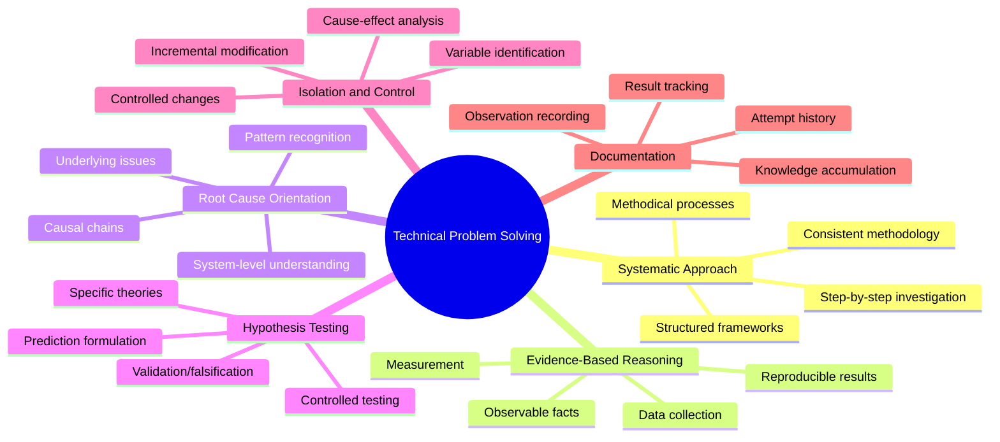
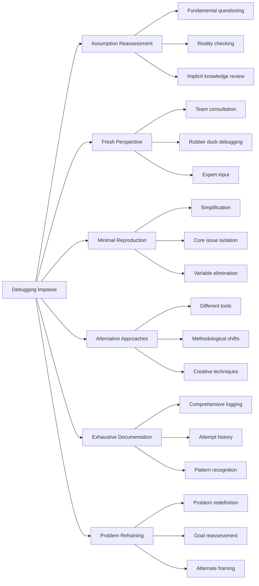
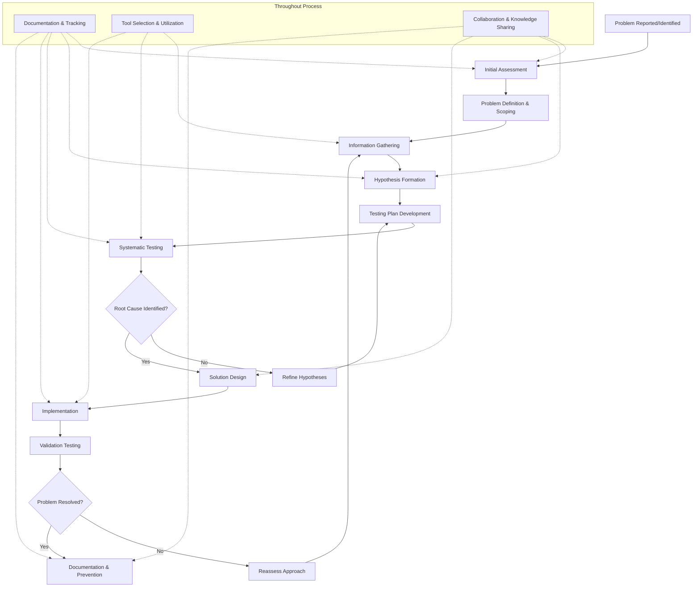

# Technical Problem Solving and Debugging

## Core Principles
- **Systematic approach**: Use methodical processes rather than random attempts
- **Evidence-based reasoning**: Base conclusions on observable facts and data
- **Root cause orientation**: Look beyond symptoms to identify underlying issues
- **Hypothesis testing**: Formulate and validate specific theories about the problem
- **Isolation and control**: Change one variable at a time to determine cause-effect relationships
- **Documentation**: Record observations, attempts, and results to build understanding

## Problem Diagnosis Framework
1. **Problem definition**
   - Clearly articulate what isn't working as expected
   - Define the scope and boundaries of the issue
   - Identify when the problem occurs and when it doesn't
   - Establish reproducible test cases when possible
   - Quantify the impact and severity

2. **Information gathering**
   - Collect error messages, logs, and system state data
   - Review recent changes that might have introduced the issue
   - Consult documentation, specifications, and expected behavior
   - Interview users or stakeholders about their observations
   - Check for similar issues and known solutions

3. **Symptom analysis**
   - Identify patterns in when and how the problem manifests
   - Note environmental or situational factors that correlate with the issue
   - Distinguish between consistent and intermittent symptoms
   - Recognize related issues that might share a common cause
   - Document the sequence of events leading to failure

4. **Hypothesis generation**
   - Formulate specific, testable theories about potential causes
   - Prioritize hypotheses based on likelihood and ease of testing
   - Consider both common failure modes and edge cases
   - Include hardware, software, configuration, and user interaction factors
   - Develop a testing approach for each hypothesis

```mermaid
flowchart TD
    A[Problem Diagnosis] --> B[Problem Definition]
    A --> C[Information Gathering]
    A --> D[Symptom Analysis]
    A --> E[Hypothesis Generation]
    
    B --> B1[Clear articulation]
    B --> B2[Scope definition]
    B --> B3[Occurrence patterns]
    B --> B4[Test case creation]
    B --> B5[Impact quantification]
    
    C --> C1[Error/log collection]
    C --> C2[Change review]
    C --> C3[Documentation consultation]
    C --> C4[User interviews]
    C --> C5[Similar issue research]
    
    D --> D1[Pattern identification]
    D --> D2[Environmental factors]
    D --> D3[Consistency assessment]
    D --> D4[Related issue recognition]
    D --> D5[Event sequencing]
    
    E --> E1[Testable theory formulation]
    E --> E2[Hypothesis prioritization]
    E --> E3[Failure mode consideration]
    E --> E4[Factor inclusiveness]
    E --> E5[Test approach development]
    
    B --> F[Diagnostic Strategy]
    C --> F
    D --> F
    E --> F
```

## Troubleshooting Techniques
1. **Divide and conquer**
   - Break complex systems into components for isolation testing
   - Use binary search techniques to narrow down problem areas
   - Test at integration points between components
   - Eliminate working components to focus investigation
   - Recombine components incrementally to identify interactions

2. **State and configuration examination**
   - Compare configurations between working and non-working systems
   - Verify environment variables and system settings
   - Check permission and access control settings
   - Examine resource availability and allocation
   - Validate input data format and content

3. **Error message analysis**
   - Decode error messages and lookup error codes
   - Trace error propagation through system layers
   - Distinguish between symptoms and actual error sources
   - Look for timing and sequence information in errors
   - Correlate errors across multiple logs or components

4. **Instrumenting and monitoring**
   - Add logging at critical points to increase visibility
   - Use debugging tools appropriate to the technology
   - Monitor resource usage during problem occurrence
   - Trace execution paths through the system
   - Capture state at failure points

```mermaid
graph TD
    A[Troubleshooting Techniques] --> B[Divide and Conquer]
    A --> C[State and Configuration Examination]
    A --> D[Error Message Analysis]
    A --> E[Instrumenting and Monitoring]
    
    B --> B1[System breakdown]
    B --> B2[Binary search approach]
    B --> B3[Integration point testing]
    B --> B4[Component elimination]
    B --> B5[Incremental recombination]
    
    C --> C1[Configuration comparison]
    C --> C2[Environment verification]
    C --> C3[Permission checking]
    C --> C4[Resource validation]
    C --> C5[Input data examination]
    
    D --> D1[Error message decoding]
    D --> D2[Error propagation tracing]
    D --> D3[Symptom vs. source distinction]
    D --> D4[Timing information analysis]
    D --> D5[Cross-log correlation]
    
    E --> E1[Strategic logging]
    E --> E2[Debugging tool utilization]
    E --> E3[Resource monitoring]
    E --> E4[Execution path tracing]
    E --> E5[Failure state capture]
```

## Solution Implementation
1. **Targeted intervention**
   - Implement the minimal change needed to address the root cause
   - Document the specific changes made and their rationale
   - Consider potential side effects of the solution
   - Ensure changes follow best practices and coding standards
   - Include appropriate error handling and resilience

2. **Validation testing**
   - Verify the problem is resolved under normal conditions
   - Test edge cases and boundary conditions
   - Ensure no regression in related functionality
   - Validate performance and resource utilization
   - Confirm solution works across relevant environments

3. **Preventive measures**
   - Implement monitoring to detect similar issues early
   - Add automated tests to prevent regression
   - Update documentation with lessons learned
   - Address any underlying design or architectural weaknesses
   - Share knowledge with the team to prevent similar issues

```mermaid
flowchart TD
    A[Solution Implementation] --> B[Targeted Intervention]
    A --> C[Validation Testing]
    A --> D[Preventive Measures]
    
    B --> B1[Minimal change implementation]
    B --> B2[Change documentation]
    B --> B3[Side effect consideration]
    B --> B4[Best practice adherence]
    B --> B5[Error handling inclusion]
    
    C --> C1[Normal condition verification]
    C --> C2[Edge case testing]
    C --> C3[Regression checking]
    C --> C4[Performance validation]
    C --> C5[Cross-environment testing]
    
    D --> D1[Monitoring implementation]
    D --> D2[Automated test addition]
    D --> D3[Documentation updating]
    D --> D4[Design weakness addressing]
    D --> D5[Knowledge sharing]
    
    B --> E[Solution Deployment]
    C --> E
    D --> F[Future Prevention]
```

## Special Technical Problem Types
1. **Performance issues**
   - Profile the system to identify bottlenecks
   - Measure resource usage patterns and trends
   - Analyze algorithmic efficiency and complexity
   - Test with varying loads and data volumes
   - Check for resource leaks and inefficient patterns

2. **Intermittent problems**
   - Identify patterns or triggers in occurrence
   - Log extensively to catch the issue in action
   - Examine race conditions and timing dependencies
   - Consider environmental factors (load, time, resources)
   - Create stress tests to increase occurrence frequency

3. **Integration and compatibility issues**
   - Verify interface contracts and specifications
   - Test version compatibility between components
   - Examine data formats and serialization issues
   - Check for environmental and platform differences
   - Validate assumption alignment between components

4. **Security-related problems**
   - Review authentication and authorization flows
   - Check input validation and sanitization
   - Examine encryption and sensitive data handling
   - Analyze permission and privilege configurations
   - Consider potential attack vectors and vulnerabilities

```mermaid
graph TD
    A[Special Problem Types] --> B[Performance Issues]
    A --> C[Intermittent Problems]
    A --> D[Integration & Compatibility]
    A --> E[Security-Related Problems]
    
    B --> B1[Bottleneck profiling]
    B --> B2[Resource usage analysis]
    B --> B3[Algorithmic assessment]
    B --> B4[Load testing]
    B --> B5[Resource leak checking]
    
    C --> C1[Pattern identification]
    C --> C2[Extensive logging]
    C --> C3[Race condition examination]
    C --> C4[Environmental factor analysis]
    C --> C5[Stress testing]
    
    D --> D1[Interface verification]
    D --> D2[Version compatibility]
    D --> D3[Data format examination]
    D --> D4[Platform differences]
    D --> D5[Assumption validation]
    
    E --> E1[Auth flow review]
    E --> E2[Input validation checking]
    E --> E3[Encryption examination]
    E --> E4[Permission analysis]
    E --> E5[Vulnerability assessment]
```

## When Traditional Debugging Fails
- Take a step back and reconsider fundamental assumptions
- Get a fresh perspective from someone not immersed in the problem
- Create a minimal reproduction case to isolate the issue
- Try alternative approaches or tools for diagnosis
- Document everything to identify patterns you might have missed
- Consider whether you're solving the right problem

## Technical Problem-Solving Process Model
