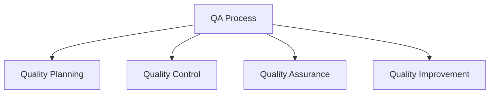

# QA Process

## 📋 Overview
This document outlines the Quality Assurance (QA) process and framework for our Operations Knowledge Base, ensuring comprehensive quality control and verification across all system components and documentation.

## 🎯 QA Framework

### Core Components


### Process Architecture
1. **QA Layers**
   ```yaml
   qa_layers:
     planning:
       - quality_standards
       - test_planning
       - resource_planning
       - schedule_planning
     execution:
       - quality_control
       - testing_process
       - verification
       - validation
   ```

2. **Process Types**
   - Documentation QA
   - System QA
   - Process QA
   - Performance QA

## 📊 Quality Planning

### Planning Process
1. **Quality Standards**
   ```python
   def plan_quality():
       define_standards()
       establish_criteria()
       develop_procedures()
       allocate_resources()
   ```

2. **Test Planning**
   - Test strategy
   - Test plans
   - Test cases
   - Test schedules

### Resource Planning
1. **Resource Requirements**
   ```json
   {
     "qa_resources": {
       "personnel": ["qa_engineers", "testers", "reviewers", "specialists"],
       "tools": ["testing_tools", "automation_tools", "monitoring_tools"],
       "environments": ["test_env", "staging_env", "production_env"]
     }
   }
   ```

2. **Resource Allocation**
   - Team allocation
   - Tool allocation
   - Environment allocation
   - Schedule allocation

## 🔍 Quality Control

### Control Process
1. **Testing Process**
   - Test execution
   - Defect tracking
   - Progress monitoring
   - Results analysis

2. **Review Process**
   - Documentation review
   - Code review
   - Process review
   - Performance review

### Verification
1. **Verification Methods**
   - Testing verification
   - Review verification
   - Process verification
   - Performance verification

2. **Validation Steps**
   - Requirements validation
   - Design validation
   - Implementation validation
   - Performance validation

## 📈 Quality Metrics

### Performance Metrics
1. **Quality Metrics**
   - Defect metrics
   - Coverage metrics
   - Performance metrics
   - Process metrics

2. **Effectiveness Metrics**
   - Testing effectiveness
   - Review effectiveness
   - Process effectiveness
   - Resource efficiency

### Analysis
1. **Metric Analysis**
   - Trend analysis
   - Root cause analysis
   - Impact analysis
   - Performance analysis

2. **Reporting**
   - Status reports
   - Progress reports
   - Quality reports
   - Trend reports

## 🔄 Continuous Improvement

### Process Improvement
1. **Improvement Process**
   - Process review
   - Gap analysis
   - Improvement planning
   - Implementation

2. **Enhancement Steps**
   - Process updates
   - Tool updates
   - Training updates
   - Documentation updates

### Quality Management
1. **Management Process**
   - Quality oversight
   - Process control
   - Resource management
   - Performance management

2. **Control Measures**
   - Quality controls
   - Process controls
   - Performance controls
   - Resource controls

## 📝 Documentation

### Process Documentation
1. **QA Documentation**
   - Process documents
   - Test documents
   - Review documents
   - Report documents

2. **Guidelines**
   - Testing guidelines
   - Review guidelines
   - Process guidelines
   - Quality guidelines

### Record Keeping
1. **Quality Records**
   - Test records
   - Review records
   - Process records
   - Performance records

2. **Documentation Management**
   - Version control
   - Change tracking
   - Access control
   - Archive management

## 🛠 Tools and Resources

### QA Tools
1. **Testing Tools**
   - Test management
   - Test automation
   - Performance testing
   - Security testing

2. **Support Tools**
   - Documentation tools
   - Review tools
   - Analysis tools
   - Reporting tools

### Resource Management
1. **Team Resources**
   - QA team
   - Test team
   - Review team
   - Support team

2. **Technical Resources**
   - Test environments
   - Test data
   - Test tools
   - Support tools

## 🎓 Training and Support

### Training Program
1. **Training Requirements**
   - Process training
   - Tool training
   - Skill development
   - Best practices

2. **Support Resources**
   - Documentation
   - Training materials
   - Reference guides
   - Support channels

## 📝 Related Documentation
- [[testing-standards]]
- [[quality-metrics]]
- [[process-improvement]]
- [[qa-guidelines]]

## 🔄 Change Log
| Date | Change | Author |
|------|--------|--------|
| YYYY-MM-DD | Initial QA process documentation | Name |

---

*Last updated: <% tp.date.now("YYYY-MM-DD") %>* 