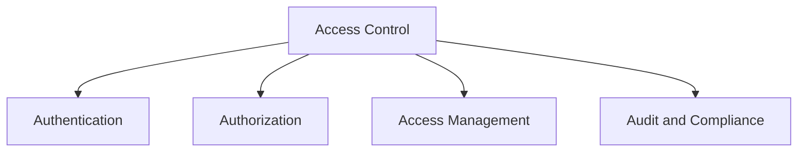

# Access Control

## 📋 Overview
This document outlines the access control framework and implementation for our Operations Knowledge Base, ensuring secure and appropriate access to systems, data, and resources through comprehensive authentication and authorization mechanisms.

## 🎯 Access Control Framework

### Core Components


### Control Architecture
1. **Control Layers**
   ```yaml
   access_layers:
     authentication:
       - identity_verification
       - multi_factor_auth
       - session_management
       - credential_management
     authorization:
       - permission_control
       - role_management
       - resource_access
       - policy_enforcement
   ```

2. **Control Types**
   - Authentication controls
   - Authorization controls
   - Access controls
   - Audit controls

## 🔐 Authentication

### Identity Management
1. **Identity Verification**
   ```python
   def verify_identity():
       validate_credentials()
       check_mfa_requirements()
       verify_session_token()
       log_authentication()
   ```

2. **Credential Management**
   - Password policies
   - Key management
   - Certificate management
   - Token management

### Multi-Factor Authentication
1. **MFA Implementation**
   ```json
   {
     "mfa_methods": {
       "knowledge": ["password", "pin", "security_questions"],
       "possession": ["mobile_device", "hardware_token", "smart_card"],
       "inherence": ["biometrics", "behavioral", "location"]
     }
   }
   ```

2. **MFA Requirements**
   - Required factors
   - Factor validation
   - Recovery process
   - Bypass controls

## 🔑 Authorization

### Role-Based Access Control
1. **Role Management**
   - Role definitions
   - Role hierarchy
   - Role assignments
   - Role reviews

2. **Permission Management**
   - Permission sets
   - Access levels
   - Resource permissions
   - Function permissions

### Policy Enforcement
1. **Access Policies**
   - Policy definitions
   - Policy rules
   - Policy conditions
   - Policy enforcement

2. **Policy Management**
   - Policy creation
   - Policy updates
   - Policy review
   - Policy retirement

## 👥 Access Management

### User Management
1. **User Lifecycle**
   - User provisioning
   - Access changes
   - Account suspension
   - Account termination

2. **Account Management**
   - Account creation
   - Account updates
   - Account monitoring
   - Account closure

### Resource Management
1. **Resource Access**
   - Resource classification
   - Access requirements
   - Access restrictions
   - Access monitoring

2. **Resource Controls**
   - Access methods
   - Access limitations
   - Usage monitoring
   - Resource protection

## 📊 Access Monitoring

### Activity Monitoring
1. **Access Logging**
   - Authentication logs
   - Authorization logs
   - Activity logs
   - Error logs

2. **Usage Monitoring**
   - Access patterns
   - Usage analytics
   - Anomaly detection
   - Trend analysis

### Audit Trails
1. **Audit Records**
   - Access records
   - Change records
   - Violation records
   - Review records

2. **Audit Analysis**
   - Pattern analysis
   - Compliance checking
   - Risk assessment
   - Performance analysis

## 🔍 Security Controls

### Technical Controls
1. **System Controls**
   - Access mechanisms
   - Security protocols
   - Protection measures
   - Monitoring tools

2. **Network Controls**
   - Network access
   - Protocol security
   - Traffic control
   - Perimeter security

### Administrative Controls
1. **Policy Controls**
   - Access policies
   - Security policies
   - Usage policies
   - Compliance policies

2. **Process Controls**
   - Access procedures
   - Review procedures
   - Change procedures
   - Incident procedures

## 🚨 Incident Response

### Security Incidents
1. **Incident Detection**
   - Violation detection
   - Breach detection
   - Anomaly detection
   - Threat detection

2. **Incident Handling**
   - Response procedures
   - Investigation process
   - Resolution steps
   - Documentation requirements

### Response Management
1. **Response Process**
   - Initial response
   - Investigation
   - Resolution
   - Recovery

2. **Follow-up Actions**
   - Root cause analysis
   - Control updates
   - Policy updates
   - Training updates

## 📈 Performance Management

### Performance Monitoring
1. **System Performance**
   - Response times
   - System load
   - Resource usage
   - Error rates

2. **User Experience**
   - Access speed
   - Authentication time
   - Authorization time
   - Session management

### Optimization
1. **Performance Tuning**
   - System optimization
   - Process optimization
   - Cache management
   - Resource allocation

2. **Efficiency Improvements**
   - Process streamlining
   - Automation enhancement
   - Integration optimization
   - User experience improvement

## 📝 Related Documentation
- [[security-policies]]
- [[authentication-systems]]
- [[authorization-framework]]
- [[security-monitoring]]

## 🔄 Change Log
| Date | Change | Author |
|------|--------|--------|
| YYYY-MM-DD | Initial access control documentation | Name |

---

*Last updated: <% tp.date.now("YYYY-MM-DD") %>* 