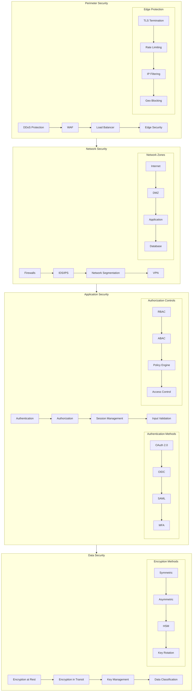
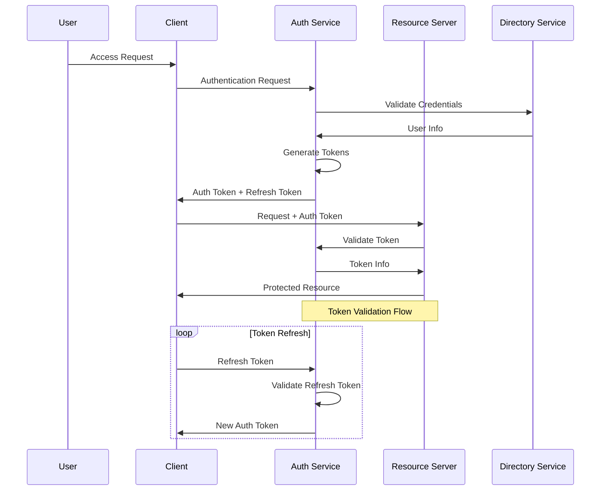
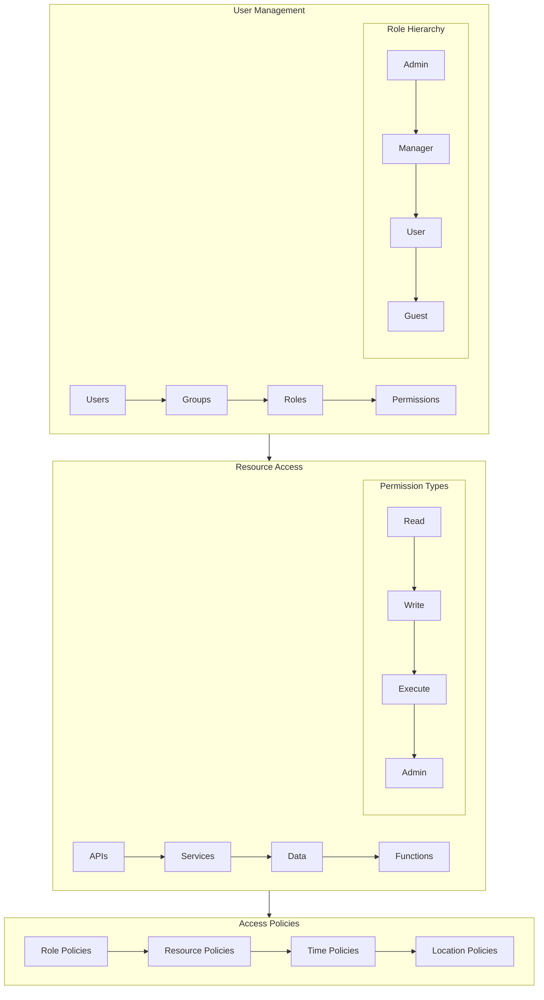
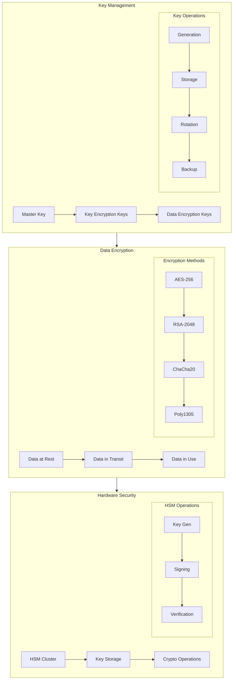
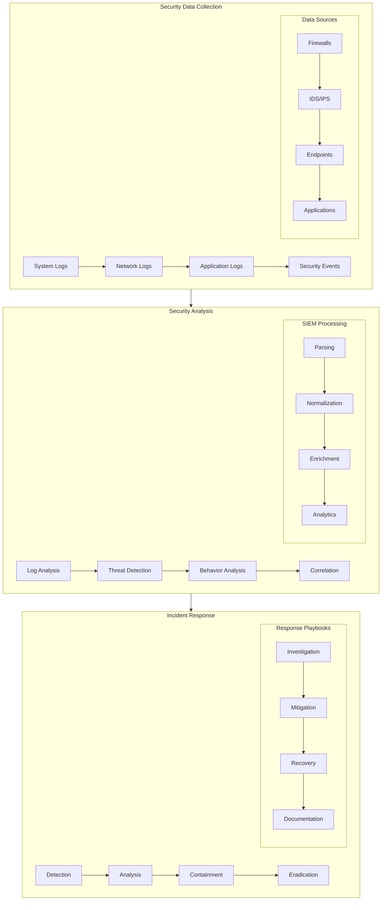
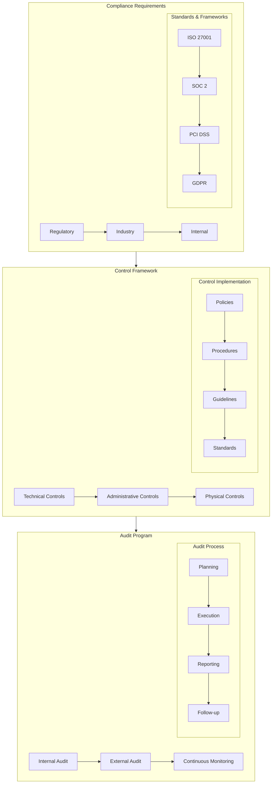

# Security Documentation

## Security Architecture Overview

### Security Layers

## Authentication System

### Authentication Flow

## Authorization Framework

### RBAC Implementation

## Data Protection

### Encryption Architecture

## Security Monitoring

### Security Operations

## Compliance Framework

### Compliance Architecture

## Related Documentation
- [Authentication Guide](authentication/guide.md)
- [Authorization Framework](authorization/framework.md)
- [Encryption Standards](encryption/standards.md)
- [Security Monitoring](monitoring/security.md)
- [Compliance Guide](compliance/guide.md)

---

*Last updated: 2024-03-20* 