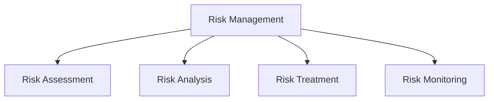

# Risk Management

## 📋 Overview
This document outlines the risk management framework and procedures for our Operations Knowledge Base, ensuring systematic identification, assessment, and mitigation of security and operational risks.

## 🎯 Risk Framework

### Core Components


### Risk Architecture
1. **Risk Layers**
   ```yaml
   risk_layers:
     identification:
       - threat_assessment
       - vulnerability_assessment
       - impact_assessment
       - likelihood_assessment
     management:
       - risk_evaluation
       - control_selection
       - implementation
       - monitoring
   ```

2. **Risk Types**
   - Security risks
   - Operational risks
   - Technical risks
   - Compliance risks

## 🔍 Risk Assessment

### Risk Identification
1. **Assessment Process**
   ```python
   def assess_risks():
       identify_threats()
       assess_vulnerabilities()
       evaluate_impacts()
       determine_likelihood()
   ```

2. **Risk Categories**
   - Technical risks
   - Process risks
   - People risks
   - External risks

### Risk Analysis
1. **Analysis Methods**
   ```json
   {
     "risk_analysis": {
       "qualitative": ["impact_scale", "likelihood_scale", "risk_matrix"],
       "quantitative": ["value_at_risk", "annual_loss_expectancy", "return_on_security_investment"],
       "hybrid": ["risk_scoring", "weighted_factors", "scenario_analysis"]
     }
   }
   ```

2. **Impact Assessment**
   - Business impact
   - Operational impact
   - Financial impact
   - Reputational impact

## 📊 Risk Evaluation

### Risk Criteria
1. **Evaluation Factors**
   - Risk severity
   - Risk likelihood
   - Risk exposure
   - Risk tolerance

2. **Risk Levels**
   - Critical risks
   - High risks
   - Medium risks
   - Low risks

### Risk Prioritization
1. **Priority Factors**
   - Impact level
   - Probability
   - Control effectiveness
   - Resource requirements

2. **Treatment Priority**
   - Immediate action
   - Short-term action
   - Medium-term action
   - Long-term action

## 🛡 Risk Treatment

### Treatment Options
1. **Risk Response**
   - Risk avoidance
   - Risk reduction
   - Risk transfer
   - Risk acceptance

2. **Control Selection**
   - Technical controls
   - Administrative controls
   - Physical controls
   - Compensating controls

### Implementation
1. **Treatment Plans**
   - Control implementation
   - Resource allocation
   - Timeline development
   - Success criteria

2. **Control Deployment**
   - Implementation steps
   - Testing procedures
   - Validation methods
   - Documentation requirements

## 📈 Risk Monitoring

### Monitoring Process
1. **Risk Tracking**
   - Risk indicators
   - Control effectiveness
   - Risk trends
   - Incident patterns

2. **Performance Metrics**
   - Risk reduction
   - Control effectiveness
   - Implementation progress
   - Resource efficiency

### Review Process
1. **Regular Reviews**
   - Risk assessments
   - Control evaluations
   - Process reviews
   - Documentation updates

2. **Improvement Planning**
   - Process enhancement
   - Control optimization
   - Resource allocation
   - Training needs

## 🔄 Risk Communication

### Stakeholder Communication
1. **Communication Strategy**
   - Risk reporting
   - Status updates
   - Issue escalation
   - Decision support

2. **Reporting Requirements**
   - Regular reports
   - Incident reports
   - Trend analysis
   - Performance metrics

### Documentation
1. **Risk Documentation**
   - Risk register
   - Control documentation
   - Assessment records
   - Review findings

2. **Process Documentation**
   - Procedures
   - Guidelines
   - Templates
   - Reference materials

## 🎓 Training and Awareness

### Training Program
1. **Training Requirements**
   - Risk awareness
   - Control implementation
   - Process knowledge
   - Tool proficiency

2. **Training Delivery**
   - Training materials
   - Training sessions
   - Practical exercises
   - Knowledge assessment

### Awareness Program
1. **Awareness Activities**
   - Regular updates
   - Best practices
   - Lessons learned
   - Case studies

2. **Program Management**
   - Content development
   - Delivery methods
   - Effectiveness measurement
   - Program improvement

## 🔍 Quality Assurance

### Quality Control
1. **Process Quality**
   - Process adherence
   - Documentation quality
   - Control effectiveness
   - Performance metrics

2. **Improvement Process**
   - Quality reviews
   - Process updates
   - Control enhancements
   - Training updates

### Compliance Verification
1. **Compliance Checks**
   - Policy compliance
   - Standard adherence
   - Regulatory requirements
   - Best practices

2. **Audit Support**
   - Audit preparation
   - Evidence collection
   - Finding resolution
   - Report generation

## 📝 Related Documentation
- [[security-policies]]
- [[compliance-framework]]
- [[security-monitoring]]
- [[incident-response]]

## 🔄 Change Log
| Date | Change | Author |
|------|--------|--------|
| YYYY-MM-DD | Initial risk management documentation | Name |

---

*Last updated: <% tp.date.now("YYYY-MM-DD") %>* 