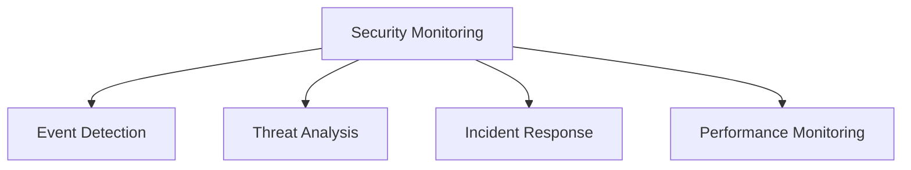

# Security Monitoring

## 📋 Overview
This document outlines the security monitoring framework and implementation for our Operations Knowledge Base, ensuring comprehensive detection, analysis, and response to security events and threats.

## 🎯 Monitoring Framework

### Core Components


### Monitoring Architecture
1. **Monitoring Layers**
   ```yaml
   monitoring_layers:
     detection:
       - event_collection
       - log_analysis
       - threat_detection
       - anomaly_detection
     response:
       - alert_management
       - incident_handling
       - threat_response
       - recovery_procedures
   ```

2. **Monitoring Types**
   - Security events
   - System events
   - Network events
   - User events

## 🔍 Event Detection

### Event Collection
1. **Collection Methods**
   ```python
   def collect_security_events():
       monitor_system_logs()
       analyze_network_traffic()
       track_user_activities()
       detect_security_events()
   ```

2. **Event Sources**
   - System logs
   - Network logs
   - Application logs
   - Security logs

### Event Processing
1. **Processing Pipeline**
   ```json
   {
     "event_processing": {
       "collection": ["log_aggregation", "event_filtering", "data_normalization"],
       "analysis": ["pattern_matching", "correlation", "enrichment"],
       "storage": ["event_storage", "data_retention", "archival"]
     }
   }
   ```

2. **Event Analysis**
   - Pattern detection
   - Correlation analysis
   - Threat assessment
   - Impact evaluation

## 🚨 Threat Detection

### Detection Methods
1. **Detection Techniques**
   - Signature detection
   - Anomaly detection
   - Behavior analysis
   - Threat intelligence

2. **Detection Tools**
   - SIEM systems
   - IDS/IPS
   - Network monitoring
   - Endpoint detection

### Threat Analysis
1. **Analysis Process**
   - Event correlation
   - Pattern recognition
   - Threat assessment
   - Risk evaluation

2. **Analysis Tools**
   - Analytics platforms
   - Correlation engines
   - Threat intelligence
   - Risk assessment

## 📊 Monitoring Systems

### System Components
1. **Monitoring Infrastructure**
   - Collection systems
   - Analysis platforms
   - Storage systems
   - Response systems

2. **Integration Points**
   - Log sources
   - Security tools
   - Network systems
   - Response platforms

### Data Management
1. **Data Collection**
   - Data sources
   - Collection methods
   - Processing rules
   - Storage requirements

2. **Data Analysis**
   - Analysis methods
   - Correlation rules
   - Detection logic
   - Response triggers

## 🔔 Alert Management

### Alert Processing
1. **Alert Generation**
   - Alert criteria
   - Alert levels
   - Alert routing
   - Alert enrichment

2. **Alert Handling**
   - Triage process
   - Priority assignment
   - Response procedures
   - Escalation paths

### Response Coordination
1. **Response Teams**
   - Security teams
   - Operations teams
   - Support teams
   - Management teams

2. **Communication Flow**
   - Alert notification
   - Status updates
   - Team coordination
   - Management reporting

## 📈 Performance Monitoring

### System Performance
1. **Performance Metrics**
   - System health
   - Detection rates
   - Response times
   - Resource usage

2. **Optimization**
   - Performance tuning
   - Resource allocation
   - Process improvement
   - Tool enhancement

### Quality Control
1. **Quality Metrics**
   - Detection accuracy
   - False positive rates
   - Response efficiency
   - Resolution times

2. **Improvement Process**
   - Performance review
   - Process updates
   - Tool optimization
   - Training updates

## 🔄 Continuous Monitoring

### Monitoring Process
1. **Regular Monitoring**
   - Real-time monitoring
   - Scheduled checks
   - Periodic reviews
   - Compliance verification

2. **Special Monitoring**
   - Incident monitoring
   - Investigation support
   - Audit monitoring
   - Project monitoring

### Process Improvement
1. **Review Process**
   - Performance review
   - Process assessment
   - Tool evaluation
   - Team feedback

2. **Enhancement Steps**
   - Process updates
   - Tool upgrades
   - Training enhancement
   - Documentation updates

## 📝 Documentation

### Monitoring Documentation
1. **Process Documentation**
   - Procedures
   - Guidelines
   - Work instructions
   - Reference materials

2. **Technical Documentation**
   - System configuration
   - Tool setup
   - Integration details
   - Maintenance procedures

### Reporting
1. **Regular Reports**
   - Status reports
   - Performance reports
   - Incident reports
   - Trend analysis

2. **Special Reports**
   - Investigation reports
   - Audit reports
   - Assessment reports
   - Management reports

## 🎓 Training and Support

### Training Program
1. **Training Requirements**
   - Tool proficiency
   - Process knowledge
   - Analysis skills
   - Response procedures

2. **Support Resources**
   - Documentation
   - Training materials
   - Reference guides
   - Support channels

## 📝 Related Documentation
- [[security-policies]]
- [[incident-response]]
- [[threat-detection]]
- [[alert-management]]

## 🔄 Change Log
| Date | Change | Author |
|------|--------|--------|
| YYYY-MM-DD | Initial security monitoring documentation | Name |

---

*Last updated: <% tp.date.now("YYYY-MM-DD") %>* 