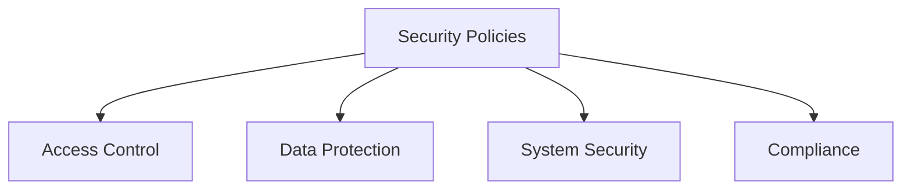

# Security Policies

## 📋 Overview
This document outlines the security policies and governance framework for our Operations Knowledge Base, ensuring comprehensive protection of systems, data, and operations through well-defined security controls and practices.

## 🎯 Policy Framework

### Core Components


### Policy Architecture
1. **Policy Layers**
   ```yaml
   policy_layers:
     governance:
       - security_governance
       - risk_management
       - compliance_management
       - policy_enforcement
     operational:
       - access_control
       - data_protection
       - system_security
       - incident_response
   ```

2. **Policy Types**
   - Security governance
   - Operational security
   - Technical security
   - Compliance requirements

## 🔒 Access Control Policies

### Authentication
1. **Authentication Requirements**
   ```python
   def enforce_authentication():
       validate_credentials()
       verify_multi_factor()
       check_session_security()
       log_access_attempts()
   ```

2. **Identity Management**
   - User identification
   - Credential management
   - Access provisioning
   - Identity lifecycle

### Authorization
1. **Access Control Model**
   ```json
   {
     "access_control": {
       "rbac": ["roles", "permissions", "groups", "hierarchies"],
       "abac": ["attributes", "policies", "conditions", "context"],
       "controls": ["least_privilege", "separation_duties", "need_to_know"]
     }
   }
   ```

2. **Permission Management**
   - Role definitions
   - Permission sets
   - Access levels
   - Resource controls

## 🛡 Data Protection

### Data Classification
1. **Classification Levels**
   - Public data
   - Internal data
   - Confidential data
   - Restricted data

2. **Data Handling**
   - Storage requirements
   - Transmission security
   - Processing controls
   - Disposal procedures

### Data Security
1. **Security Controls**
   - Encryption requirements
   - Access controls
   - Data masking
   - Audit logging

2. **Data Lifecycle**
   - Creation security
   - Storage security
   - Usage security
   - Disposal security

## 🔐 System Security

### Infrastructure Security
1. **System Controls**
   - Network security
   - Host security
   - Application security
   - Database security

2. **Security Architecture**
   - Defense in depth
   - Security zones
   - Trust boundaries
   - Control layers

### Security Operations
1. **Operational Controls**
   - Monitoring requirements
   - Patch management
   - Configuration security
   - Change control

2. **Security Maintenance**
   - Security updates
   - System hardening
   - Vulnerability management
   - Security testing

## 📜 Compliance Requirements

### Regulatory Compliance
1. **Compliance Framework**
   - Legal requirements
   - Industry standards
   - Best practices
   - Internal policies

2. **Compliance Controls**
   - Control implementation
   - Control monitoring
   - Control testing
   - Control reporting

### Audit Requirements
1. **Audit Controls**
   - Audit logging
   - Audit trails
   - Audit reviews
   - Audit reporting

2. **Compliance Monitoring**
   - Control monitoring
   - Compliance testing
   - Issue tracking
   - Remediation management

## 🚨 Incident Management

### Security Incidents
1. **Incident Response**
   - Detection requirements
   - Response procedures
   - Investigation process
   - Resolution steps

2. **Incident Reporting**
   - Notification requirements
   - Escalation procedures
   - Documentation requirements
   - Follow-up actions

### Breach Management
1. **Breach Response**
   - Containment procedures
   - Investigation process
   - Recovery steps
   - Prevention measures

2. **Breach Reporting**
   - Notification requirements
   - Documentation requirements
   - Legal obligations
   - Stakeholder communication

## 📊 Risk Management

### Risk Assessment
1. **Assessment Process**
   - Risk identification
   - Risk analysis
   - Risk evaluation
   - Risk treatment

2. **Risk Controls**
   - Control selection
   - Control implementation
   - Control monitoring
   - Control effectiveness

### Risk Mitigation
1. **Mitigation Strategies**
   - Risk reduction
   - Risk transfer
   - Risk acceptance
   - Risk avoidance

2. **Control Implementation**
   - Technical controls
   - Administrative controls
   - Physical controls
   - Compensating controls

## 🔍 Policy Enforcement

### Monitoring and Enforcement
1. **Policy Monitoring**
   - Compliance monitoring
   - Violation detection
   - Exception handling
   - Enforcement actions

2. **Policy Violations**
   - Violation handling
   - Disciplinary actions
   - Remediation requirements
   - Documentation requirements

### Policy Management
1. **Policy Maintenance**
   - Regular reviews
   - Policy updates
   - Version control
   - Change management

2. **Policy Communication**
   - Policy distribution
   - Training requirements
   - Awareness programs
   - Acknowledgment tracking

## 📝 Related Documentation
- [[access-control]]
- [[data-protection]]
- [[system-security]]
- [[compliance-framework]]

## 🔄 Change Log
| Date | Change | Author |
|------|--------|--------|
| YYYY-MM-DD | Initial security policies documentation | Name |

---

*Last updated: <% tp.date.now("YYYY-MM-DD") %>* 