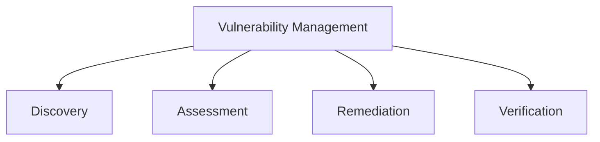

# Vulnerability Management

## 📋 Overview
This document outlines the vulnerability management framework and procedures for our Operations Knowledge Base, ensuring systematic identification, assessment, and remediation of security vulnerabilities across all system components.

## 🎯 Management Framework

### Core Components


### Management Architecture
1. **Management Layers**
   ```yaml
   vulnerability_layers:
     discovery:
       - scanning
       - monitoring
       - reporting
       - tracking
     remediation:
       - assessment
       - prioritization
       - patching
       - verification
   ```

2. **Management Types**
   - System vulnerabilities
   - Network vulnerabilities
   - Application vulnerabilities
   - Configuration vulnerabilities

## 🔍 Vulnerability Discovery

### Discovery Methods
1. **Scanning Process**
   ```python
   def discover_vulnerabilities():
       scan_systems()
       identify_weaknesses()
       assess_configurations()
       track_findings()
   ```

2. **Detection Tools**
   - Vulnerability scanners
   - Security tools
   - Monitoring systems
   - Assessment tools

### Assessment Process
1. **Vulnerability Analysis**
   ```json
   {
     "vulnerability_assessment": {
       "severity": ["critical", "high", "medium", "low"],
       "impact": ["system", "data", "user", "business"],
       "complexity": ["high", "medium", "low"],
       "exploitability": ["easy", "moderate", "difficult"]
     }
   }
   ```

2. **Risk Assessment**
   - Severity rating
   - Impact analysis
   - Exploitation risk
   - Business impact

## 📊 Vulnerability Management

### Prioritization
1. **Priority Factors**
   - Severity level
   - Business impact
   - Exploitation risk
   - Resource requirements

2. **Treatment Priority**
   - Critical vulnerabilities
   - High-risk issues
   - Medium-risk issues
   - Low-risk issues

### Remediation Planning
1. **Action Planning**
   - Remediation steps
   - Resource allocation
   - Timeline development
   - Success criteria

2. **Implementation Strategy**
   - Patch management
   - Configuration changes
   - Security updates
   - System hardening

## 🛠 Remediation Process

### Implementation
1. **Remediation Steps**
   - Patch deployment
   - Configuration updates
   - Security fixes
   - System updates

2. **Change Management**
   - Change planning
   - Impact assessment
   - Rollback planning
   - Documentation

### Verification
1. **Testing Process**
   - Patch testing
   - Security testing
   - Performance testing
   - Integration testing

2. **Validation Steps**
   - Vulnerability verification
   - Security assessment
   - Performance validation
   - User acceptance

## 📈 Performance Monitoring

### Metrics Collection
1. **Performance Metrics**
   - Remediation time
   - Success rate
   - Coverage rate
   - Risk reduction

2. **Effectiveness Metrics**
   - Vulnerability trends
   - Risk reduction
   - Control effectiveness
   - Resource efficiency

### Progress Tracking
1. **Status Monitoring**
   - Open vulnerabilities
   - Remediation progress
   - Risk levels
   - Compliance status

2. **Reporting**
   - Status reports
   - Trend analysis
   - Performance reports
   - Management updates

## 🔄 Continuous Improvement

### Process Enhancement
1. **Review Process**
   - Performance review
   - Process assessment
   - Tool evaluation
   - Resource analysis

2. **Improvement Steps**
   - Process updates
   - Tool upgrades
   - Training enhancement
   - Documentation updates

### Knowledge Management
1. **Documentation**
   - Process documentation
   - Technical guides
   - Best practices
   - Lessons learned

2. **Training Program**
   - Security awareness
   - Tool training
   - Process training
   - Best practices

## 🔒 Security Controls

### Prevention Controls
1. **Security Measures**
   - System hardening
   - Access control
   - Configuration management
   - Patch management

2. **Monitoring Controls**
   - Vulnerability monitoring
   - Security monitoring
   - Activity monitoring
   - Performance monitoring

### Response Controls
1. **Incident Response**
   - Alert handling
   - Investigation process
   - Remediation steps
   - Recovery procedures

2. **Emergency Response**
   - Critical vulnerabilities
   - Zero-day threats
   - Emergency patches
   - Rapid response

## 📝 Documentation

### Process Documentation
1. **Procedures**
   - Scanning procedures
   - Assessment procedures
   - Remediation procedures
   - Verification procedures

2. **Guidelines**
   - Security guidelines
   - Patching guidelines
   - Configuration guidelines
   - Testing guidelines

### Technical Documentation
1. **System Documentation**
   - System configurations
   - Security settings
   - Patch levels
   - Control documentation

2. **Tool Documentation**
   - Tool configurations
   - Usage guides
   - Integration details
   - Maintenance procedures

## 🎓 Training and Support

### Training Program
1. **Training Requirements**
   - Security awareness
   - Tool proficiency
   - Process knowledge
   - Best practices

2. **Support Resources**
   - Documentation
   - Training materials
   - Reference guides
   - Support channels

## 📝 Related Documentation
- [[security-policies]]
- [[security-monitoring]]
- [[patch-management]]
- [[configuration-management]]

## 🔄 Change Log
| Date | Change | Author |
|------|--------|--------|
| YYYY-MM-DD | Initial vulnerability management documentation | Name |

---

*Last updated: <% tp.date.now("YYYY-MM-DD") %>* 