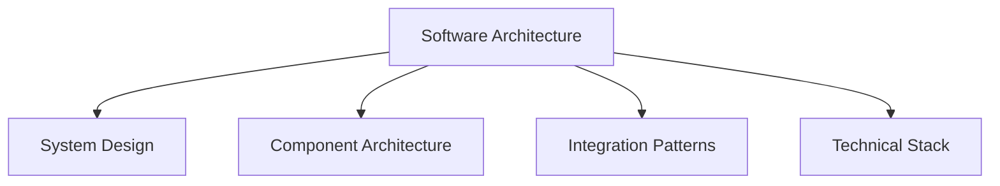

# Software Architecture

## 📋 Overview
This document defines the software architecture and system design principles for our Operations Knowledge Base, establishing the technical foundation for all software components and integrations.

## 🏗 Architecture Framework

### Core Components


### Architecture Layers
1. **System Layers**
   ```yaml
   architecture_layers:
     presentation:
       - user_interface
       - api_gateway
       - client_services
     business:
       - core_services
       - business_logic
       - workflow_engine
     data:
       - data_storage
       - data_access
       - data_processing
   ```

2. **Cross-Cutting Concerns**
   - Security
   - Logging
   - Monitoring
   - Performance

## 💻 System Design

### Design Principles
1. **Architecture Principles**
   ```python
   def apply_principles():
       ensure_modularity()
       maintain_scalability()
       implement_security()
       optimize_performance()
   ```

2. **Design Patterns**
   - Microservices
   - Event-driven
   - Domain-driven
   - Cloud-native

### System Components
1. **Core Systems**
   ```json
   {
     "core_systems": {
       "frontend": ["web", "mobile", "desktop"],
       "backend": ["api", "services", "workers"],
       "data": ["storage", "processing", "analytics"],
       "infrastructure": ["cloud", "network", "security"]
     }
   }
   ```

2. **Support Systems**
   - Monitoring
   - Logging
   - Analytics
   - Administration

## 🔌 Component Architecture

### Service Components
1. **Service Design**
   - Service boundaries
   - Component interfaces
   - Communication patterns
   - State management

2. **Service Implementation**
   - Business logic
   - Data access
   - Error handling
   - Performance optimization

### Component Integration
1. **Integration Patterns**
   - API integration
   - Event messaging
   - Data synchronization
   - Service composition

2. **Integration Standards**
   - Protocol standards
   - Data formats
   - Security requirements
   - Performance criteria

## 🔄 Integration Patterns

### Communication Patterns
1. **Synchronous Patterns**
   - REST APIs
   - GraphQL
   - RPC
   - Direct calls

2. **Asynchronous Patterns**
   - Event streaming
   - Message queues
   - Pub/sub
   - Webhooks

### Data Patterns
1. **Data Flow**
   - Data pipelines
   - ETL processes
   - Stream processing
   - Batch processing

2. **Data Storage**
   - Databases
   - File systems
   - Cache systems
   - Archive storage

## 🛠 Technical Stack

### Technology Selection
1. **Core Technologies**
   - Programming languages
   - Frameworks
   - Libraries
   - Tools

2. **Infrastructure**
   - Cloud platforms
   - Servers
   - Networks
   - Storage

### Development Stack
1. **Frontend Stack**
   - Web frameworks
   - UI libraries
   - State management
   - Build tools

2. **Backend Stack**
   - Server frameworks
   - Database systems
   - Cache systems
   - Message brokers

## 🔒 Security Architecture

### Security Design
1. **Security Patterns**
   - Authentication
   - Authorization
   - Encryption
   - Access control

2. **Security Implementation**
   - Security protocols
   - Security controls
   - Threat protection
   - Compliance measures

### Security Integration
1. **Security Services**
   - Identity services
   - Key management
   - Certificate management
   - Security monitoring

2. **Security Controls**
   - Access management
   - Data protection
   - Network security
   - Application security

## 📊 Performance Architecture

### Performance Design
1. **Performance Patterns**
   - Caching
   - Load balancing
   - Scaling
   - Optimization

2. **Performance Implementation**
   - Resource management
   - Request handling
   - Data optimization
   - Response time

### Monitoring Architecture
1. **Monitoring Systems**
   - Performance monitoring
   - Resource monitoring
   - Error monitoring
   - User monitoring

2. **Analysis Systems**
   - Performance analysis
   - Trend analysis
   - Capacity planning
   - Optimization analysis

## 📝 Related Documentation
- [[system-design]]
- [[component-architecture]]
- [[integration-patterns]]
- [[technical-stack]]

## 🔄 Change Log
| Date | Change | Author |
|------|--------|--------|
| YYYY-MM-DD | Initial software architecture documentation | Name |

---

*Last updated: <% tp.date.now("YYYY-MM-DD") %>* 