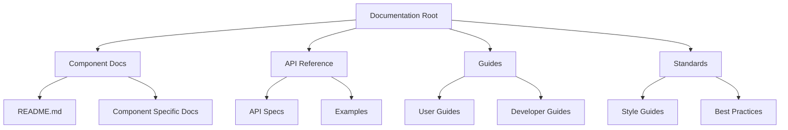
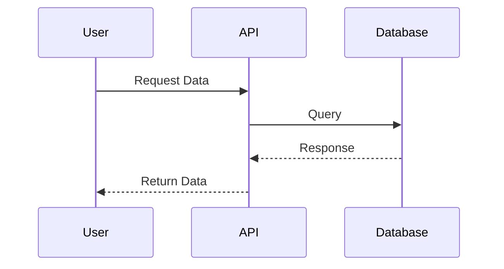
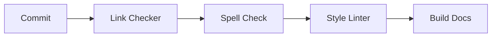

# Documentation Style Guide

## Document Structure

### File Organization


## Formatting Standards

### Markdown Usage
- Use ATX-style headers (`#` for h1, `##` for h2, etc.)
- Use `-` for unordered lists
- Use `1.` for ordered lists
- Use `>` for blockquotes
- Use ` ``` ` for code blocks with language specification

### Code Blocks
```python
# Example code block with syntax highlighting
def example_function():
    """
    Function docstring following standards
    """
    return True
```

### YAML Frontmatter
```yaml
---
title: Document Title
created: YYYY-MM-DD
updated: YYYY-MM-DD
tags: [tag1, tag2]
---
```

## Diagrams

### Mermaid Diagram Standards
- Use meaningful node names
- Include clear relationships
- Add descriptive labels
- Maintain consistent styling
- Use appropriate diagram types:
  - `graph` for relationships
  - `sequenceDiagram` for processes
  - `classDiagram` for structure
  - `gantt` for timelines

### Example Sequence Diagram


## Writing Style

### General Guidelines
1. Use active voice
2. Write concisely
3. Use present tense
4. Be specific
5. Include examples

### Technical Writing
- Define acronyms on first use
- Link to related documentation
- Include version information
- Document prerequisites
- Provide complete examples

### Code Documentation
- Use consistent commenting style
- Document parameters and return values
- Include usage examples
- Note any limitations or edge cases

## Version Control

### Git Commit Messages
```
type(scope): brief description

Detailed description of changes
```

Types:
- `docs`: Documentation changes
- `feat`: New features
- `fix`: Bug fixes
- `style`: Formatting changes
- `refactor`: Code restructuring

## Review Process

### Documentation Review Checklist
- [ ] Follows style guide
- [ ] Contains all required sections
- [ ] Includes appropriate diagrams
- [ ] Links are valid
- [ ] Code examples work
- [ ] No spelling errors
- [ ] Updated metadata

## Maintenance

### Regular Tasks
1. Review for accuracy
2. Update examples
3. Verify links
4. Check for completeness
5. Update diagrams

### Automated Checks


## Best Practices

### Documentation Types
1. Tutorials
2. How-to guides
3. Reference documentation
4. Explanations

### Content Organization
- Use clear hierarchy
- Keep related content together
- Provide navigation aids
- Include search functionality

---

*Last updated: 2024-03-20* 