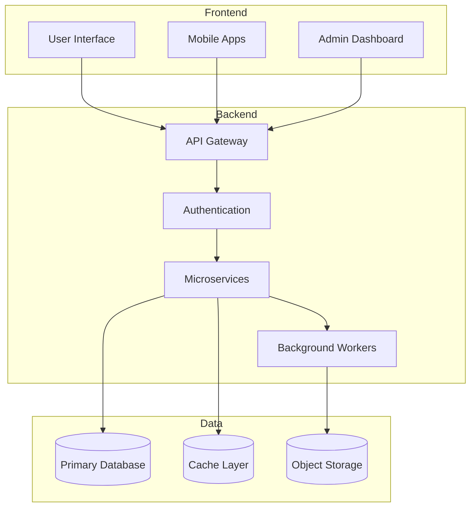
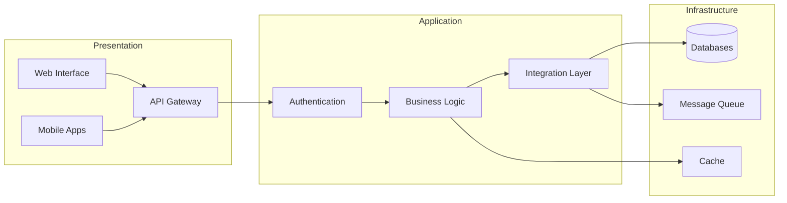
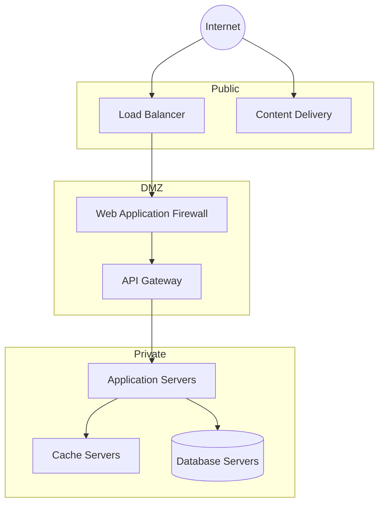
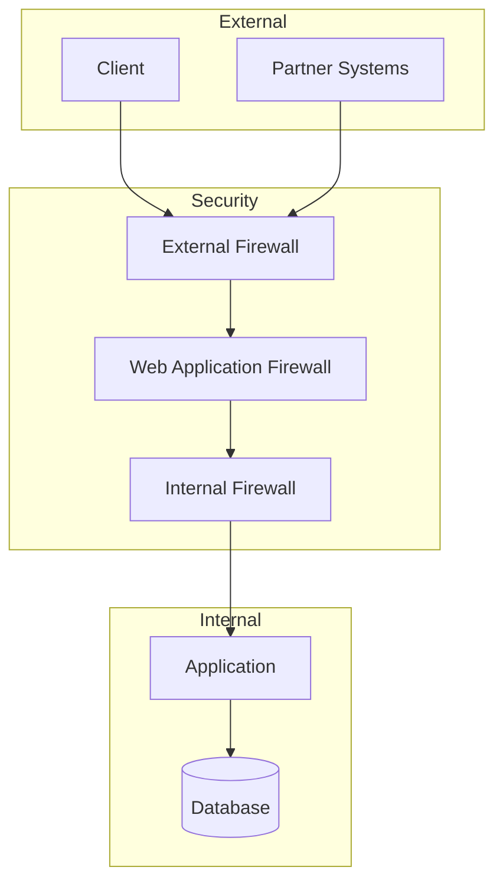
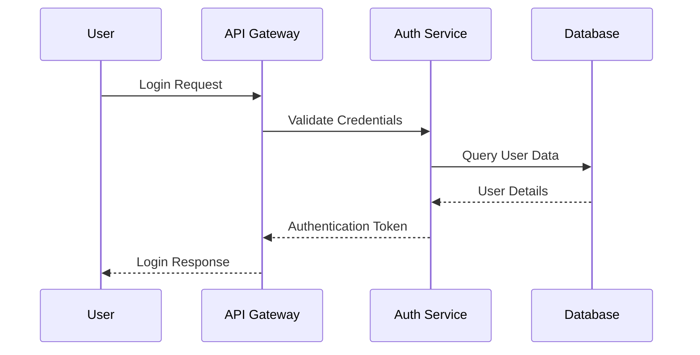
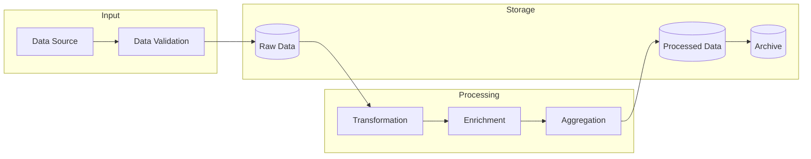
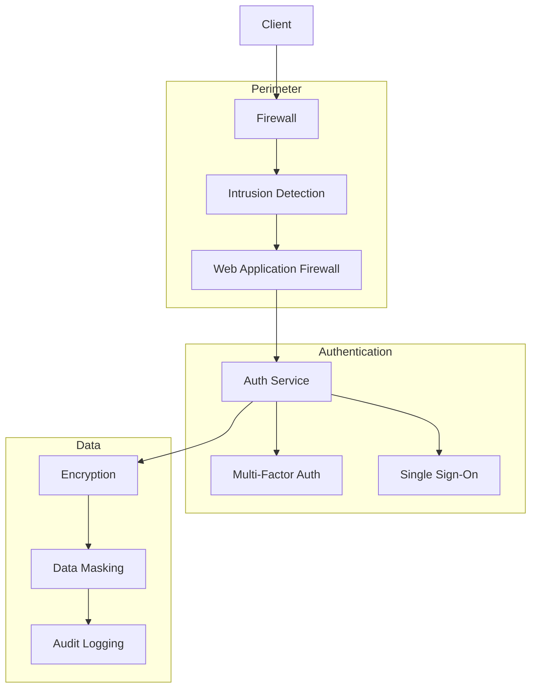
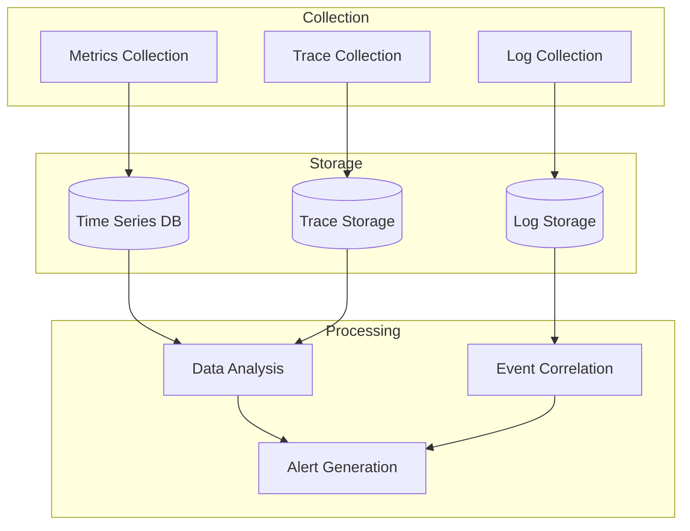

# System Diagrams

## 📋 Overview
This document provides comprehensive system diagrams illustrating our architecture, network topology, and data flows to ensure clear understanding of system structure and interactions.

## 🏗 Architecture Diagrams

### High-Level Architecture

### Component Architecture

## 🌐 Network Diagrams

### Network Topology

### Network Security

## 🔄 Data Flow Diagrams

### User Authentication Flow

### Data Processing Flow

## 🔒 Security Architecture

### Security Controls

## 📊 Monitoring Architecture

### Monitoring Flow

## 📚 References

### Internal Documentation
- [[system-architecture]]
- [[network-topology]]
- [[data-flows]]
- [[security-architecture]]

### External Resources
- [Architecture Patterns](https://example.com/architecture-patterns)
- [Network Design](https://example.com/network-design)
- [Data Flow Patterns](https://example.com/data-flow-patterns)

## 📅 Version History
- 2024-03-20: Initial system diagrams documentation
- [Future updates will be logged here]

---

*Last updated: 2024-03-20* 