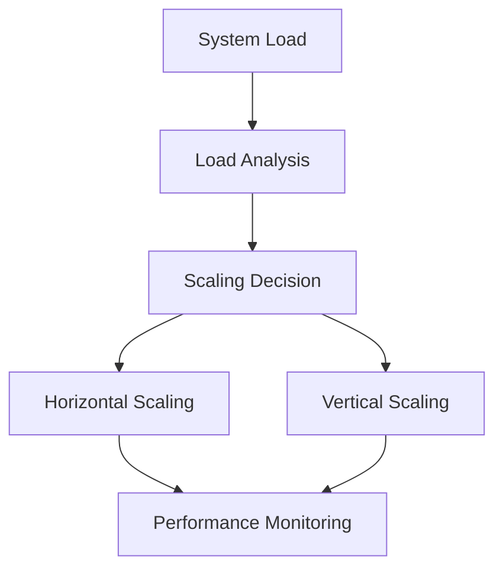

# System Scaling

## 📋 Overview
This document outlines the system scaling strategies and implementation for our Operations Knowledge Base, ensuring sustainable growth and optimal performance.

## 🏗 Scaling Architecture

### Scaling Model


### Scaling Components
1. **Resource Scaling**
   ```yaml
   scaling_components:
     compute:
       - cpu_allocation
       - memory_allocation
       - storage_capacity
     network:
       - bandwidth
       - throughput
       - connections
   ```

2. **Application Scaling**
   - Service instances
   - Database replicas
   - Cache layers
   - Load balancers

## 🔄 Scaling Strategies

### Horizontal Scaling
1. **Service Replication**
   ```python
   def scale_horizontally():
       analyze_load()
       determine_instances()
       deploy_replicas()
       balance_load()
   ```

2. **Data Distribution**
   - Sharding strategy
   - Replication policy
   - Consistency management
   - Data synchronization

### Vertical Scaling
1. **Resource Enhancement**
   - CPU upgrade
   - Memory expansion
   - Storage increase
   - Network capacity

2. **Performance Optimization**
   - Query optimization
   - Cache enhancement
   - Connection pooling
   - Resource allocation

## 📊 Capacity Planning

### Load Analysis
1. **Usage Patterns**
   - User activity
   - Resource consumption
   - Peak periods
   - Growth trends

2. **Performance Metrics**
   - Response times
   - Throughput rates
   - Error frequencies
   - Resource utilization

### Growth Projections
1. **Trend Analysis**
   ```python
   def analyze_growth():
       collect_historical_data()
       identify_patterns()
       project_growth()
       plan_capacity()
   ```

2. **Capacity Requirements**
   - Storage needs
   - Processing power
   - Memory requirements
   - Network bandwidth

## 🛠 Implementation Tools

### Monitoring Tools
1. **Performance Monitoring**
   - Resource usage
   - System health
   - Service metrics
   - User metrics

2. **Capacity Monitoring**
   - Storage utilization
   - Processing load
   - Memory usage
   - Network traffic

### Automation Tools
1. **Auto-scaling**
   ```json
   {
     "auto_scaling": {
       "triggers": {
         "cpu_usage": 75,
         "memory_usage": 80,
         "response_time": "2s"
       },
       "actions": {
         "scale_up": "add_instance",
         "scale_down": "remove_instance"
       }
     }
   }
   ```

2. **Resource Management**
   - Load balancing
   - Resource allocation
   - Instance management
   - Health checking

## 🔒 Security Integration

### Security Scaling
1. **Security Controls**
   - Access management
   - Authentication scaling
   - Authorization scaling
   - Audit capacity

2. **Compliance Scaling**
   - Data protection
   - Audit logging
   - Compliance monitoring
   - Security scanning

### Risk Management
1. **Risk Assessment**
   - Capacity risks
   - Performance risks
   - Security risks
   - Compliance risks

2. **Mitigation Strategies**
   - Redundancy
   - Failover systems
   - Backup capacity
   - Emergency resources

## 📈 Performance Optimization

### System Optimization
1. **Resource Optimization**
   - Cache optimization
   - Query optimization
   - Storage optimization
   - Network optimization

2. **Process Optimization**
   - Workflow efficiency
   - Task scheduling
   - Resource allocation
   - Load distribution

### Performance Monitoring
1. **Metrics Tracking**
   - Performance metrics
   - Resource metrics
   - User metrics
   - System metrics

2. **Analysis Tools**
   - Performance analysis
   - Bottleneck detection
   - Capacity analysis
   - Trend analysis

## 🔄 Continuous Improvement

### Evolution Management
1. **System Updates**
   - Architecture updates
   - Component upgrades
   - Capacity adjustments
   - Performance tuning

2. **Process Refinement**
   - Workflow optimization
   - Automation enhancement
   - Tool improvement
   - Documentation updates

### Learning System
1. **Pattern Recognition**
   - Usage patterns
   - Growth patterns
   - Performance patterns
   - Issue patterns

2. **Predictive Analysis**
   - Growth prediction
   - Capacity needs
   - Performance requirements
   - Resource planning

## 📝 Related Documentation
- [[system-resilience]]
- [[system-modernization]]
- [[performance-tools]]
- [[monitoring-tools]]

## 🔄 Change Log
| Date | Change | Author |
|------|--------|--------|
| YYYY-MM-DD | Initial system scaling documentation | Name |

---

*Last updated: <% tp.date.now("YYYY-MM-DD") %>* 