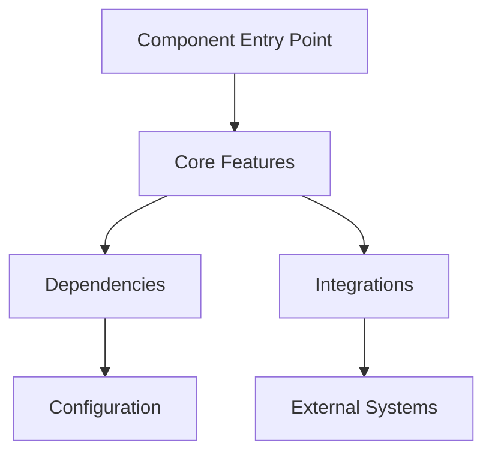
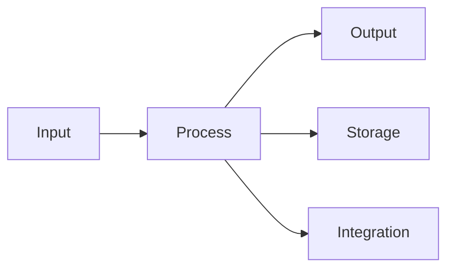

# [Component Name]

## Overview



## Purpose
Brief description of the component's purpose and role in the system.

## Features
- Feature 1
- Feature 2
- Feature 3

## Architecture
Detailed description of the component's architecture.

### Component Diagram


## Configuration
```yaml
# Example configuration
component:
  setting1: value1
  setting2: value2
  features:
    - feature1
    - feature2
```

## Dependencies
- Dependency 1
- Dependency 2
- Dependency 3

## Usage
Example usage and code snippets.

## API Reference
If applicable, API documentation.

## Best Practices
List of best practices and recommendations.

## Troubleshooting
Common issues and their solutions.

## Related Documentation
- [Link to related doc 1]
- [Link to related doc 2]

## Contributing
Guidelines for contributing to this component.

---

*Last updated: [DATE]* 