# Deployment & Release Template

## 📊 Deployment Dashboard
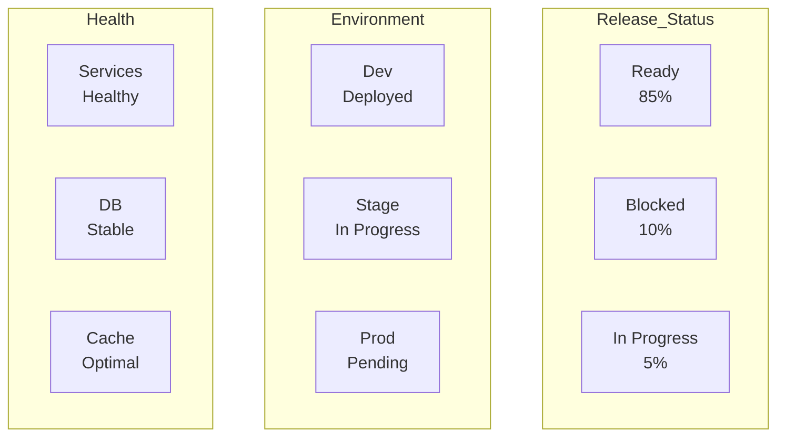

## 🔄 Deployment Pipeline
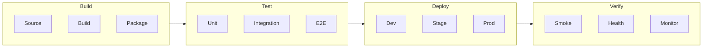

## 📈 Release Progress
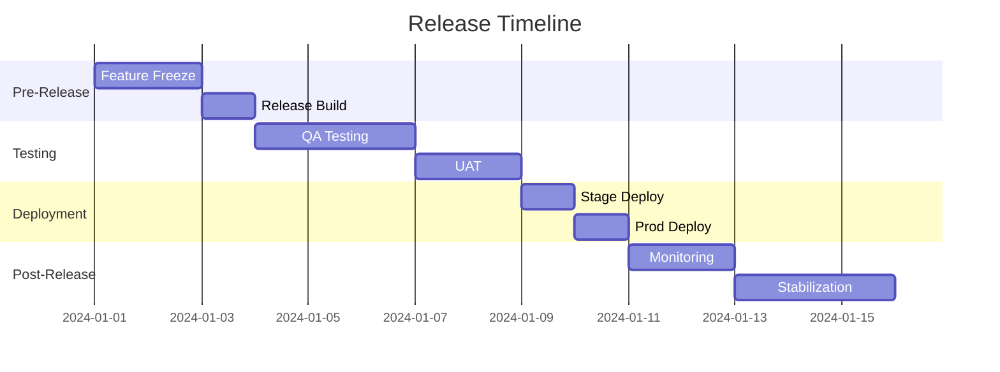

## 🎯 Release Readiness
```mermaid
radar
    title "Release Readiness Assessment"
    variables
        Code Complete
        Tests Passed
        Docs Updated
        Security Scan
        Performance
        Compliance
    data
        Current: 95, 92, 88, 90, 85, 87
        Required: 100, 95, 90, 95, 90, 90
```

## 🔍 Environment Health
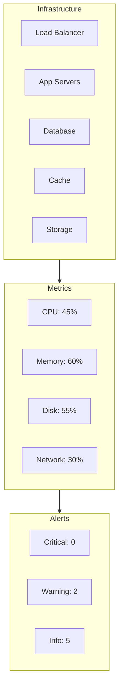

## ⚡ Performance Baseline
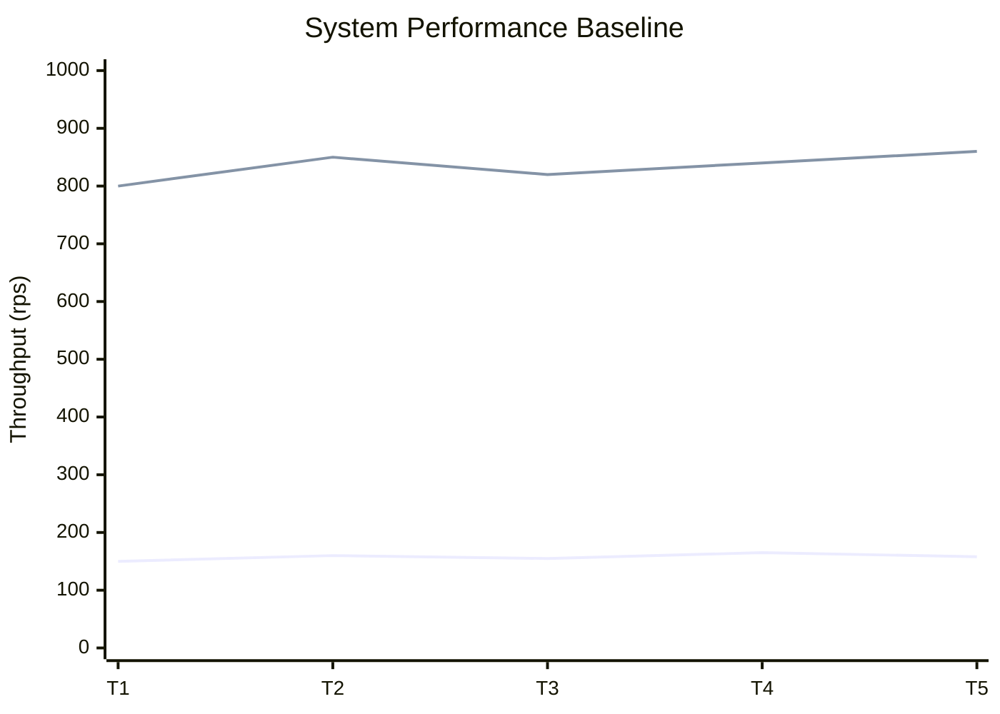

## 🔄 Rollback Strategy
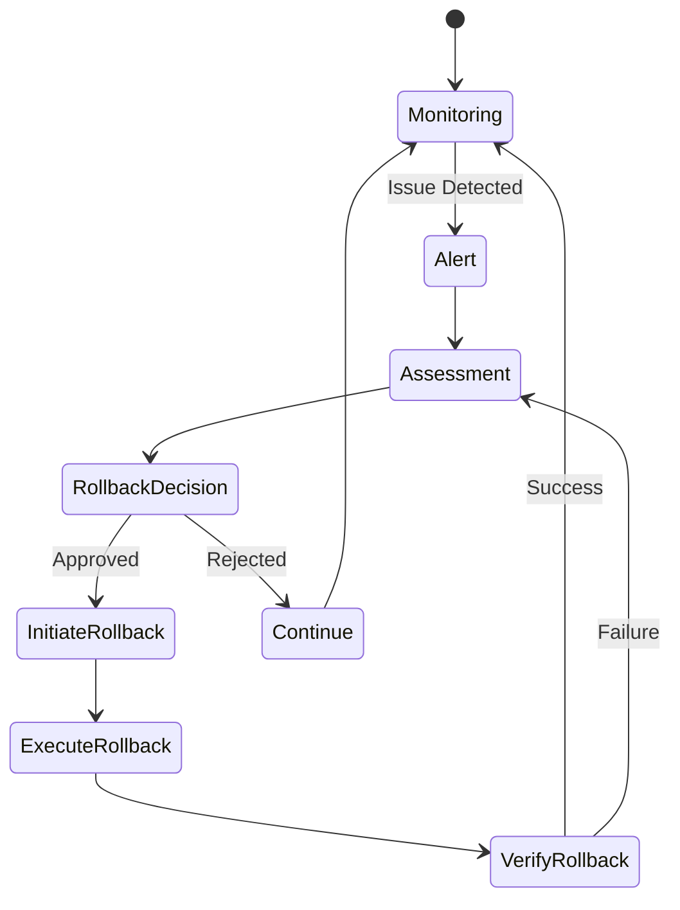

## 📋 Deployment Checklist
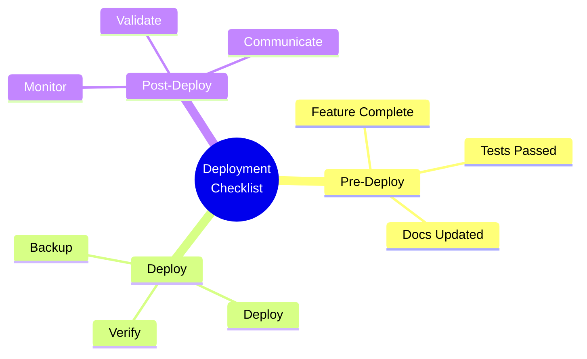

## 🔐 Security Gates
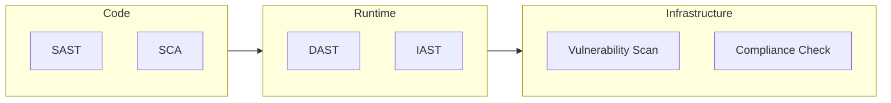

## Deployment Documentation

### 📋 Release Package
- Release Notes: [[release/notes|Release Notes]]
- Change Log: [[release/changelog|Change Log]]
- Known Issues: [[release/issues|Known Issues]]
- Dependencies: [[release/dependencies|Dependencies]]

### 🛠️ Environment Setup
- Infrastructure: [[env/infrastructure|Infrastructure Setup]]
- Configuration: [[env/config|Configuration Guide]]
- Secrets: [[env/secrets|Secrets Management]]
- Scaling: [[env/scaling|Scaling Guide]]

### 📊 Monitoring Setup
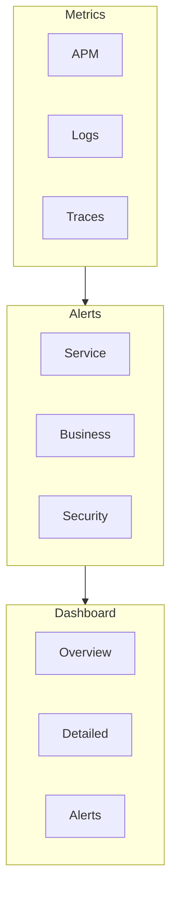

### 🔄 Rollback Procedures
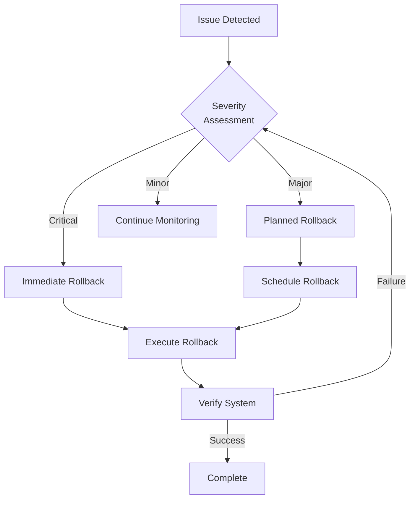

## Release Management

### 📈 Release Metrics
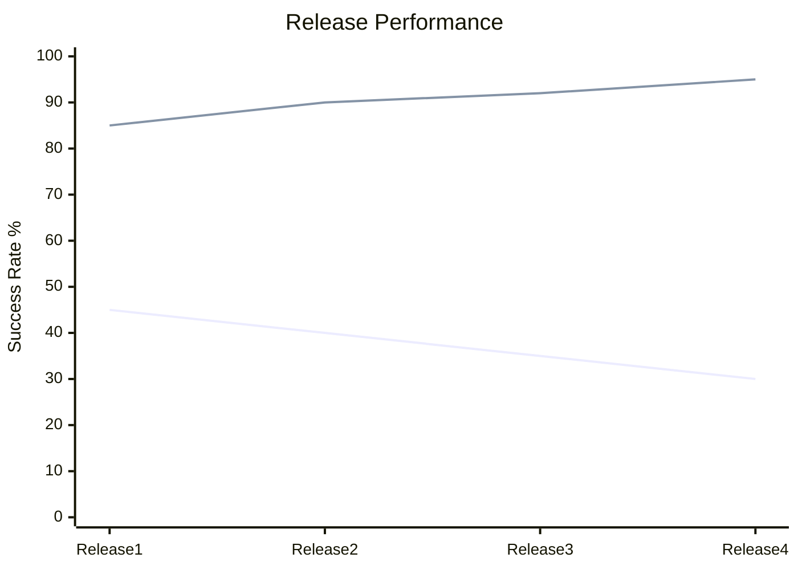

### 🎯 Release Impact
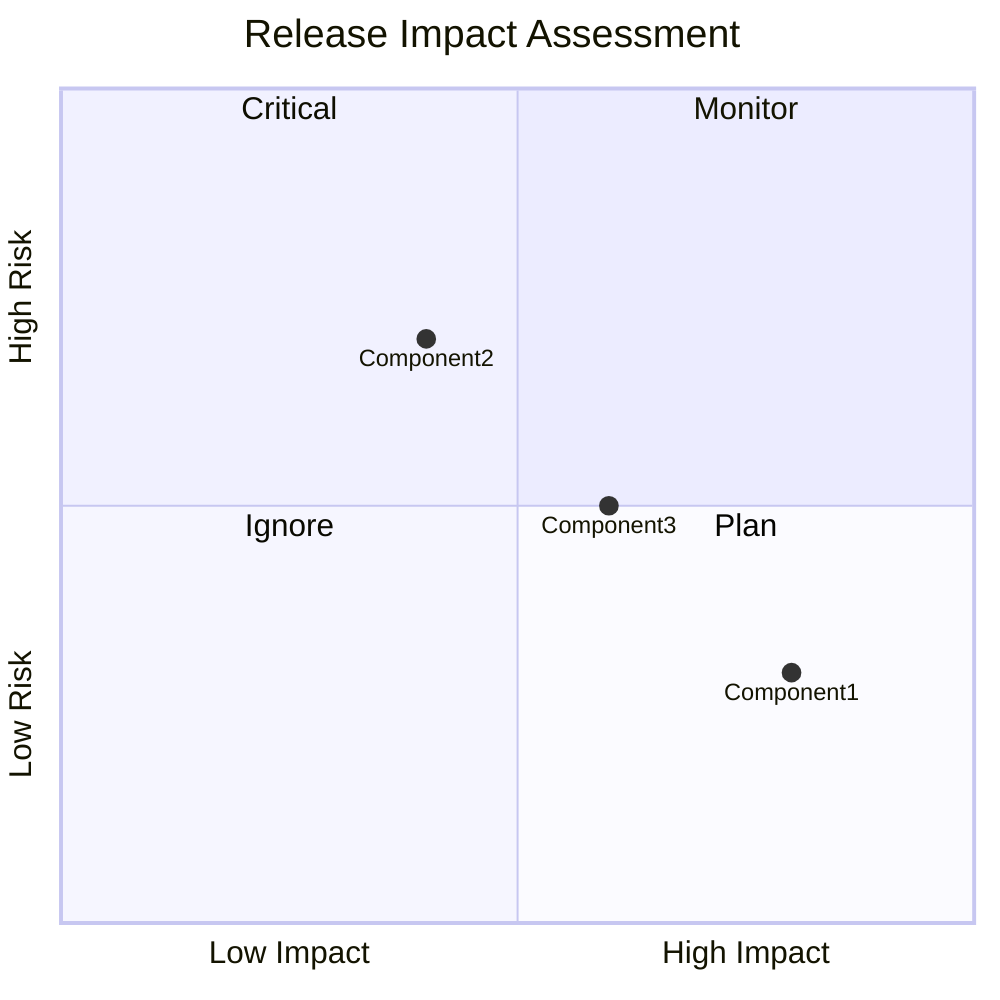

### 📊 Service Health
```mermaid
radar
    title "Service Health Metrics"
    variables
        Availability
        Response Time
        Error Rate
        CPU Usage
        Memory Usage
        Disk I/O
    data
        Current: 99.9, 95, 98, 85, 80, 90
        Target: 99.99, 99, 99, 90, 85, 95
```

## Post-Deployment

### 🔍 Verification Steps
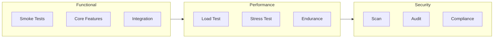

### 📈 Monitoring Dashboard
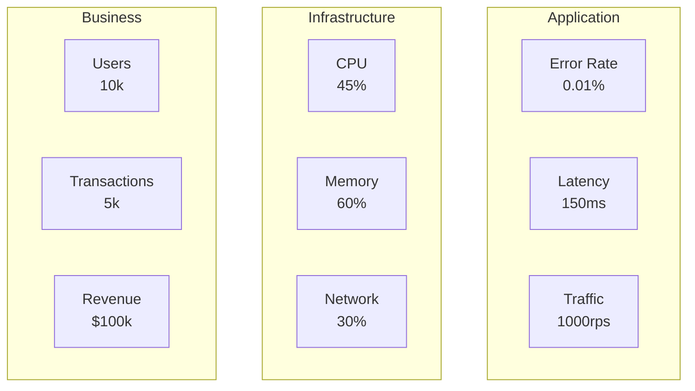

---
**Metadata**
- Template Version: 1.0
- Last Updated: [Date]
- Created By: [[people/creator|Creator]]
- Department: [[departments/ops|Operations]]

**Related Templates**
- [[templates/task|Task Template]]
- [[templates/project|Project Template]]
- [[templates/review|Review Template]] 