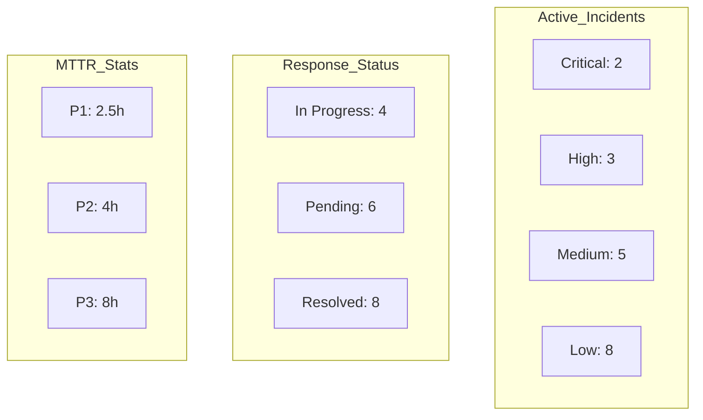
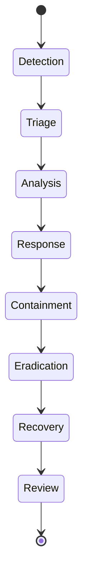
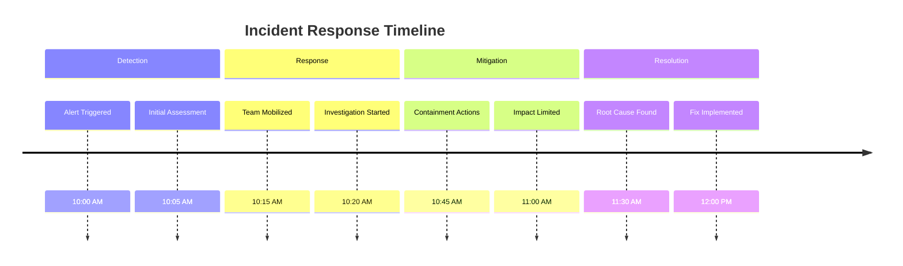
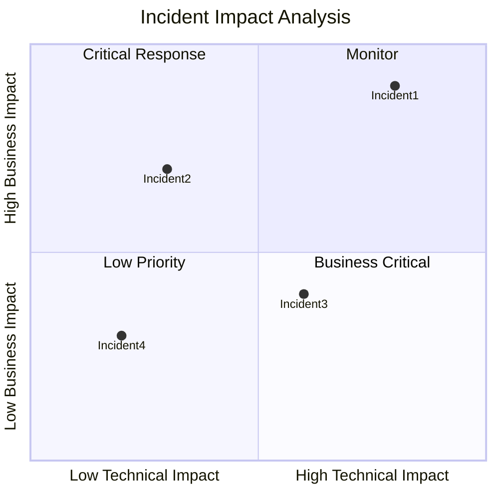
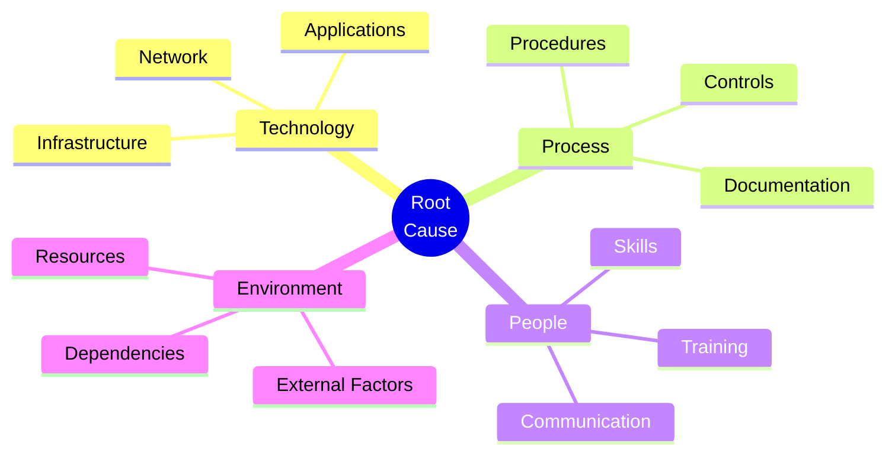
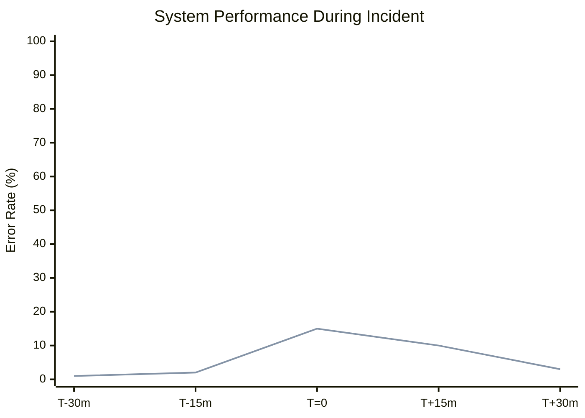
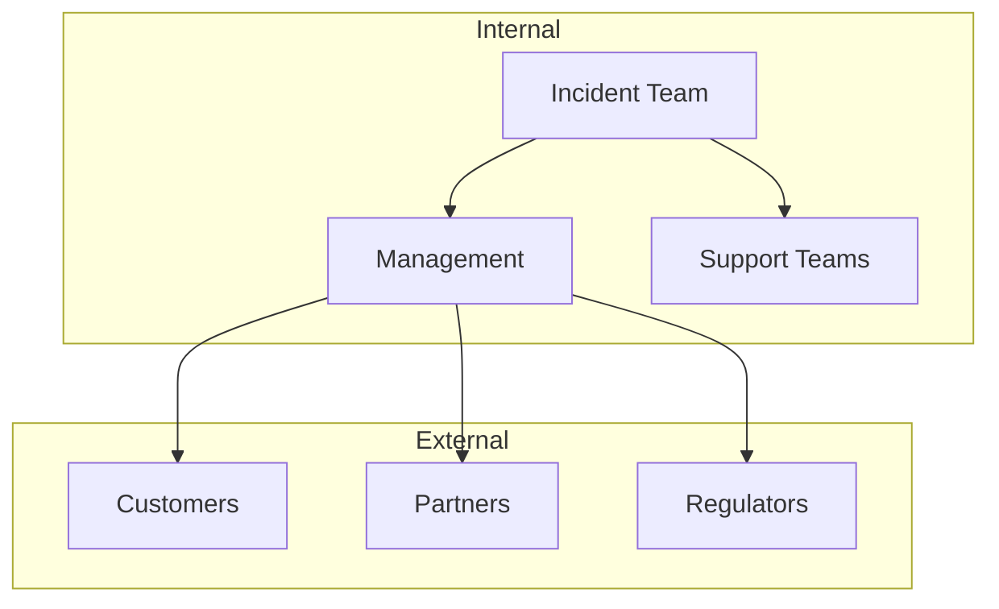
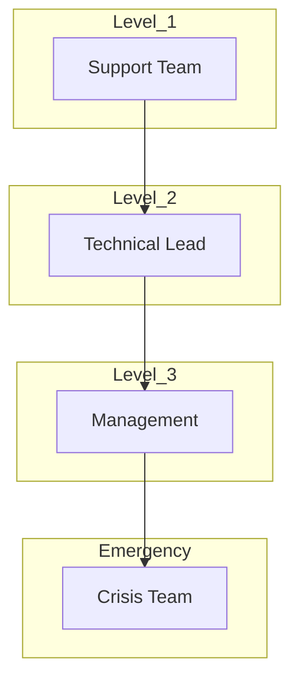
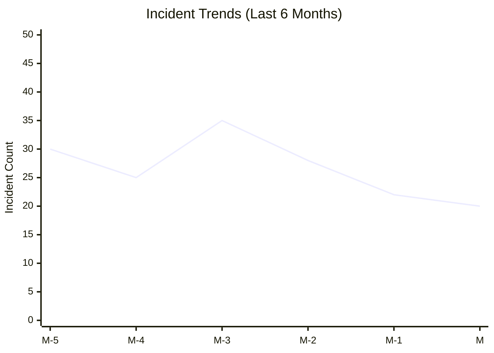

# 🚨 Incident Response & Management Template

## 📊 Incident Overview Dashboard


## 🔄 Incident Lifecycle


## ⏱️ Response Timeline


## 📈 Impact Assessment


## 🔍 Root Cause Analysis


## 📊 Performance Impact


## 🔄 Communication Flow


## 📈 Resource Allocation
```mermaid
sankey-beta
    First Response: 30
    Investigation: 25
    Mitigation: 20
    Recovery: 15
    Documentation: 10
    
    First Response -> Investigation: 20
    Investigation -> Mitigation: 15
    Mitigation -> Recovery: 12
    Recovery -> Documentation: 8
```

## 🎯 Escalation Matrix


## 📋 Incident Documentation

### Incident Details
- **ID**: INC-[YYYY]-[MM]-[XXX]
- **Status**: [Active/Resolved]
- **Priority**: [P1/P2/P3/P4]
- **Start Time**: [DateTime]
- **End Time**: [DateTime]
- **Duration**: [Time]

### Impact Analysis
- **Affected Systems**:
  - System 1
  - System 2
- **Affected Users**:
  - Count:
  - Categories:
- **Business Impact**:
  - Financial:
  - Operational:
  - Reputational:

### Response Strategy
1. **Initial Response**:
   - Actions taken:
   - Resources allocated:
   - Timeline:

2. **Investigation**:
   - Methods used:
   - Findings:
   - Evidence collected:

3. **Mitigation Steps**:
   - Actions implemented:
   - Effectiveness:
   - Side effects:

### Investigation Checklist
- [ ] Initial assessment completed
- [ ] Evidence collected
- [ ] Systems analyzed
- [ ] Root cause identified
- [ ] Impact assessed
- [ ] Mitigation implemented
- [ ] Recovery verified
- [ ] Documentation completed

### Recovery Metrics
- Time to Detect:
- Time to Respond:
- Time to Resolve:
- Time to Recover:

## 📈 Post-Incident Analysis

### Lessons Learned
1. What went well:
   - 
2. What could be improved:
   - 
3. Action items:
   - 

### Prevention Measures
1. Technical Controls:
   - 
2. Process Improvements:
   - 
3. Training Requirements:
   - 

### Trend Analysis


---
*Template Version: 1.0*
*Last Updated: [Date]*
*Created By: [Name]*
*Related Templates: Deployment Template, SOP Template* 