# Review & Testing Template

## 📊 Quality Dashboard
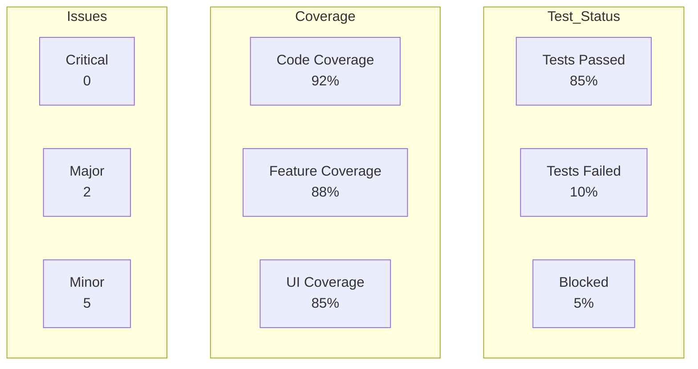

## 🔍 Test Coverage Map
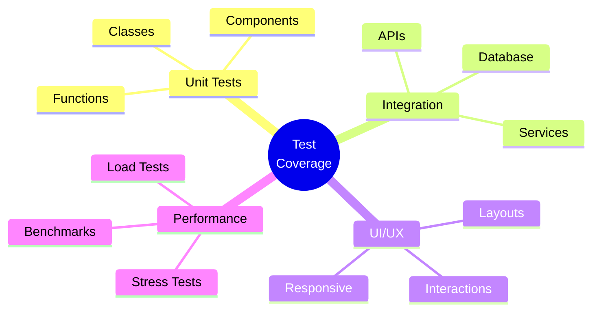

## 📈 Test Execution Progress
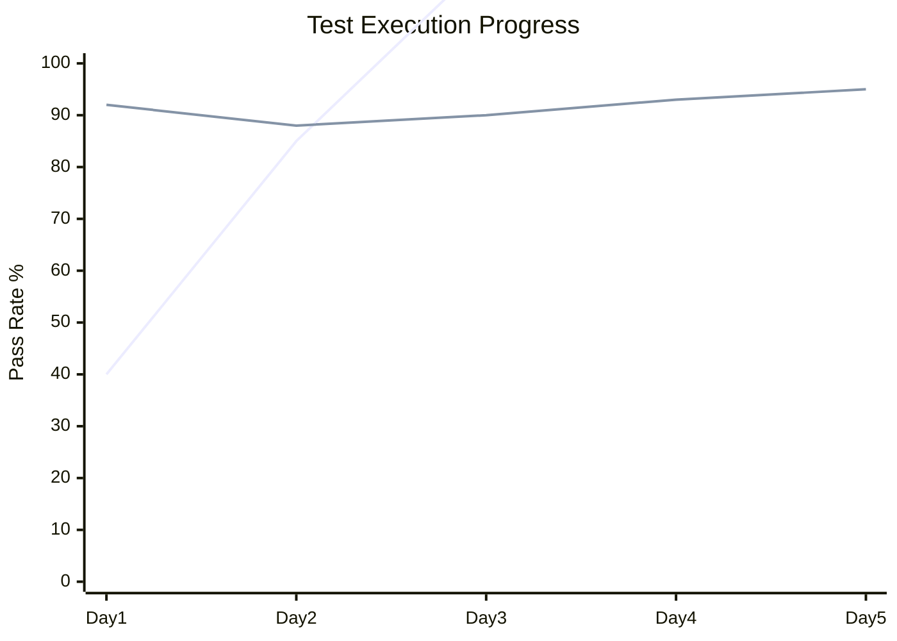

## 🎯 Test Case Priority
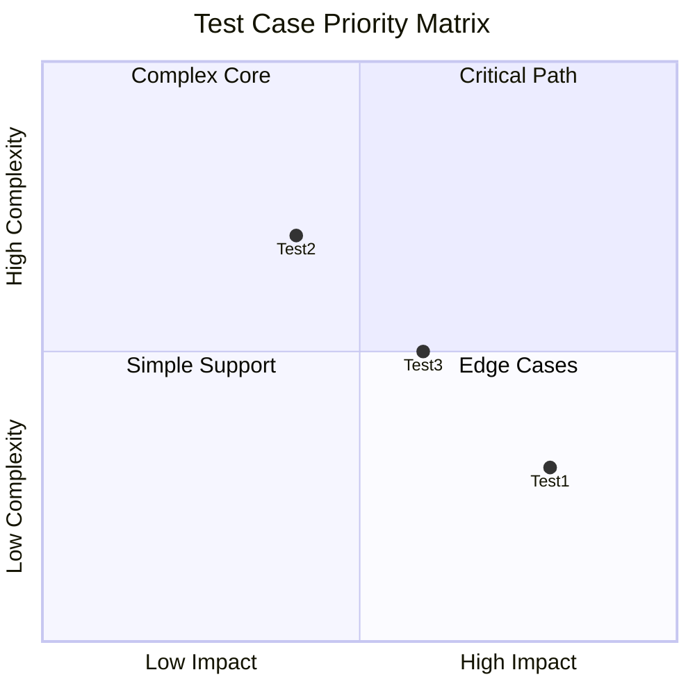

## 🔄 Test Workflow
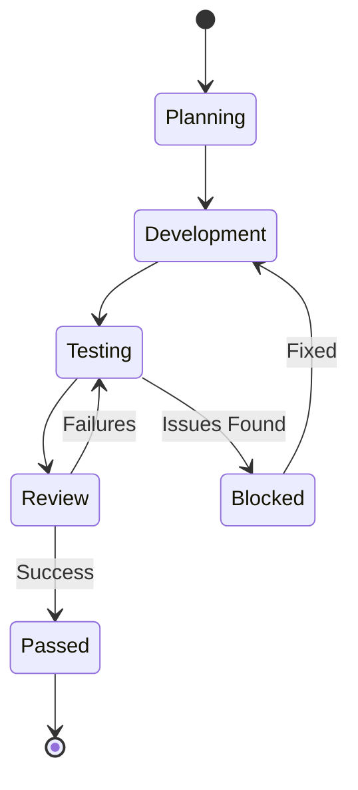

## 📋 Test Suite Structure
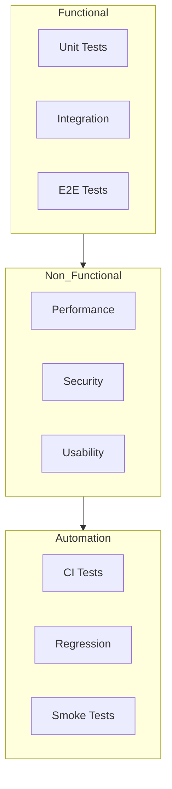

## ⚡ Performance Metrics
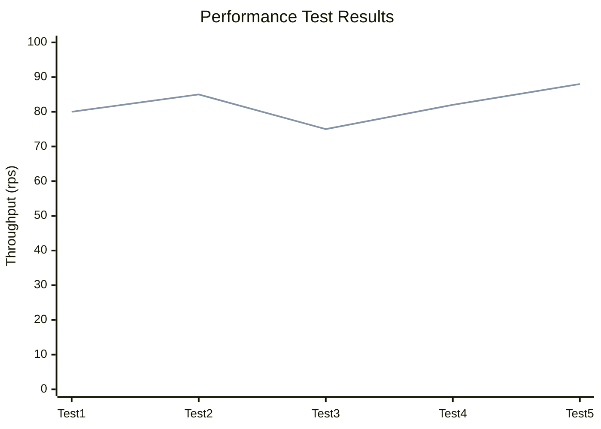

## 🔍 Code Review Flow
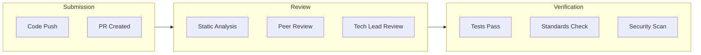

## Review & Testing Documentation

### 📋 Test Plan
- Test Strategy: [[testing/strategy|Test Strategy]]
- Test Scope: [[testing/scope|Test Scope]]
- Test Environment: [[testing/environment|Environment Setup]]
- Test Schedule: [[testing/schedule|Test Timeline]]

### 🎯 Test Cases
- Functional Tests: [[tests/functional|Functional Test Cases]]
- Integration Tests: [[tests/integration|Integration Test Cases]]
- Performance Tests: [[tests/performance|Performance Test Cases]]
- Security Tests: [[tests/security|Security Test Cases]]

### 🔍 Review Checklist
- Code Standards: [[review/standards|Coding Standards]]
- Best Practices: [[review/practices|Best Practices]]
- Security Review: [[review/security|Security Checklist]]
- Performance Review: [[review/performance|Performance Checklist]]

### 📊 Test Results
- Test Reports: [[results/test_reports|Test Reports]]
- Coverage Reports: [[results/coverage|Coverage Reports]]
- Performance Reports: [[results/performance|Performance Reports]]
- Issue Reports: [[results/issues|Issue Reports]]

### 🐛 Defect Tracking
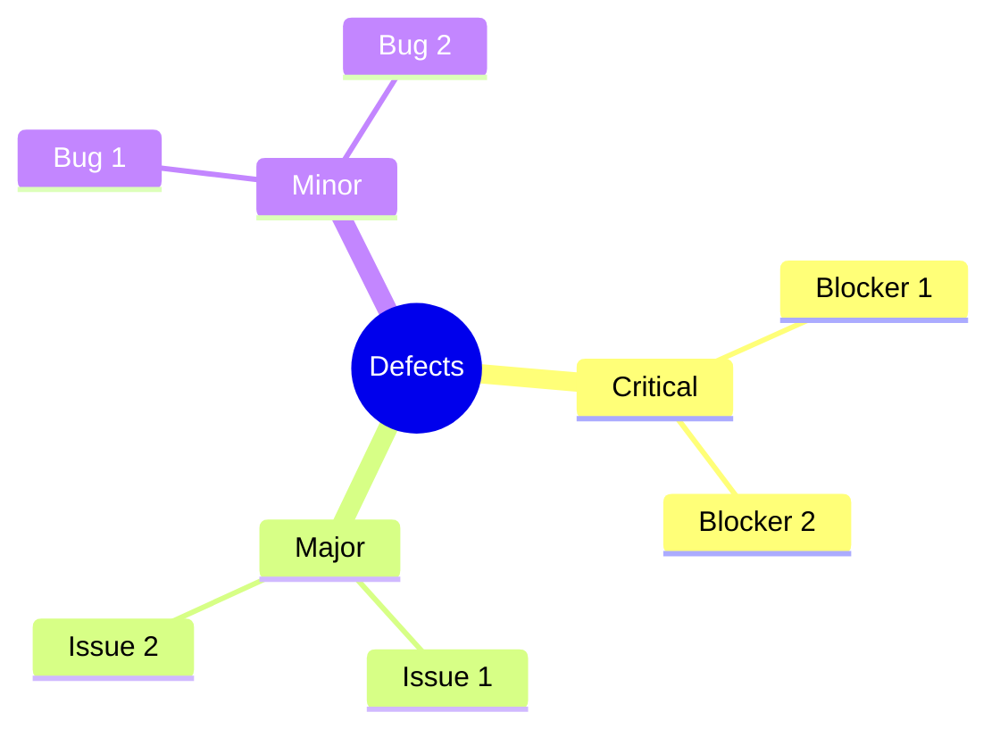

### 📈 Quality Metrics
```mermaid
radar
    title "Quality Metrics"
    variables
        Code Coverage
        Test Coverage
        Performance
        Security
        Usability
        Reliability
    data
        Current: 92, 88, 85, 90, 87, 89
        Target: 95, 90, 90, 95, 90, 92
```

## Test Automation

### 🤖 Automation Framework
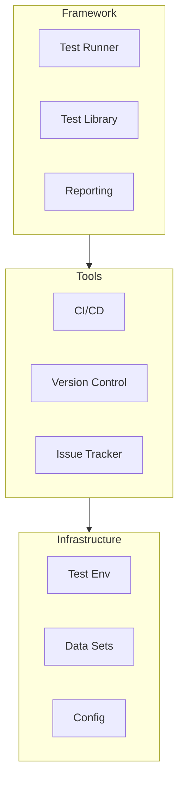

### 📊 Automation Coverage
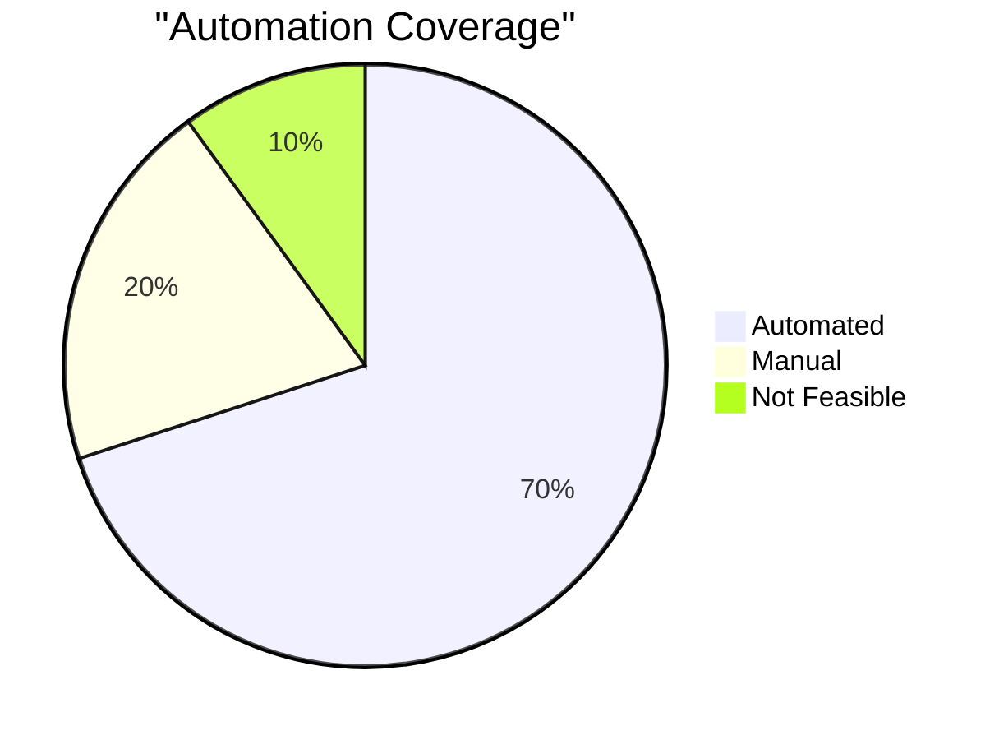

### 🔄 CI/CD Pipeline
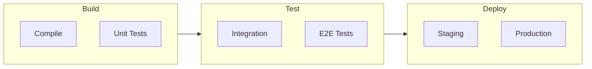

## Review & Testing Metrics

### 📈 Quality Trends
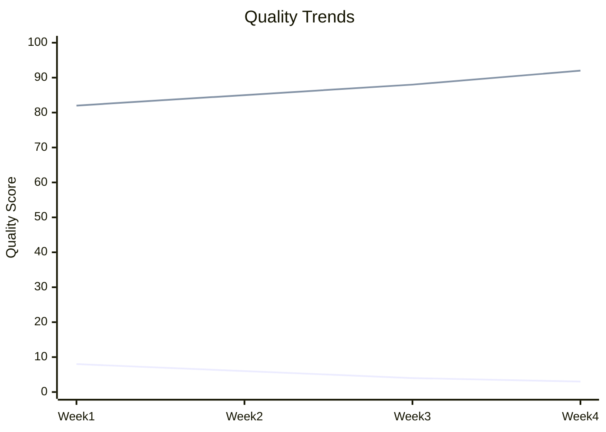

### 🎯 Test Effectiveness
```mermaid
radar
    title "Test Effectiveness"
    variables
        Defect Detection
        Coverage
        Automation
        Performance
        Reliability
        Maintainability
    data
        Current: 85, 88, 75, 82, 80, 78
        Target: 90, 90, 85, 85, 85, 85
```

---
**Metadata**
- Template Version: 1.0
- Last Updated: [Date]
- Created By: [[people/creator|Creator]]
- Department: [[departments/qa|QA Department]]

**Related Templates**
- [[templates/task|Task Template]]
- [[templates/project|Project Template]]
- [[templates/deployment|Deployment Template]] 