# Task & Project Completion Template

## 📊 Task Status Dashboard
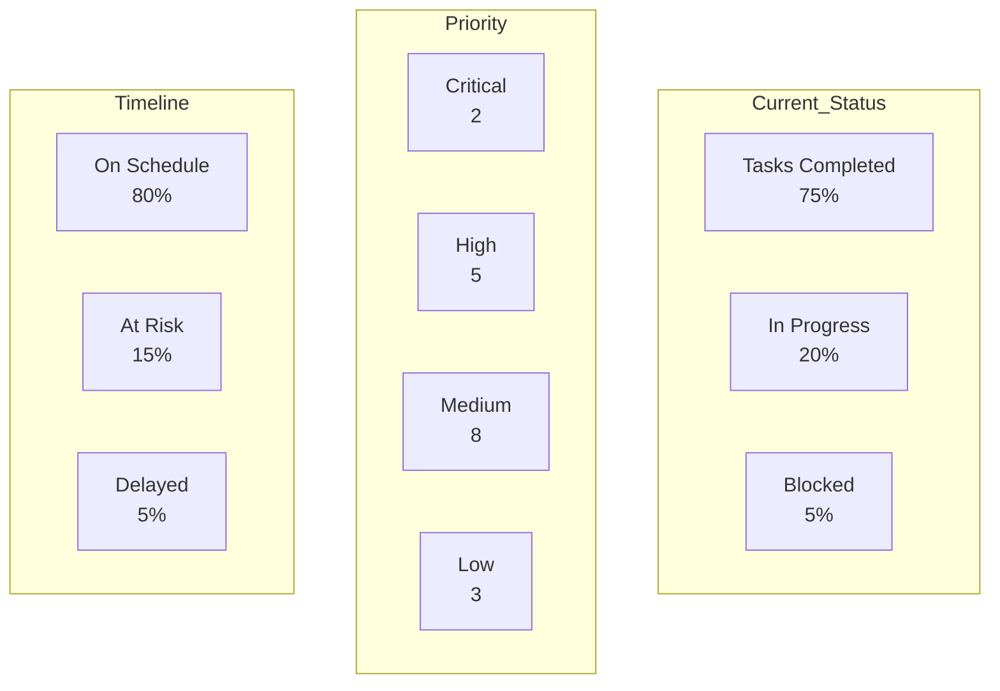

## 📈 Completion Progress
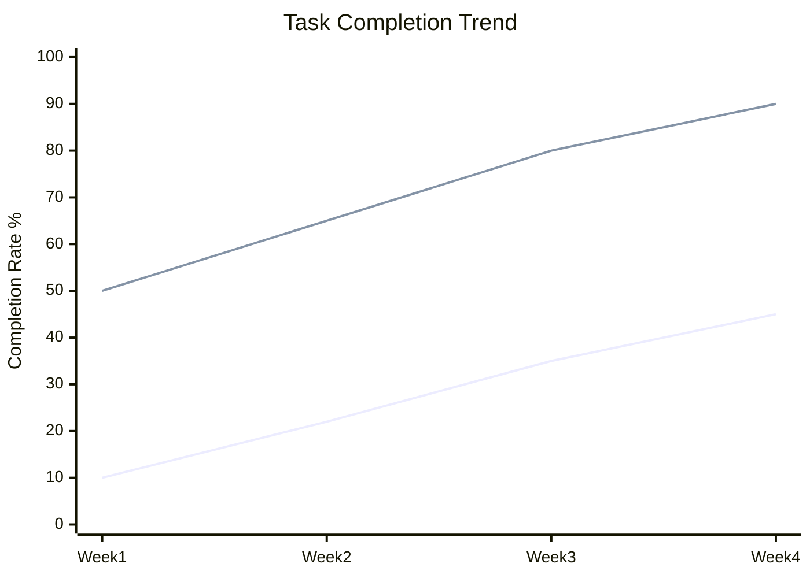

## 🎯 Task Dependencies
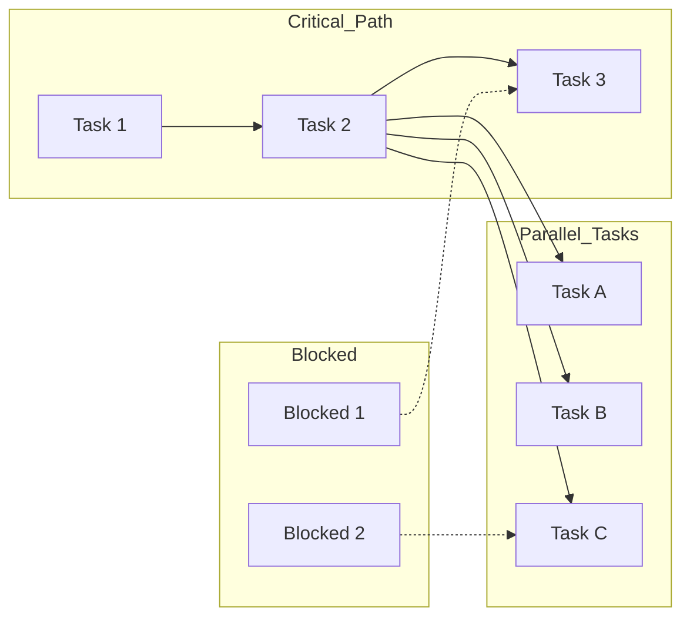

## 📋 Task Breakdown Structure
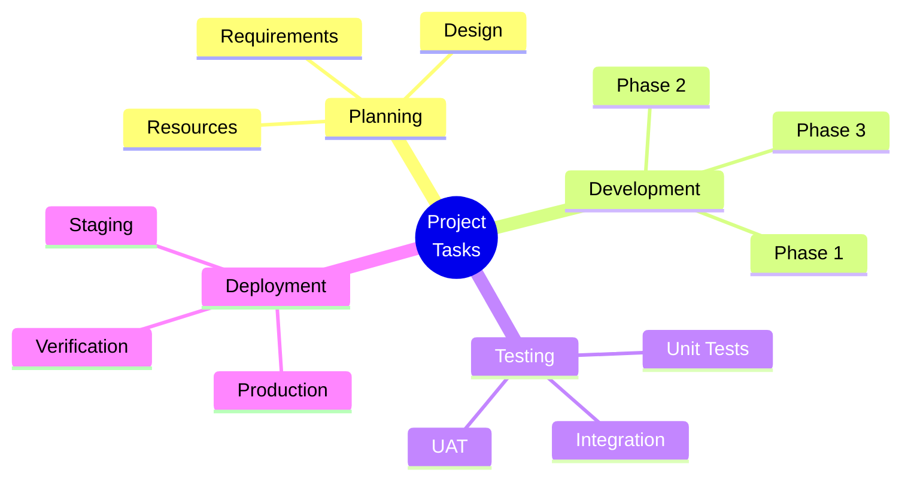

## ⏱️ Task Timeline
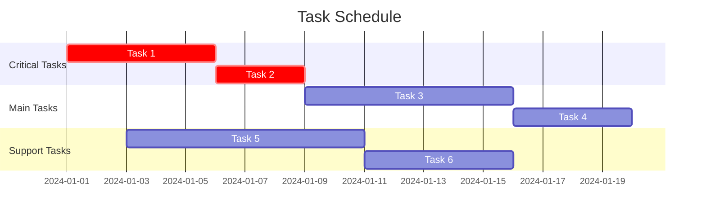

## 🔄 Task Flow
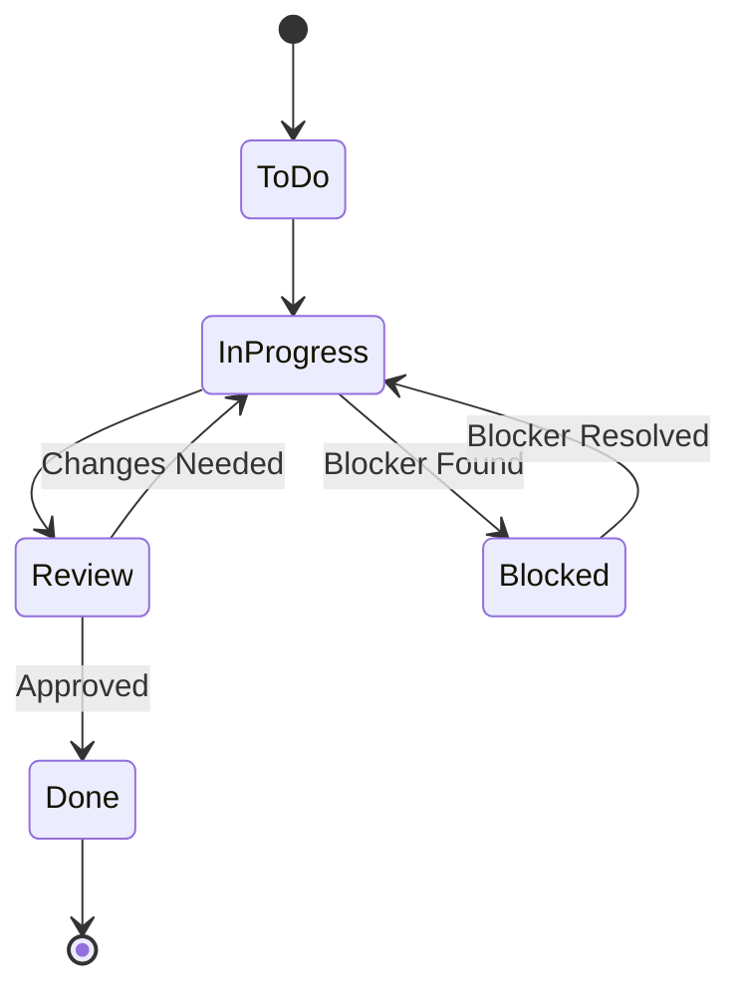

## 📊 Resource Allocation
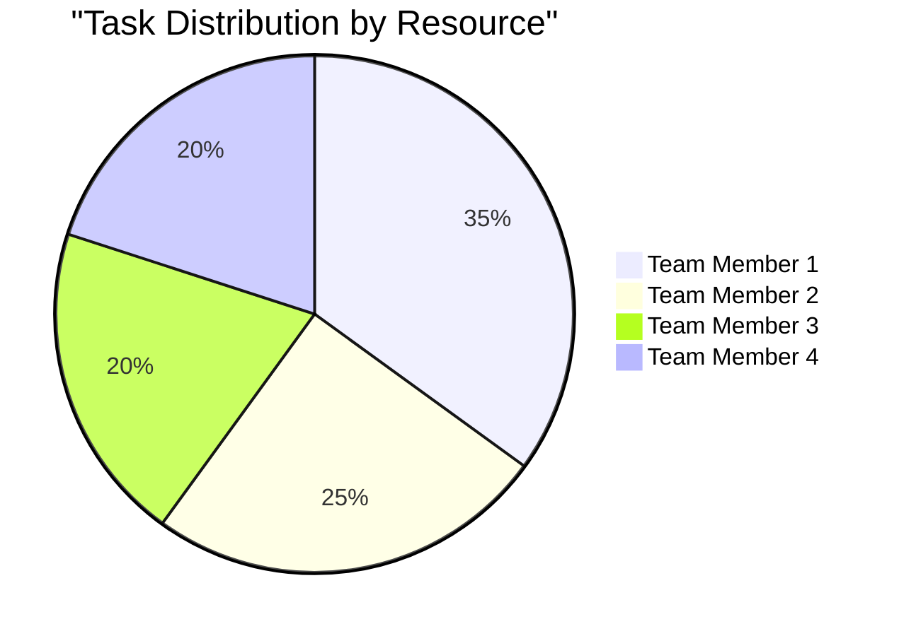

## 🎯 Task Priority Matrix
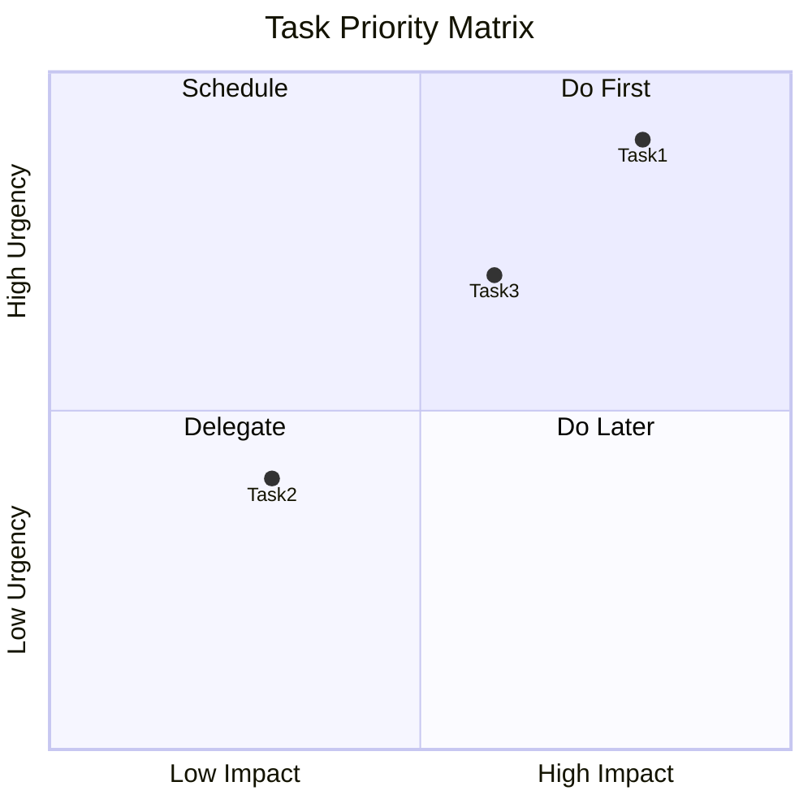

## 📈 Velocity Tracking
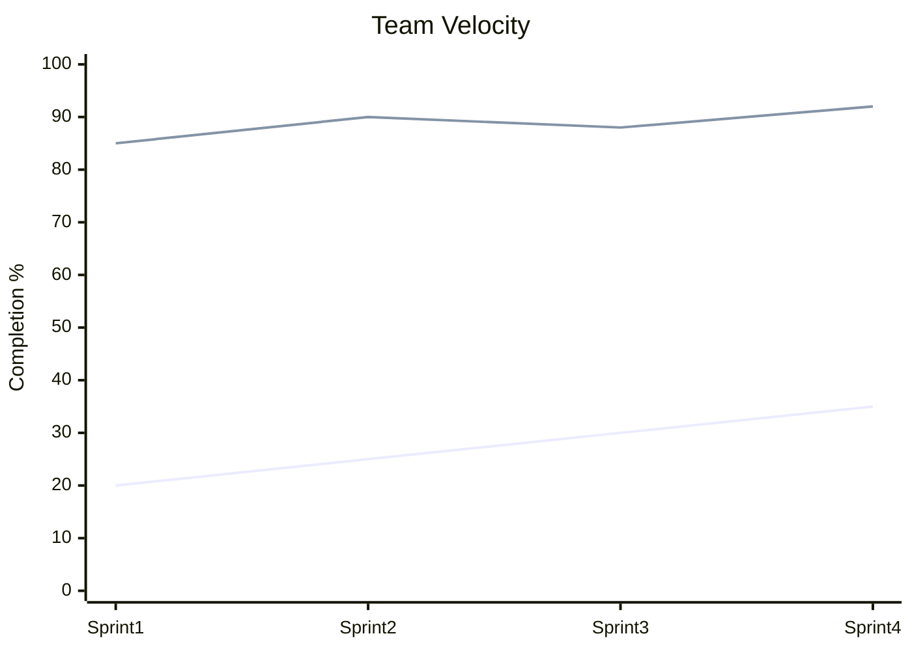

## 🔍 Quality Gates
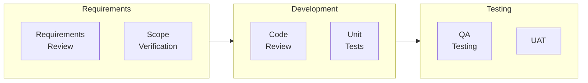

## Task Documentation

### 📋 Task Details
- Task ID: [ID]
- Title: [Task Title]
- Description: [[tasks/description|Detailed Description]]
- Priority: [High/Medium/Low]
- Status: [To Do/In Progress/Review/Done]
- Due Date: [Date]
- Assigned To: [[people/assignee|Assignee]]

### 📊 Task Requirements
- Business Requirements: [[requirements/business|Business Specs]]
- Technical Requirements: [[requirements/technical|Tech Specs]]
- Acceptance Criteria: [[requirements/acceptance|Acceptance Criteria]]
- Dependencies: [[requirements/dependencies|Dependencies List]]

### 🛠️ Implementation Details
- Technical Design: [[implementation/design|Design Doc]]
- Architecture: [[implementation/architecture|Architecture]]
- Code Changes: [[implementation/code|Code Changes]]
- Test Cases: [[implementation/tests|Test Suite]]

### 🔍 Quality Assurance
- Test Plan: [[qa/test_plan|Test Plan]]
- Test Results: [[qa/results|Test Results]]
- Code Review: [[qa/code_review|Review Notes]]
- Performance Tests: [[qa/performance|Performance Results]]

### 📝 Documentation
- User Guide: [[docs/user_guide|User Documentation]]
- Technical Doc: [[docs/technical|Technical Documentation]]
- Release Notes: [[docs/release|Release Notes]]
- Known Issues: [[docs/issues|Issues List]]

### ✅ Completion Checklist
- Requirements Review: [[checklist/requirements|Requirements Sign-off]]
- Code Review: [[checklist/code|Code Review Sign-off]]
- Testing: [[checklist/testing|Testing Sign-off]]
- Documentation: [[checklist/docs|Documentation Sign-off]]
- Deployment: [[checklist/deployment|Deployment Sign-off]]

## Task Tracking

### 📈 Progress Updates
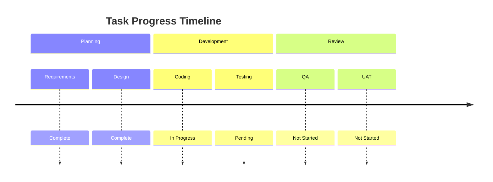

### 🚧 Blockers & Issues
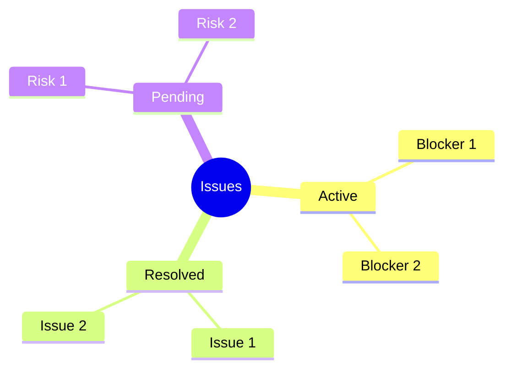

### 📊 Metrics Dashboard
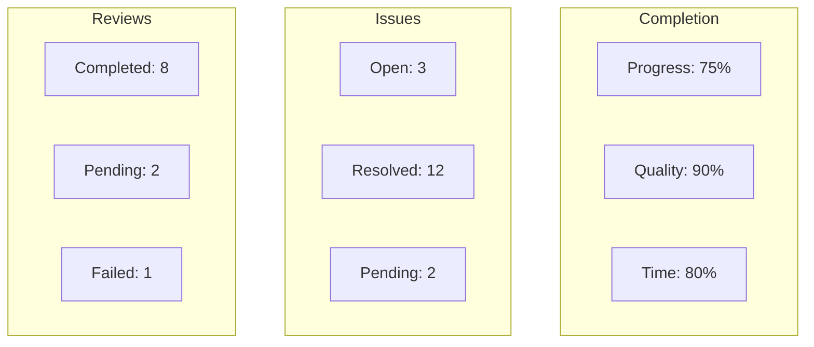

---
**Metadata**
- Template Version: 1.0
- Last Updated: [Date]
- Created By: [[people/creator|Creator]]
- Department: [[departments/dept|Department]]

**Related Templates**
- [[templates/project|Project Template]]
- [[templates/review|Review Template]]
- [[templates/testing|Testing Template]] 