# [Unit Name]

## Overview Dashboard
```mermaid
graph TB
    subgraph Status_Overview
    S1[Unit Status<br>[Status]]
    S2[Compliance<br>Rate: X%]
    S3[Risk Level<br>[Level]]
    end
    
    subgraph Key_Metrics
    M1[KPI 1<br>Value]
    M2[KPI 2<br>Value]
    end
    
    S1 --- M1
    S2 --- M2
    S3 --- M1
```

## Overview
**Unit Type**: [Executive/Advisory/Operational/Support]
**Reports To**: [[relevant_superior_unit]]
**Last Updated**: <% tp.date.now("YYYY-MM-DD") %>
**Status**: [Active/In Development/Under Review]

## Core Purpose
[One paragraph describing the unit's primary purpose and mission]

## Strategic Alignment
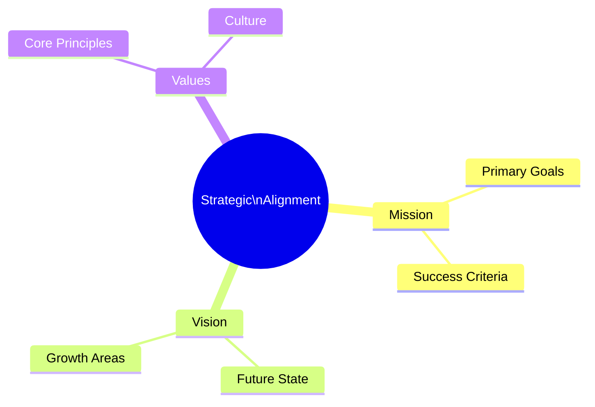

## Organizational Structure
### Leadership
- **Unit Head**: [[people/unit_head|Unit Head]]
- **Deputy**: [[people/deputy|Deputy]]
- **Key Leaders**: 
  - [[people/leader1|Leader 1]]
  - [[people/leader2|Leader 2]]

```mermaid
orgChart
    direction TB
    unitHead["Unit Head"]
    deputy["Deputy"]
    leader1["Leader 1"]
    leader2["Leader 2"]
    team1["Team 1"]
    team2["Team 2"]
    
    unitHead --> deputy
    deputy --> leader1
    deputy --> leader2
    leader1 --> team1
    leader2 --> team2
```

### Sub-Units
- [[sub_units/sub_unit_1|Sub Unit 1]] - [Brief description]
- [[sub_units/sub_unit_2|Sub Unit 2]] - [Brief description]
- [[sub_units/sub_unit_3|Sub Unit 3]] - [Brief description]

## Capability Matrix
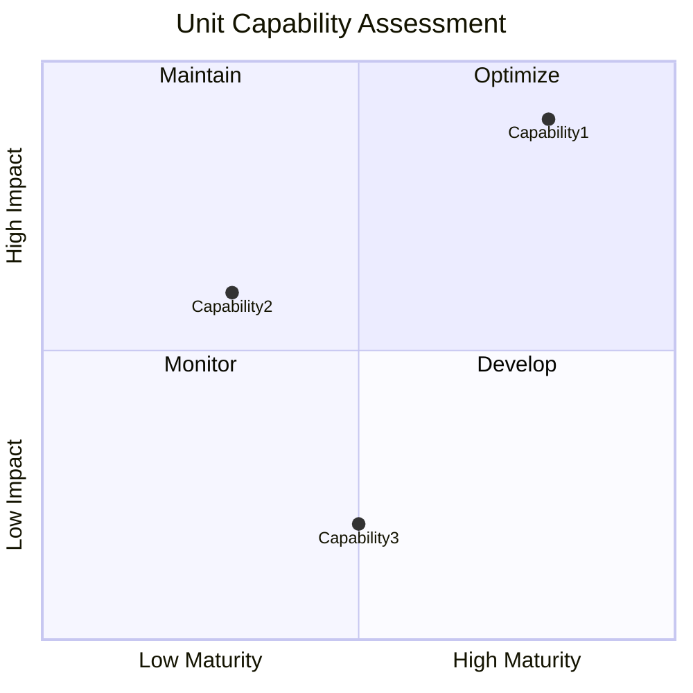

## Resource Utilization
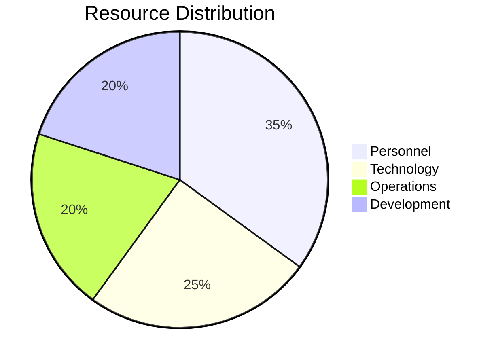

## Decision Flow
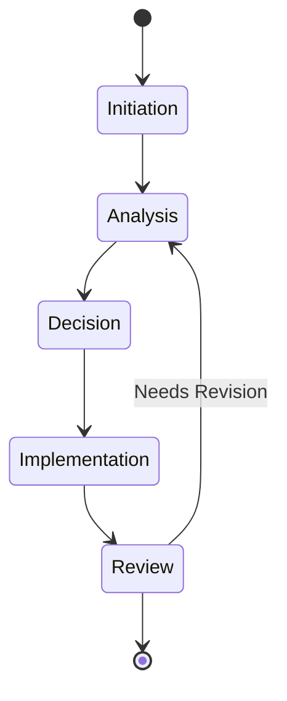

## Process Flow
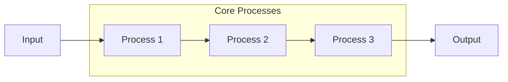

### Core Processes
1. [[processes/process_1|Process 1]] - [Brief description]
2. [[processes/process_2|Process 2]] - [Brief description]
3. [[processes/process_3|Process 3]] - [Brief description]

### Support Processes
1. [[processes/support_process_1|Support Process 1]] - [Brief description]
2. [[processes/support_process_2|Support Process 2]] - [Brief description]

## Communication Channels
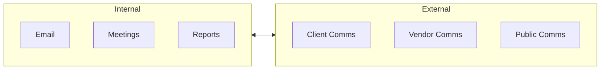

## Budget Allocation
```mermaid
sankey-beta
    Personnel [35] -> Operations [20]
    Personnel [35] -> Development [15]
    Technology [25] -> Operations [15]
    Technology [25] -> Development [10]
    Operations [35] -> Maintenance [20]
    Operations [35] -> Support [15]
    Development [25] -> Projects [15]
    Development [25] -> Innovation [10]
```

## Interface Map
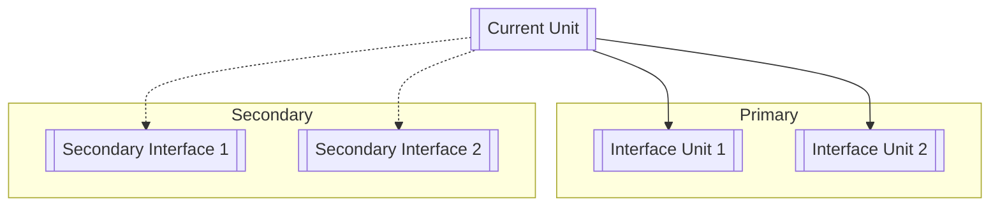

### Primary Interfaces
- [[units/interface_unit_1|Interface Unit 1]] - [Nature of interaction]
- [[units/interface_unit_2|Interface Unit 2]] - [Nature of interaction]

### Secondary Interfaces
- [[units/secondary_interface_1|Secondary Interface 1]] - [Nature of interaction]
- [[units/secondary_interface_2|Secondary Interface 2]] - [Nature of interaction]

## Systems Architecture
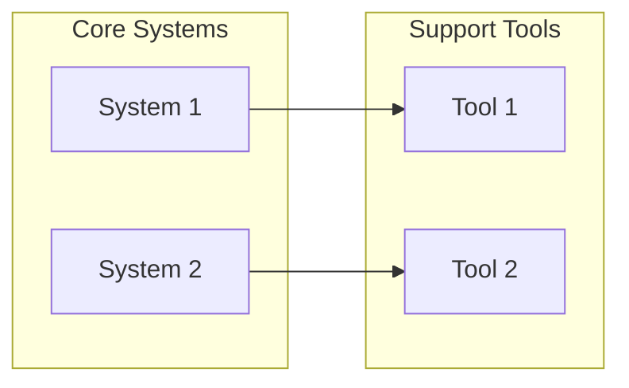

### Core Systems
- [[systems/system_1|System 1]] - [Purpose]
- [[systems/system_2|System 2]] - [Purpose]

### Support Tools
- [[tools/tool_1|Tool 1]] - [Purpose]
- [[tools/tool_2|Tool 2]] - [Purpose]

## Documentation Map
```mermaid
mindmap
    root((Unit Docs))
        Policies
            [[policies/policy_1]]
            [[policies/policy_2]]
        Procedures
            [[procedures/procedure_1]]
            [[procedures/procedure_2]]
        Frameworks
            [[frameworks/framework_1]]
            [[frameworks/framework_2]]
```

## Performance Metrics
### KPI Dashboard
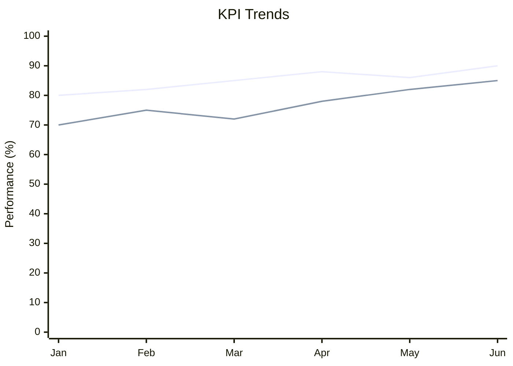

### Key Performance Indicators (KPIs)
1. [KPI 1]
   - Target: [Target value]
   - Measurement: [Measurement method]
2. [KPI 2]
   - Target: [Target value]
   - Measurement: [Measurement method]

### Success Metrics
1. [Success Metric 1]
2. [Success Metric 2]

## Risk Management
### Key Risks
1. [[risks/risk_1|Risk 1]]
   - Impact: [High/Medium/Low]
   - Mitigation: [Mitigation strategy]
2. [[risks/risk_2|Risk 2]]
   - Impact: [High/Medium/Low]
   - Mitigation: [Mitigation strategy]

### Controls
1. [Control 1] - [Purpose]
2. [Control 2] - [Purpose]

## Innovation and Improvement
### Current Initiatives
1. [[initiative_1]] - [Brief description]
2. [[initiative_2]] - [Brief description]

### Planned Improvements
1. [Improvement 1] - [Expected impact]
2. [Improvement 2] - [Expected impact]

## Resources
### Knowledge Base
- [[knowledge_base_1]] - [Content description]
- [[knowledge_base_2]] - [Content description]

### Training Materials
- [[training_1]] - [Content description]
- [[training_2]] - [Content description]

## Compliance Requirements
### Regulatory Requirements
1. [Requirement 1] - [Brief description]
2. [Requirement 2] - [Brief description]

### Internal Standards
1. [Standard 1] - [Brief description]
2. [Standard 2] - [Brief description]

## Change Management
### Version History
| Version | Date | Changes | Author |
|---------|------|---------|---------|
| 1.0 | YYYY-MM-DD | Initial version | [Author] |

### Scheduled Reviews
- Next Review Date: [YYYY-MM-DD]
- Review Frequency: [Quarterly/Bi-annual/Annual]

## Related Links
### Internal Links
- [[related_link_1]] - [Relationship description]
- [[related_link_2]] - [Relationship description]

### External References
- [Reference 1]
- [Reference 2]

## Risk Assessment Matrix
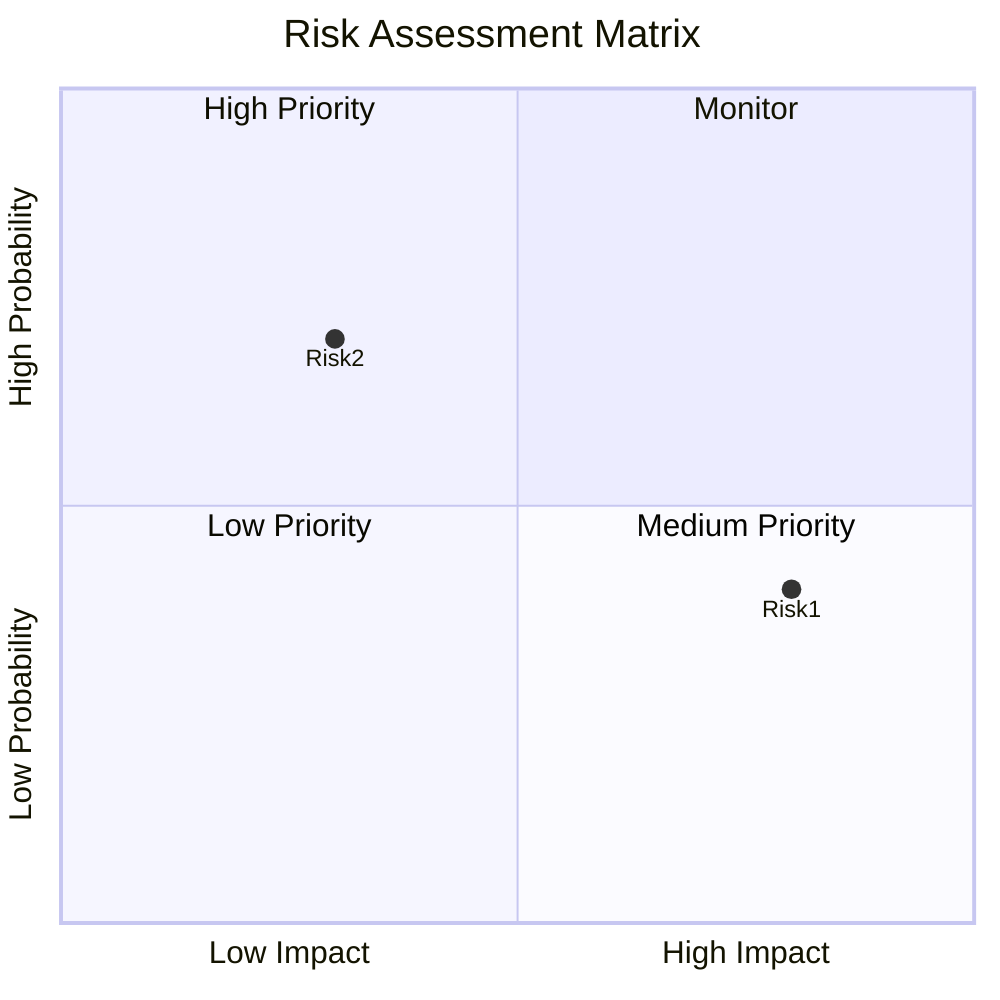

## Innovation Timeline
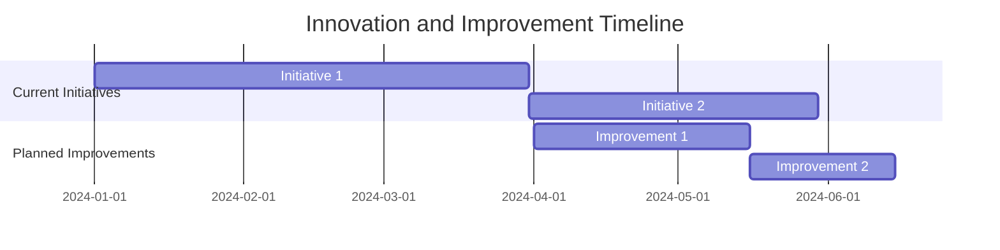

## Risk Assessment
### Risk Trend Analysis
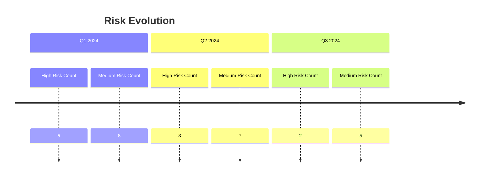

## Compliance Tracking
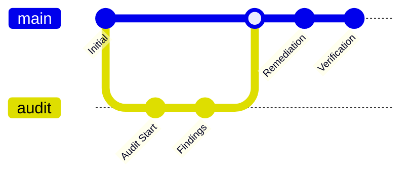

## Innovation Pipeline
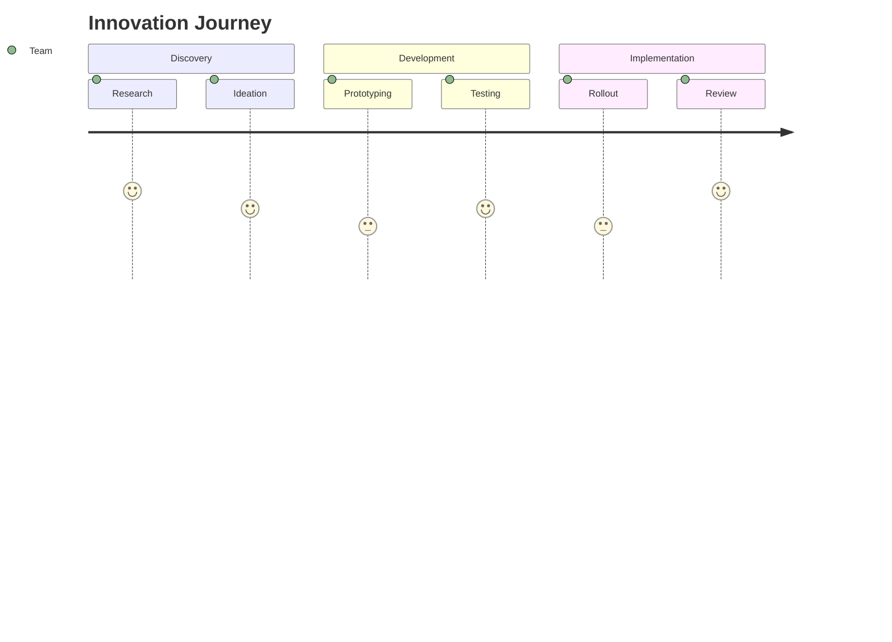

## Dependencies Map
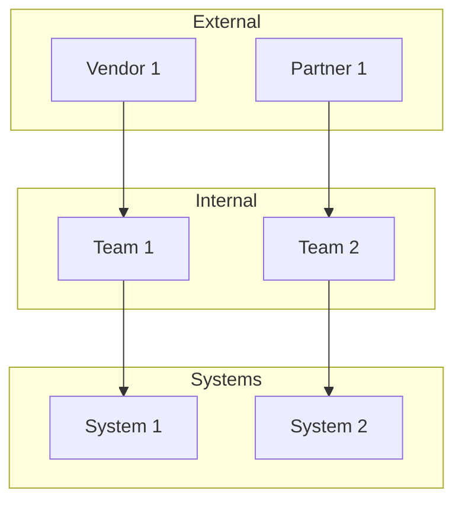

## Operational Health
```mermaid
radar
    title "Operational Health Metrics"
    variables
        Performance
        Quality
        Efficiency
        Innovation
        Compliance
    data
        Current: 85, 90, 75, 80, 95
        Target: 90, 95, 85, 85, 100
```

## 📊 Resource Optimization
```mermaid
sankey-beta
    Budget [100] -> Personnel [40]
    Budget [100] -> Technology [30]
    Budget [100] -> Operations [30]
    Personnel [40] -> Training [15]
    Personnel [40] -> Development [25]
    Technology [30] -> Infrastructure [20]
    Technology [30] -> Tools [10]
    Operations [30] -> Maintenance [20]
    Operations [30] -> Support [10]
```

## 🎯 Strategic Initiatives
```mermaid
timeline
    title Strategic Roadmap
    section Q1 2024
        Initiative 1 : Planning
        Initiative 2 : Research
    section Q2 2024
        Initiative 1 : Development
        Initiative 2 : Testing
    section Q3 2024
        Initiative 1 : Implementation
        Initiative 2 : Deployment
    section Q4 2024
        Initiative 1 : Review
        Initiative 2 : Optimization
```

## 🔄 Process Maturity
```mermaid
radar
    title "Process Maturity Assessment"
    variables
        Documentation
        Automation
        Monitoring
        Optimization
        Integration
        Compliance
    data
        Current: 85, 75, 80, 70, 85, 90
        Target: 90, 85, 85, 80, 90, 95
```

## 📈 Performance Trends
```mermaid
xychart-beta
    title "Unit Performance Metrics"
    x-axis [Jan, Feb, Mar, Apr, May, Jun]
    y-axis "Efficiency %" 0 --> 100
    y-axis "Output Units" 0 --> 1000
    line [85, 87, 90, 88, 92, 95]
    line [750, 800, 850, 820, 880, 900]
```

## 🔍 Quality Metrics
```mermaid
quadrantChart
    title Quality Assessment Matrix
    x-axis Low Impact --> High Impact
    y-axis Low Control --> High Control
    quadrant-1 Optimize
    quadrant-2 Maintain
    quadrant-3 Monitor
    quadrant-4 Improve
    Metric1: [0.8, 0.9]
    Metric2: [0.4, 0.6]
    Metric3: [0.7, 0.3]
```

## ⚡ Operational Efficiency
```mermaid
graph TB
    subgraph Inputs
    I1[Resources]
    I2[Requirements]
    I3[Data]
    end
    
    subgraph Processing
    P1[Analysis]
    P2[Execution]
    P3[Validation]
    end
    
    subgraph Outputs
    O1[Deliverables]
    O2[Reports]
    O3[Metrics]
    end
    
    Inputs --> Processing
    Processing --> Outputs
```

## 🔐 Risk Management
```mermaid
mindmap
    root((Risk<br>Management))
        Identification
            Risk Assessment
            Threat Analysis
            Vulnerability Scan
        Mitigation
            Controls
            Procedures
            Training
        Monitoring
            Alerts
            Reviews
            Audits
        Response
            Incident Plan
            Recovery
            Communication
```

## 📊 Stakeholder Analysis
```mermaid
quadrantChart
    title Stakeholder Matrix
    x-axis Low Interest --> High Interest
    y-axis Low Power --> High Power
    quadrant-1 Keep Satisfied
    quadrant-2 Manage Closely
    quadrant-3 Monitor
    quadrant-4 Keep Informed
    Stakeholder1: [0.9, 0.8]
    Stakeholder2: [0.3, 0.7]
    Stakeholder3: [0.6, 0.2]
```

## 🔄 Change Management
```mermaid
gitGraph
    commit id: "Initial State"
    branch change
    checkout change
    commit id: "Proposal"
    commit id: "Review"
    checkout main
    merge change
    commit id: "Implementation"
    commit id: "Validation"
```

## 📈 Value Stream
```mermaid
journey
    title Value Delivery Stream
    section Input
      Requirements: 5: Team
      Planning: 4: Team
    section Process
      Development: 3: Team
      Testing: 4: Team
    section Output
      Delivery: 3: Team
      Feedback: 5: Team
```

## 📊 Capacity Planning
```mermaid
xychart-beta
    title "Resource Capacity Forecast"
    x-axis [Q1, Q2, Q3, Q4]
    y-axis "Current Capacity %" 0 --> 100
    y-axis "Projected Need %" 0 --> 150
    line [75, 80, 85, 90]
    line [70, 85, 100, 120]
```

## 🔄 Knowledge Transfer
```mermaid
mindmap
    root((Knowledge<br>Management))
        Documentation
            SOPs
            Guidelines
            Best Practices
        Training
            Onboarding
            Skill Development
            Certification
        Resources
            Tools
            Templates
            References
        Expertise
            Subject Matter
            Technical
            Domain
```

## 🎯 Strategic Initiatives Map
```mermaid
graph TB
    subgraph Short_Term
    S1[Initiative 1]
    S2[Initiative 2]
    end
    
    subgraph Mid_Term
    M1[Project 1]
    M2[Project 2]
    end
    
    subgraph Long_Term
    L1[Strategy 1]
    L2[Strategy 2]
    end
    
    S1 & S2 --> M1 & M2
    M1 & M2 --> L1 & L2
```

## ⚡ Competency Matrix
```mermaid
radar
    title "Team Competency Assessment"
    variables
        Technical Skills
        Leadership
        Communication
        Problem Solving
        Innovation
        Collaboration
    data
        Current: 85, 75, 90, 80, 70, 85
        Required: 90, 85, 95, 85, 80, 90
```

## 📈 Quality Metrics Dashboard
```mermaid
graph TB
    subgraph Delivery
    D1[On-Time<br>95%]
    D2[Accuracy<br>98%]
    D3[Completeness<br>92%]
    end
    
    subgraph Performance
    P1[Efficiency<br>88%]
    P2[Productivity<br>90%]
    P3[Quality<br>95%]
    end
    
    subgraph Innovation
    I1[New Ideas<br>15]
    I2[Implementations<br>8]
    I3[Impact<br>High]
    end
```

## 🔍 Process Optimization
```mermaid
graph LR
    subgraph Current
    C1[Step 1]
    C2[Step 2]
    C3[Step 3]
    end
    
    subgraph Optimized
    O1[Step 1]
    O2[Combined Step]
    O3[Enhanced Step]
    end
    
    subgraph Benefits
    B1[Time -30%]
    B2[Cost -25%]
    B3[Quality +15%]
    end
    
    Current --> Optimized
    Optimized --> Benefits
```

## 🎯 Succession Planning
```mermaid
mindmap
    root((Succession<br>Planning))
        Leadership Roles
            Current Leaders
            Potential Successors
            Development Needs
        Critical Positions
            Key Roles
            Backup Personnel
            Training Requirements
        Development Plans
            Skills Gap
            Training Programs
            Mentorship
```

## ⚡ Innovation Pipeline
```mermaid
timeline
    title Innovation Projects Timeline
    section Research
        Market Analysis : Active
        Feasibility Study : Planned
    section Development
        Prototype 1 : In Progress
        Testing : Scheduled
    section Implementation
        Pilot Program : Q3 2024
        Full Rollout : Q4 2024
```

## 📊 Stakeholder Engagement Matrix
```mermaid
quadrantChart
    title Stakeholder Engagement Strategy
    x-axis Low Influence --> High Influence
    y-axis Low Interest --> High Interest
    quadrant-1 Keep Satisfied
    quadrant-2 Key Players
    quadrant-3 Monitor
    quadrant-4 Keep Informed
    Stakeholder1: [0.9, 0.8]
    Stakeholder2: [0.4, 0.3]
    Stakeholder3: [0.7, 0.6]
    Stakeholder4: [0.2, 0.9]
```

## 🔄 Change Impact Analysis
```mermaid
mindmap
    root((Change<br>Impact))
        People
            Skills Required
            Training Needs
            Role Changes
        Process
            Workflow Updates
            New Procedures
            Documentation
        Technology
            System Updates
            Tool Changes
            Integration
        Organization
            Structure
            Reporting Lines
            Communication
```

---
**Metadata**
- Created: <% tp.date.now("YYYY-MM-DD") %>
- Last Updated: <% tp.date.now("YYYY-MM-DD") %>
- Owner: [[people/unit_owner|Unit Owner]]
- Contributors: [[people/contributor_1|Contributor 1]], [[people/contributor_2|Contributor 2]]
- Review Status: [Under Review/Approved/Pending]
- Security Classification: [Public/Internal/Confidential/Restricted]

**Related Notes**
- [[meeting-notes/unit-meetings]]
- [[projects/unit-projects]]
- [[reviews/unit-reviews]] 