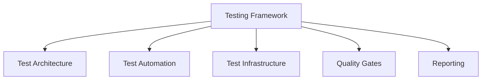

# Testing Framework

## 📋 Overview
This document defines the comprehensive testing framework for our Operations Knowledge Base, establishing standardized testing practices, automation approaches, and quality assurance processes.

## 🎯 Framework Architecture

### Core Components


### Framework Layers
```yaml
testing_layers:
  architecture:
    - test_strategy
    - test_types
    - test_coverage
    - test_data
  automation:
    - unit_tests
    - integration_tests
    - performance_tests
    - security_tests
  infrastructure:
    - environments
    - tools
    - data_management
    - reporting
```

## 🔄 Test Architecture

### Test Strategy
1. **Testing Approach**
   ```python
   def test_strategy():
       implement_test_pyramid()
       define_test_scope()
       establish_priorities()
       set_quality_gates()
   ```

2. **Test Categories**
   ```json
   {
     "test_types": {
       "unit": ["component", "function", "class"],
       "integration": ["api", "service", "system"],
       "performance": ["load", "stress", "scalability"],
       "security": ["vulnerability", "penetration", "compliance"]
     }
   }
   ```

## 🛠 Test Automation

### Automation Framework
1. **Unit Testing**
   - Component tests
   - Function tests
   - Class tests
   - Mock integration

2. **Integration Testing**
   - API testing
   - Service integration
   - System integration
   - End-to-end flows

### Performance Testing
1. **Load Testing**
   - Concurrent users
   - Transaction volume
   - Response times
   - Resource usage

2. **Stress Testing**
   - Peak loads
   - Recovery testing
   - Failover testing
   - Reliability checks

## 🏗 Test Infrastructure

### Environment Management
1. **Test Environments**
   - Development
   - Integration
   - Staging
   - Production-like

2. **Data Management**
   - Test data generation
   - Data cleanup
   - State management
   - Version control

### Tool Integration
1. **Testing Tools**
   - Test runners
   - Assertion libraries
   - Mocking frameworks
   - Coverage tools

2. **CI/CD Integration**
   - Pipeline integration
   - Automated triggers
   - Results reporting
   - Feedback loops

## 🎯 Quality Gates

### Gate Definition
1. **Quality Criteria**
   - Code coverage
   - Test pass rate
   - Performance thresholds
   - Security standards

2. **Gate Enforcement**
   - Automated checks
   - Manual reviews
   - Approval workflows
   - Release criteria

### Quality Metrics
1. **Test Metrics**
   - Coverage metrics
   - Success rates
   - Execution time
   - Defect density

2. **Quality Indicators**
   - Code quality
   - Technical debt
   - Security score
   - Performance score

## 📊 Reporting System

### Test Reporting
1. **Results Dashboard**
   - Test status
   - Coverage reports
   - Trend analysis
   - Issue tracking

2. **Performance Reports**
   - Response times
   - Resource usage
   - Bottlenecks
   - Optimization opportunities

### Analysis Tools
1. **Test Analysis**
   - Failure analysis
   - Pattern detection
   - Root cause analysis
   - Improvement recommendations

2. **Trend Analysis**
   - Historical data
   - Success trends
   - Issue patterns
   - Quality trends

## 🔒 Security Integration

### Security Testing
1. **Security Checks**
   - Vulnerability scanning
   - Penetration testing
   - Compliance checking
   - Security audits

2. **Security Controls**
   - Access control
   - Data protection
   - Secure execution
   - Audit logging

## 📝 Related Documentation
- [[ci-cd-pipeline]]
- [[automation-framework]]
- [[quality-assurance]]
- [[security-testing]]
- [[performance-testing]]
- [[test-automation]]

## 🔄 Change Log
| Date | Change | Author |
|------|--------|--------|
| YYYY-MM-DD | Initial testing framework documentation | Name |

---

*Last updated: <% tp.date.now("YYYY-MM-DD") %>* 