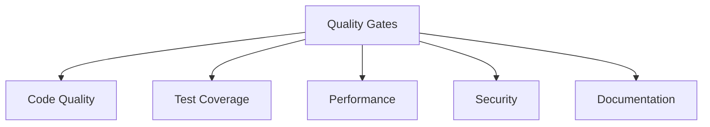

# Testing Standards

## 📋 Overview
This document defines the comprehensive testing standards for our Operations Knowledge Base, establishing quality gates, acceptance criteria, performance benchmarks, and security requirements.

## 🎯 Quality Gates

### Gate Structure


### Gate Requirements
```yaml
quality_gates:
  code_quality:
    - static_analysis
    - code_review
    - style_compliance
    - complexity_metrics
  test_coverage:
    - unit_test_coverage
    - integration_coverage
    - functional_coverage
    - documentation_coverage
  performance:
    - response_time
    - resource_usage
    - scalability
    - reliability
  security:
    - vulnerability_scan
    - security_review
    - compliance_check
    - risk_assessment
```

## 🔄 Acceptance Criteria

### Functional Requirements
1. **Feature Validation**
   ```python
   def validate_feature():
       verify_functionality()
       check_edge_cases()
       validate_integrations()
       confirm_requirements()
   ```

2. **Quality Metrics**
   ```json
   {
     "acceptance_metrics": {
       "functionality": ["completeness", "correctness", "reliability"],
       "usability": ["efficiency", "learnability", "satisfaction"],
       "performance": ["speed", "resource_usage", "scalability"],
       "security": ["safety", "compliance", "protection"]
     }
   }
   ```

## 🛠 Performance Benchmarks

### Response Time Standards
1. **Latency Requirements**
   - API response: < 100ms
   - Page load: < 1s
   - Database query: < 50ms
   - Background jobs: < 5min

2. **Throughput Requirements**
   - Requests/second: > 1000
   - Concurrent users: > 100
   - Data processing: > 1MB/s
   - Queue processing: > 100/s

### Resource Usage Standards
1. **CPU Requirements**
   - Average usage: < 60%
   - Peak usage: < 80%
   - Idle usage: < 20%
   - Thread count: < 100

2. **Memory Requirements**
   - Heap usage: < 70%
   - GC frequency: < 10/min
   - Memory leaks: None
   - Cache hit rate: > 90%

## 🔒 Security Requirements

### Security Standards
1. **Authentication Requirements**
   - Multi-factor authentication
   - Password complexity
   - Session management
   - Access control

2. **Data Protection**
   - Encryption at rest
   - Encryption in transit
   - Data masking
   - Access logging

### Compliance Requirements
1. **Regulatory Compliance**
   - Data protection
   - Privacy standards
   - Industry regulations
   - Security frameworks

2. **Security Testing**
   - Vulnerability scanning
   - Penetration testing
   - Security audits
   - Risk assessments

## 📊 Quality Metrics

### Code Quality
1. **Static Analysis**
   - Code complexity
   - Code duplication
   - Style compliance
   - Best practices

2. **Dynamic Analysis**
   - Runtime behavior
   - Memory usage
   - Thread safety
   - Resource leaks

### Test Coverage
1. **Coverage Requirements**
   - Line coverage: > 80%
   - Branch coverage: > 70%
   - Function coverage: > 90%
   - Integration coverage: > 60%

2. **Test Quality**
   - Test reliability
   - Test isolation
   - Test maintainability
   - Test documentation

## 🔍 Review Process

### Code Review
1. **Review Standards**
   - Code quality
   - Test coverage
   - Documentation
   - Security practices

2. **Review Process**
   - Peer review
   - Technical review
   - Security review
   - Architecture review

### Documentation Review
1. **Documentation Requirements**
   - API documentation
   - Test documentation
   - User documentation
   - Maintenance guides

2. **Review Criteria**
   - Completeness
   - Accuracy
   - Clarity
   - Maintainability

## 📝 Related Documentation
- [[testing-framework]]
- [[quality-assurance]]
- [[performance-testing]]
- [[security-testing]]
- [[code-review]]
- [[documentation-standards]]

## 🔄 Change Log
| Date | Change | Author |
|------|--------|--------|
| YYYY-MM-DD | Initial testing standards documentation | Name |

---

*Last updated: <% tp.date.now("YYYY-MM-DD") %>* 