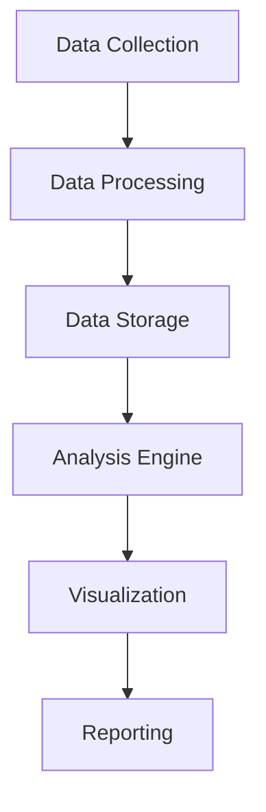

# Analytics Platform

## 📋 Overview
This document outlines the analytics platform used in our Operations Knowledge Base for comprehensive data analysis and reporting.

## 🏗 Platform Architecture

### Core Components


### Data Flow
1. **Collection Pipeline**
   ```yaml
   collectors:
     - system_metrics
     - user_analytics
     - content_metrics
     - performance_data
   processors:
     - data_cleaning
     - transformation
     - enrichment
     - aggregation
   ```

2. **Storage Layer**
   - Time-series data
   - Relational data
   - Document store
   - Analytics cache

## 📊 Data Collection

### Metric Sources
1. **System Metrics**
   ```python
   def collect_metrics():
       gather_performance_data()
       collect_usage_stats()
       track_user_activity()
       measure_system_health()
   ```

2. **User Analytics**
   - User behavior
   - Feature usage
   - Content interaction
   - Search patterns

### Data Integration
1. **Source Integration**
   - API connections
   - Log ingestion
   - Event streaming
   - Batch imports

2. **Data Validation**
   - Schema validation
   - Data quality checks
   - Consistency verification
   - Completeness checks

## 🔍 Analysis Capabilities

### Data Analysis
1. **Statistical Analysis**
   - Descriptive statistics
   - Trend analysis
   - Pattern detection
   - Correlation analysis

2. **Machine Learning**
   - Predictive analytics
   - Anomaly detection
   - Classification
   - Clustering

### Advanced Analytics
1. **Content Analysis**
   - Topic modeling
   - Sentiment analysis
   - Usage patterns
   - Quality metrics

2. **User Analysis**
   - Behavior analysis
   - Journey mapping
   - Engagement metrics
   - Satisfaction scores

## 📈 Visualization Tools

### Dashboard System
1. **Real-time Dashboards**
   ```json
   {
     "dashboard": {
       "metrics": ["performance", "usage", "errors"],
       "refresh_rate": "1m",
       "visualization": ["graphs", "charts", "tables"],
       "interactivity": true
     }
   }
   ```

2. **Historical Dashboards**
   - Trend visualization
   - Comparative analysis
   - Performance tracking
   - Usage patterns

### Custom Visualizations
1. **Chart Types**
   - Time series
   - Heat maps
   - Scatter plots
   - Network graphs

2. **Interactive Features**
   - Drill-down capability
   - Custom filters
   - Dynamic updates
   - Export options

## 📊 Reporting System

### Automated Reports
1. **Scheduled Reports**
   - Daily summaries
   - Weekly analysis
   - Monthly reviews
   - Quarterly reports

2. **Alert Reports**
   - Threshold alerts
   - Anomaly detection
   - Error reporting
   - Performance issues

### Custom Reports
1. **Report Builder**
   - Metric selection
   - Time range selection
   - Filter configuration
   - Format options

2. **Export Options**
   - PDF generation
   - Excel export
   - CSV export
   - API access

## 🔒 Security and Privacy

### Data Security
1. **Access Control**
   - Role-based access
   - Data masking
   - Encryption
   - Audit logging

2. **Privacy Controls**
   - Data anonymization
   - PII protection
   - Consent management
   - Retention policies

### Compliance
1. **Regulatory Compliance**
   - Data protection
   - Privacy regulations
   - Industry standards
   - Internal policies

2. **Audit Support**
   - Audit trails
   - Compliance reports
   - Evidence collection
   - Control documentation

## 🔄 Platform Management

### System Administration
1. **Configuration Management**
   - Platform settings
   - Integration setup
   - User management
   - Access control

2. **Performance Optimization**
   - Query optimization
   - Cache management
   - Resource allocation
   - Load balancing

### Maintenance
1. **Regular Tasks**
   - Data cleanup
   - Index optimization
   - Cache management
   - Backup verification

2. **System Updates**
   - Version updates
   - Security patches
   - Feature additions
   - Bug fixes

## 📝 Related Documentation
- [[monitoring-tools]]
- [[performance-tools]]
- [[metrics-dashboard]]
- [[reporting-system]]

## 🔄 Change Log
| Date | Change | Author |
|------|--------|--------|
| YYYY-MM-DD | Initial analytics platform documentation | Name |

---

*Last updated: <% tp.date.now("YYYY-MM-DD") %>* 