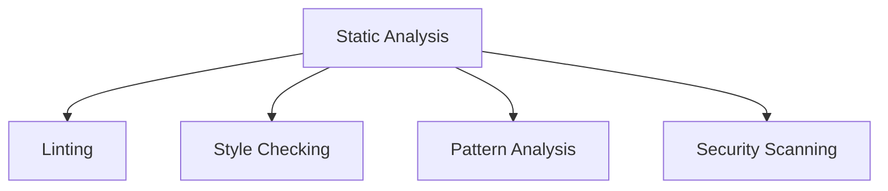

# Code Quality Tools

## 📋 Overview
This document outlines the code quality tools and practices used in our Operations Knowledge Base to ensure high-quality, maintainable documentation and code.

## 🔍 Quality Analysis Tools

### Static Analysis


### Tool Configuration
1. **Markdown Lint**
   ```yaml
   extends: recommended
   rules:
     MD001: true  # Header levels increment by one
     MD003: true  # Header style
     MD009: true  # No trailing spaces
     MD013: false # Line length
     MD033: false # No inline HTML
   ```

2. **Style Checker**
   ```json
   {
     "style": {
       "headings": "atx",
       "listStyle": "dash",
       "emphasisMarker": "asterisk",
       "strongMarker": "asterisk"
     }
   }
   ```

## 🛠 Implementation Tools

### Linting Tools
1. **Markdown Linting**
   - markdownlint
   - remark-lint
   - textlint
   - Vale

2. **Code Linting**
   - ESLint
   - Prettier
   - stylelint
   - shellcheck

### Quality Checkers
1. **Content Quality**
   ```python
   def check_content_quality(content):
       validate_structure(content)
       check_style(content)
       verify_links(content)
       assess_readability(content)
   ```

2. **Technical Quality**
   - Syntax validation
   - Format checking
   - Reference validation
   - Dependency analysis

## 📊 Quality Metrics

### Code Metrics
1. **Complexity Metrics**
   - Cyclomatic complexity
   - Cognitive complexity
   - Maintainability index
   - Technical debt

2. **Style Metrics**
   - Style compliance
   - Format consistency
   - Documentation coverage
   - Comment quality

### Documentation Metrics
1. **Content Quality**
   - Readability scores
   - Completeness
   - Accuracy
   - Consistency

2. **Technical Quality**
   - Link validity
   - Reference accuracy
   - Code snippet validity
   - API documentation coverage

## 🔄 Quality Workflows

### Pre-commit Checks
```bash
#!/bin/bash
# Pre-commit hook configuration
markdownlint "**/*.md"
prettier --check "**/*.{md,js,json}"
vale "**/*.md"
```

### Continuous Integration
1. **Automated Checks**
   - Style validation
   - Link checking
   - Content validation
   - Security scanning

2. **Quality Gates**
   - Quality thresholds
   - Coverage requirements
   - Performance criteria
   - Security standards

## 🎯 Quality Standards

### Documentation Standards
1. **Style Guide**
   - Writing style
   - Formatting rules
   - Link conventions
   - Code examples

2. **Technical Standards**
   - API documentation
   - Code snippets
   - Configuration examples
   - Command references

### Quality Requirements
1. **Content Requirements**
   - Completeness
   - Accuracy
   - Clarity
   - Consistency

2. **Technical Requirements**
   - Performance
   - Security
   - Maintainability
   - Reliability

## 📈 Quality Monitoring

### Continuous Assessment
1. **Automated Monitoring**
   - Quality metrics
   - Error detection
   - Performance tracking
   - Usage analytics

2. **Manual Reviews**
   - Peer reviews
   - Expert reviews
   - User feedback
   - Quality audits

### Quality Reports
1. **Regular Reports**
   - Quality metrics
   - Issue tracking
   - Improvement trends
   - Action items

2. **Quality Dashboards**
   - Real-time metrics
   - Quality trends
   - Issue status
   - Improvement tracking

## 🔒 Security Integration

### Security Checks
1. **Code Security**
   - Vulnerability scanning
   - Dependency checking
   - Secret detection
   - License compliance

2. **Content Security**
   - Sensitive data detection
   - Access control validation
   - Compliance checking
   - Security best practices

### Security Standards
- Security guidelines
- Access controls
- Data protection
- Compliance requirements

## 🔄 Continuous Improvement

### Tool Evolution
1. **Tool Updates**
   - Version updates
   - Configuration tuning
   - Rule refinement
   - Integration improvements

2. **Process Improvements**
   - Workflow optimization
   - Automation enhancement
   - Quality refinement
   - Feedback integration

### Learning System
- Pattern detection
- Issue prediction
- Quality trends
- Improvement suggestions

## 📝 Related Documentation
- [[development-environment]]
- [[debugging-tools]]
- [[quality-metrics]]
- [[security-tools]]

## 🔄 Change Log
| Date | Change | Author |
|------|--------|--------|
| YYYY-MM-DD | Initial code quality tools documentation | Name |

---

*Last updated: <% tp.date.now("YYYY-MM-DD") %>* 