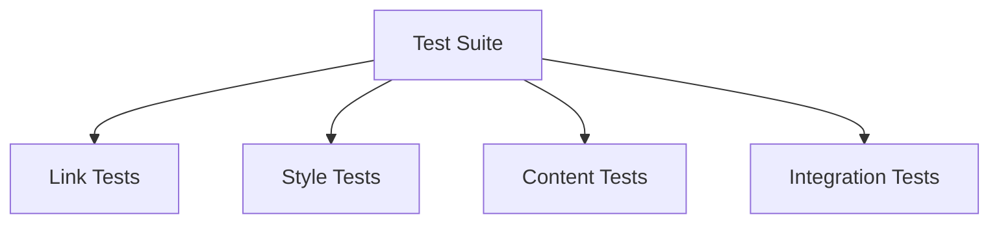

# Development Environment

## 📋 Overview
This document defines the development environment setup and tooling for our Operations Knowledge Base, ensuring consistent and efficient development practices.

## 🛠 Core Components

### IDE Configuration
1. **Obsidian Setup**
   ```yaml
   core_plugins:
     - file-explorer
     - graph-view
     - backlinks
     - outgoing-links
     - tag-pane
     - templates
   
   community_plugins:
     - dataview
     - templater
     - git
     - natural-language-dates
   ```

2. **VSCode Integration**
   - Markdown extensions
   - Git integration
   - Linting tools
   - Preview features

### Version Control
1. **Git Configuration**
   ```bash
   git config --global core.autocrlf input
   git config --global pull.rebase true
   git config --global commit.template .gitmessage
   ```

2. **Repository Setup**
   - Branch protection
   - Pre-commit hooks
   - CI/CD integration
   - Automated testing

## 🔧 Development Tools

### Build Tools
1. **Documentation Build**
   - Markdown processing
   - Link validation
   - Style checking
   - Output generation

2. **Automation Tools**
   - Task runners
   - Build scripts
   - Deployment tools
   - Testing frameworks

### Testing Framework


## 📊 Quality Tools

### Linting
1. **Markdown Linting**
   ```yaml
   rules:
     - no-trailing-spaces
     - no-multiple-blanks
     - proper-headers
     - consistent-links
   ```

2. **Style Checking**
   - Grammar checking
   - Spelling validation
   - Format compliance
   - Style consistency

### Code Analysis
1. **Static Analysis**
   - Link validation
   - Structure checking
   - Pattern detection
   - Complexity analysis

2. **Dynamic Analysis**
   - Performance testing
   - Load testing
   - Integration testing
   - User testing

## 🔄 Development Workflow

### Local Development
1. **Setup Process**
   ```bash
   # Clone repository
   git clone [repository-url]
   
   # Install dependencies
   npm install
   
   # Set up pre-commit hooks
   pre-commit install
   
   # Configure environment
   cp .env.example .env
   ```

2. **Development Cycle**
   - Branch creation
   - Local testing
   - Code review
   - Merge process

### CI/CD Pipeline
1. **Continuous Integration**
   - Automated testing
   - Style checking
   - Link validation
   - Build verification

2. **Continuous Deployment**
   - Staging deployment
   - Production deployment
   - Rollback procedures
   - Monitoring setup

## 🔍 Monitoring and Debugging

### Development Monitoring
1. **Performance Monitoring**
   - Response times
   - Resource usage
   - Error rates
   - User metrics

2. **Quality Monitoring**
   - Code quality
   - Documentation quality
   - Test coverage
   - User satisfaction

### Debugging Tools
1. **Log Analysis**
   ```python
   def analyze_logs():
       collect_logs()
       parse_errors()
       identify_patterns()
       generate_report()
   ```

2. **Diagnostic Tools**
   - Error tracking
   - Performance profiling
   - Memory analysis
   - Network monitoring

## 🔒 Security Tools

### Security Scanning
1. **Code Scanning**
   - Vulnerability scanning
   - Dependency checking
   - Secret detection
   - License compliance

2. **Content Scanning**
   - Sensitive data detection
   - Access control validation
   - Compliance checking
   - Security best practices

### Access Control
- Role-based access
- Authentication tools
- Authorization checks
- Audit logging

## 📈 Performance Tools

### Performance Testing
1. **Load Testing**
   - Response time testing
   - Concurrency testing
   - Resource usage testing
   - Scalability testing

2. **Optimization Tools**
   - Cache optimization
   - Query optimization
   - Resource optimization
   - Network optimization

### Monitoring Tools
- Performance metrics
- Resource usage
- Error tracking
- User analytics

## 📝 Related Documentation
- [[code-quality]]
- [[debugging-tools]]
- [[deployment-tools]]
- [[monitoring-tools]]

## 🔄 Change Log
| Date | Change | Author |
|------|--------|--------|
| YYYY-MM-DD | Initial development environment documentation | Name |

---

*Last updated: <% tp.date.now("YYYY-MM-DD") %>* 