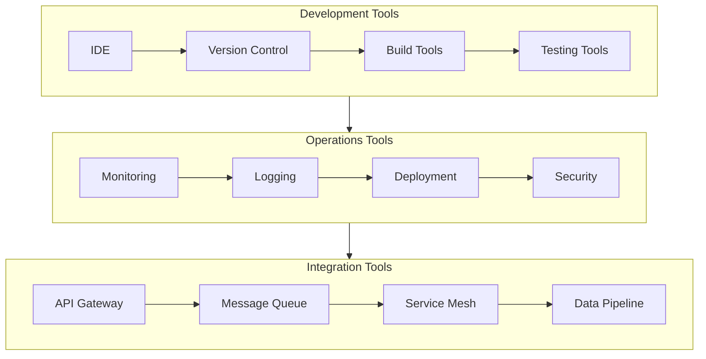
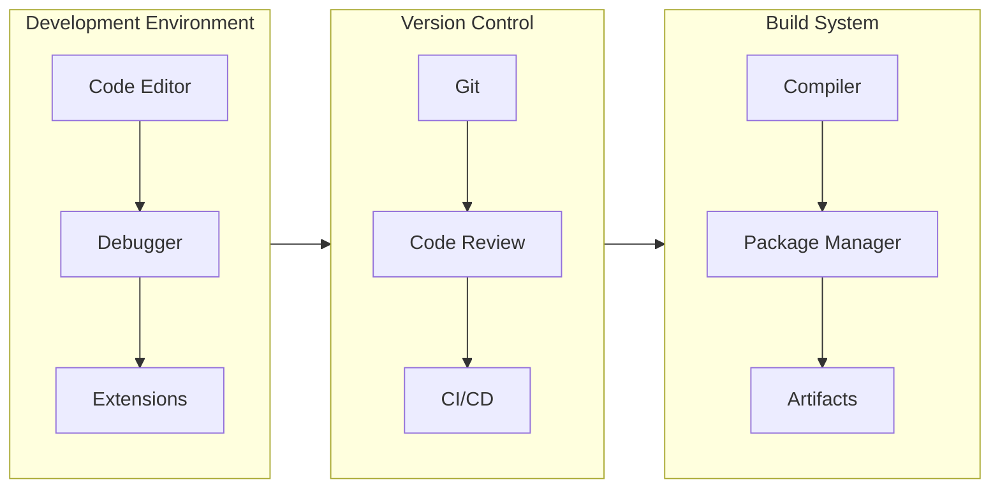
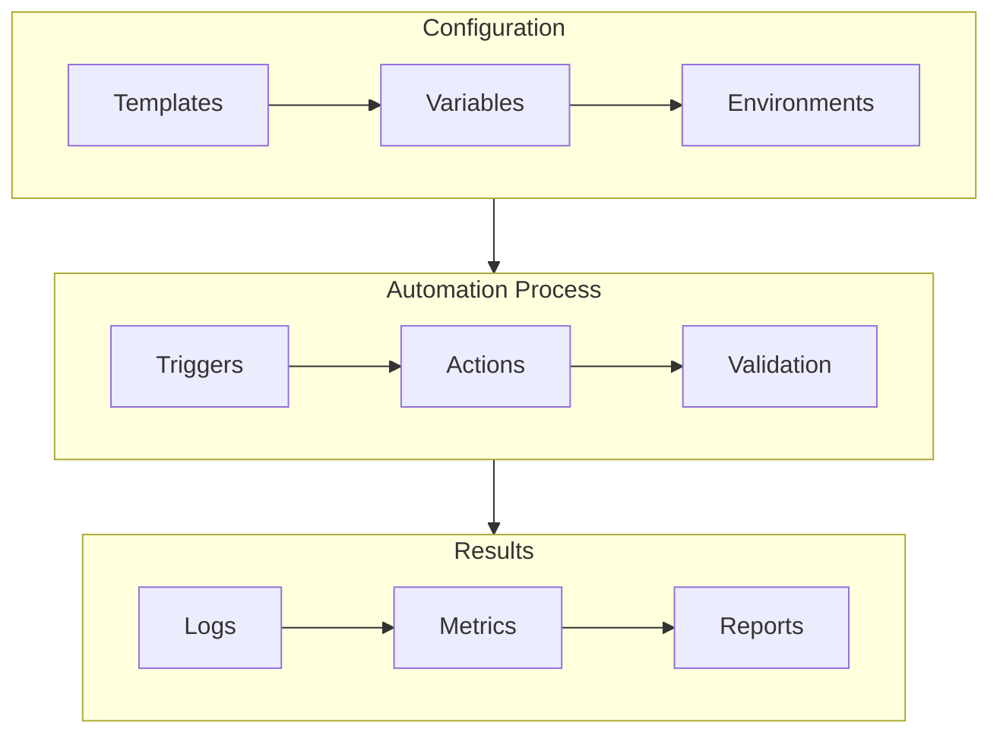
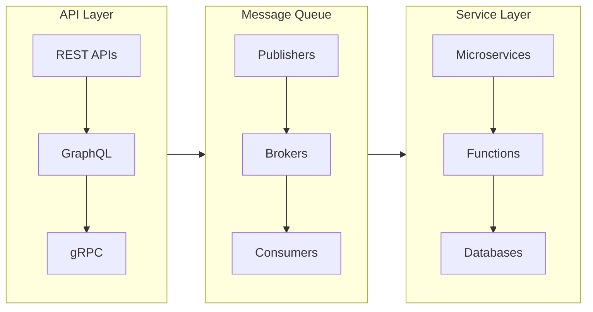
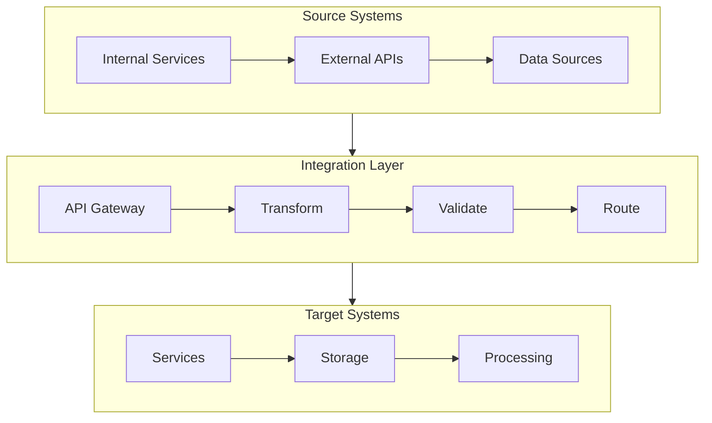
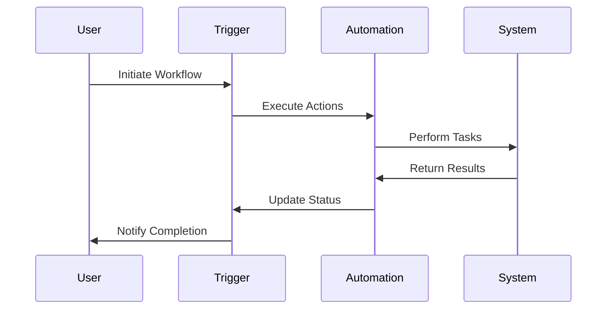
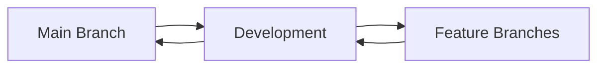
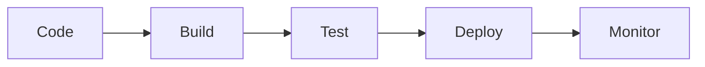

# Tools & Integration Documentation

## Tools Ecosystem Overview

## Tool Categories

### Development Tools

### Automation Tools

### Integration Architecture

## Quick Navigation

### Development Tools
- [IDE Setup](development/ide-setup.md)
- [Version Control](development/version-control.md)
- [Build System](development/build-system.md)
- [Testing Tools](development/testing-tools.md)
- [Debugging Tools](development/debugging.md)

### Automation Tools
- [CI/CD Pipeline](automation/cicd.md)
- [Infrastructure as Code](automation/iac.md)
- [Configuration Management](automation/config.md)
- [Task Automation](automation/tasks.md)
- [Monitoring Automation](automation/monitoring.md)

### Integration Tools
- [API Gateway](integration/api-gateway.md)
- [Message Queue](integration/message-queue.md)
- [Service Mesh](integration/service-mesh.md)
- [Data Pipeline](integration/data-pipeline.md)
- [Authentication](integration/auth.md)

## Tool Integration Flow

## Workflow Automation

## Tool Management

### Version Control Strategy

### Deployment Pipeline

## Related Documentation
- [Development Standards](../standards/development.md)
- [Security Guidelines](../guidelines/security.md)
- [Operations Manual](../operations/manual.md)
- [Integration Patterns](../patterns/integration.md)

---

*Last updated: 2024-03-20* 