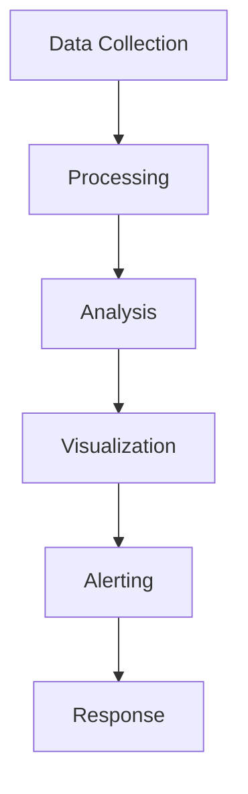

# Monitoring Tools

## 📋 Overview
This document outlines the monitoring tools and practices used in our Operations Knowledge Base for comprehensive system and application monitoring.

## 🔍 Monitoring Framework

### Core Components


### System Architecture
1. **Collection Layer**
   ```yaml
   collectors:
     - system_metrics
     - application_logs
     - user_activity
     - performance_data
   aggregators:
     - log_aggregation
     - metric_consolidation
     - event_correlation
   ```

2. **Processing Layer**
   - Data normalization
   - Pattern detection
   - Anomaly detection
   - Trend analysis

## 📊 Metrics Collection

### System Metrics
1. **Resource Metrics**
   ```python
   def collect_system_metrics():
       monitor_cpu()
       monitor_memory()
       monitor_disk()
       monitor_network()
   ```

2. **Performance Metrics**
   - Response times
   - Throughput
   - Error rates
   - Latency

### Application Metrics
1. **Usage Metrics**
   - Active users
   - Feature usage
   - Session duration
   - Error encounters

2. **Business Metrics**
   - User satisfaction
   - Task completion
   - Documentation quality
   - System reliability

## 🚨 Alert Management

### Alert Configuration
1. **Threshold Alerts**
   ```json
   {
     "alerts": {
       "cpu_usage": {
         "warning": 75,
         "critical": 90,
         "duration": "5m"
       },
       "error_rate": {
         "warning": 5,
         "critical": 10,
         "duration": "15m"
       }
     }
   }
   ```

2. **Pattern Alerts**
   - Anomaly detection
   - Trend deviation
   - Error patterns
   - Usage spikes

### Alert Routing
1. **Notification Channels**
   - Email alerts
   - Slack notifications
   - SMS alerts
   - Dashboard updates

2. **Escalation Paths**
   - First responders
   - Secondary support
   - Management escalation
   - Emergency contacts

## 📈 Visualization Tools

### Dashboards
1. **System Dashboards**
   - Resource utilization
   - Performance metrics
   - Error tracking
   - Health status

2. **Application Dashboards**
   - User activity
   - Feature usage
   - Error rates
   - Performance trends

### Reports
1. **Regular Reports**
   - Daily summaries
   - Weekly analysis
   - Monthly trends
   - Quarterly reviews

2. **Custom Reports**
   - Ad-hoc analysis
   - Issue investigation
   - Capacity planning
   - Performance review

## 🔄 Real-time Monitoring

### Live Monitoring
1. **System Status**
   ```python
   def monitor_system_health():
       check_vital_signs()
       analyze_performance()
       detect_issues()
       update_status()
   ```

2. **User Activity**
   - Active sessions
   - Current operations
   - Error occurrences
   - Resource usage

### Performance Tracking
1. **Real-time Metrics**
   - Current load
   - Response times
   - Error rates
   - Resource usage

2. **Trend Analysis**
   - Short-term trends
   - Pattern detection
   - Anomaly detection
   - Predictive analysis

## 🔍 Log Management

### Log Collection
1. **Log Sources**
   - System logs
   - Application logs
   - Access logs
   - Error logs

2. **Log Processing**
   - Log aggregation
   - Log parsing
   - Pattern matching
   - Event correlation

### Log Analysis
1. **Analysis Tools**
   - Log search
   - Pattern detection
   - Error analysis
   - Performance analysis

2. **Retention Policies**
   - Storage duration
   - Archival process
   - Data compression
   - Access controls

## 🔒 Security Monitoring

### Security Metrics
1. **Access Monitoring**
   - Authentication attempts
   - Authorization checks
   - Access patterns
   - Security events

2. **Threat Detection**
   - Suspicious activity
   - Security violations
   - Policy breaches
   - System attacks

### Compliance Monitoring
- Regulatory compliance
- Policy adherence
- Security standards
- Audit requirements

## 📊 Analytics Integration

### Data Integration
1. **Data Sources**
   - System metrics
   - Application data
   - User analytics
   - Business metrics

2. **Analysis Tools**
   - Statistical analysis
   - Machine learning
   - Predictive modeling
   - Pattern recognition

### Insights Generation
1. **Automated Analysis**
   - Trend detection
   - Anomaly identification
   - Performance insights
   - Usage patterns

2. **Reporting Tools**
   - Automated reports
   - Custom analysis
   - Executive summaries
   - Detailed metrics

## 📝 Related Documentation
- [[debugging-tools]]
- [[performance-tools]]
- [[analytics-platform]]
- [[alert-configuration]]

## 🔄 Change Log
| Date | Change | Author |
|------|--------|--------|
| YYYY-MM-DD | Initial monitoring tools documentation | Name |

---

*Last updated: <% tp.date.now("YYYY-MM-DD") %>* 