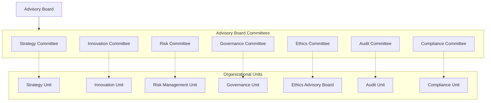

# Advisory Board Committees List

## Overview

This document provides a comprehensive listing of all Advisory Board committees, their key focus areas, and their relationships with organizational units. Each committee operates under its own charter and is composed of Advisory Board members with specific expertise in the relevant domain.

## Strategic Committees

### Strategy Committee
- **Focus**: Strategic direction, market positioning, competitive strategy
- **Chair**: [[Dr. James Martin]] - Former Chief Strategy Officer, Global Innovations Inc.
- **Related Units**: [[../../Strategy/README|Strategy Unit]]
- **Details**: [[StrategyCommittee/README|Strategy Committee]]

### Innovation Committee
- **Focus**: Innovation strategy, emerging technologies, digital transformation
- **Chair**: [[Dr. Samantha Lee]] - Technology Innovation Expert
- **Related Units**: [[../../Innovation/README|Innovation Unit]]
- **Details**: [[InnovationCommittee/README|Innovation Committee]]

## Risk and Governance Committees

### Risk Committee
- **Focus**: Enterprise risk management, risk oversight, emerging risks
- **Chair**: [[Dr. Richard Harris]] - Former Chief Risk Officer, Global Financial Group
- **Related Units**: [[../../RiskManagement/README|Risk Management Unit]]
- **Details**: [[RiskCommittee/README|Risk Committee]]

### Governance Committee
- **Focus**: Board effectiveness, governance structure, committee operations
- **Chair**: [[Elizabeth Taylor]] - Corporate Governance Expert
- **Related Units**: [[../../Governance/README|Governance Unit]]
- **Details**: [[GovernanceCommittee/README|Governance Committee]]

### Ethics Committee
- **Focus**: Ethical decision-making, values alignment, ethical standards
- **Chair**: [[Dr. Robert Chen]] - Ethics and Compliance Specialist
- **Related Units**: [[../../EthicsAdvisoryBoard/README|Ethics Advisory Board]], [[../../Compliance/README|Compliance Unit]]
- **Details**: [[EthicsCommittee/README|Ethics Committee]]

## Operational Committees

### Audit Committee
- **Focus**: Financial oversight, control assessment, compliance review
- **Chair**: [[Jennifer Williams]] - Former Audit Partner, Global Accounting Firm
- **Related Units**: [[../../Audit/README|Audit Unit]], [[../../Finance/README|Finance Unit]]
- **Details**: [[AuditCommittee/README|Audit Committee]]

### Compliance Committee
- **Focus**: Regulatory compliance, policy adherence, compliance frameworks
- **Chair**: [[David Thompson]] - Regulatory and Compliance Expert
- **Related Units**: [[../../Compliance/README|Compliance Unit]], [[../../Legal/README|Legal Unit]]
- **Details**: [[ComplianceCommittee/README|Compliance Committee]]

## Committee Structure and Governance

Each committee operates according to the following governance structure:

## Committee Operations

- Each committee meets at least quarterly, with additional meetings as needed
- Committees develop formal recommendations for Advisory Board consideration
- Committees engage with relevant organizational units as appropriate
- Annual committee effectiveness reviews are conducted
- Committee membership is reviewed annually to ensure appropriate expertise

## Related Documents

- [[../Charter|Advisory Board Charter]]
- [[../Policies/CommitteeOperations|Committee Operations Policy]]
- [[../Processes/CommitteeReporting|Committee Reporting Process]]
- [[../MeetingNotes/Committees/README|Committee Meeting Notes]] 