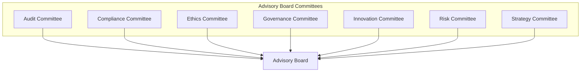

# Advisory Board Committees

## Overview

The Advisory Board Committees are specialized groups focused on providing expert guidance in specific functional areas. Each committee consists of board members with relevant expertise and may include external subject matter experts when needed.

## Committee Structure

Each committee operates under its own charter and reports directly to the Advisory Board. Committees meet on a regular schedule and provide formal recommendations to the full board.

## Committee List

- [[AuditCommittee/README|Audit Committee]] - Provides oversight on financial reporting and auditing matters
- [[ComplianceCommittee/README|Compliance Committee]] - Advises on regulatory compliance and legal requirements
- [[EthicsCommittee/README|Ethics Committee]] - Guides ethical decision-making and responsible practices
- [[GovernanceCommittee/README|Governance Committee]] - Focuses on organizational governance and board effectiveness
- [[InnovationCommittee/README|Innovation Committee]] - Advises on innovation strategy and emerging technologies
- [[RiskCommittee/README|Risk Committee]] - Evaluates organizational risks and mitigation strategies
- [[StrategyCommittee/README|Strategy Committee]] - Provides input on strategic direction and market positioning

## Committee Operation

Committees function through:
- Regular meetings (typically quarterly)
- Specialized research and analysis
- External expert consultation
- Formal recommendations to the board
- Collaborative work with relevant organizational units

## Related Documents

- [[../Charter|Advisory Board Charter]]
- [[../Policies/CommitteeOperations|Committee Operations Policy]]
- [[../Processes/CommitteeReporting|Committee Reporting Process]] 