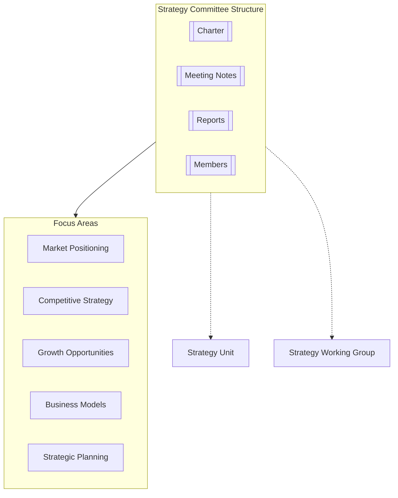

# Strategy Committee

## Overview

The Strategy Committee provides expert advisory oversight on organizational strategy, market positioning, competitive landscape, and growth opportunities. The committee collaborates closely with the [[../../../Strategy/README|Strategy Unit]] while maintaining an independent advisory perspective.

## Key Responsibilities

- Provide independent perspective on strategic direction and planning
- Evaluate market trends and competitive landscape
- Assess growth opportunities and expansion strategies
- Review business model innovation and adaptation
- Advise on strategic partnerships and alliances
- Evaluate organizational capabilities for strategy execution

## Committee Membership

- **Chair**: [[Dr. James Martin]] - Former Chief Strategy Officer, Global Innovations Inc.
- **Members**:
  - [[Rebecca Chen]] - Digital Transformation Expert
  - [[Michael Johnson]] - Market Strategy Specialist
  - [[Sophia Rodriguez]] - Business Model Innovation Consultant
  - [[Thomas Wilson]] - Competitive Intelligence Expert

## Meeting Schedule

The Strategy Committee meets quarterly and conducts additional sessions as needed for emerging strategic issues. Schedule details are maintained in [[MeetingNotes/Schedule|meeting schedule]].

## Key Documents

- [[Charter|Committee Charter]]
- [[Processes/StrategyReview|Strategy Review Process]]
- [[Reports/README|Committee Reports]]
- [[MeetingNotes/README|Meeting Notes]]

## Current Strategic Focus Areas

1. **Digital Transformation Strategy**
   - Evaluating digital capabilities and transformation roadmap
   - [[Projects/DigitalTransformation|Project Details]]

2. **Market Expansion Assessment**
   - Analyzing potential growth markets and entry strategies
   - [[Projects/MarketExpansion|Project Details]]

3. **Business Model Evolution**
   - Reviewing business model adaptation for changing market conditions
   - [[Projects/BusinessModelEvolution|Project Details]]

## Related Entities

- [[../../../Strategy/README|Strategy Unit]]
- [[../../WorkingGroups/StrategyGroup/README|Strategy Working Group]]
- [[../InnovationCommittee/README|Innovation Committee]]
- [[../RiskCommittee/README|Risk Committee]] 