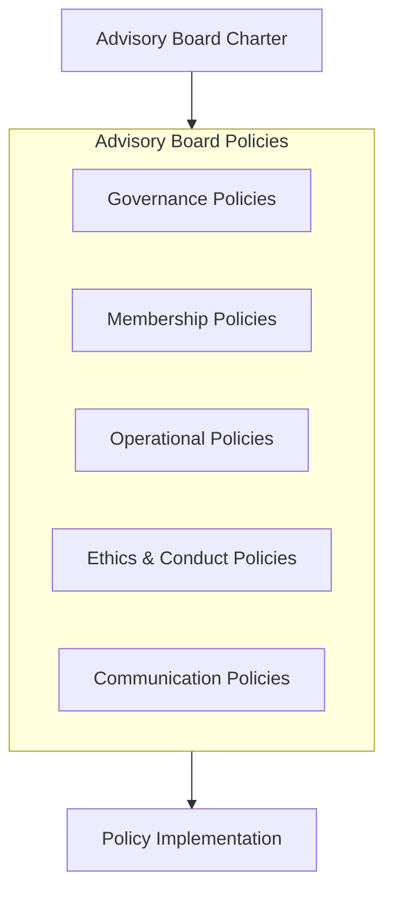

# Advisory Board Policies

## Overview

This directory contains the governing policies that establish the operational framework, standards, and guidelines for the Advisory Board. These policies define how the board functions, its governance structure, member responsibilities, and interaction with the organization.

## Policy Categories

### Governance Policies
- [[BoardGovernance|Board Governance Policy]]
- [[CommitteeOperations|Committee Operations Policy]]
- [[WorkingGroupPolicy|Working Group Policy]]
- [[DecisionMakingFramework|Decision-Making Framework]]

### Membership Policies
- [[MemberSelection|Member Selection and Appointment]]
- [[MemberResponsibilities|Member Responsibilities]]
- [[PerformanceEvaluation|Performance Evaluation]]
- [[TermsOfService|Terms of Service]]

### Operational Policies
- [[MeetingProtocols|Meeting Protocols]]
- [[DocumentationStandards|Documentation Standards]]
- [[ReportingRequirements|Reporting Requirements]]
- [[KnowledgeSharing|Knowledge Sharing]]

### Ethics & Conduct Policies
- [[ConfidentialityPolicy|Confidentiality Policy]]
- [[ConflictOfInterest|Conflict of Interest]]
- [[CodeOfConduct|Code of Conduct]]
- [[EthicalGuidelines|Ethical Guidelines]]

### Communication Policies
- [[ExternalCommunications|External Communications]]
- [[OrganizationalEngagement|Organizational Engagement]]
- [[StakeholderInteraction|Stakeholder Interaction]]
- [[MediaRelations|Media Relations]]

## Policy Development and Maintenance

The Advisory Board follows a structured approach to policy development and maintenance:

1. Policy needs identification
2. Draft development
3. Review and feedback
4. Formal approval
5. Implementation
6. Regular review and updates

## Related Documents

- [[../Charter|Advisory Board Charter]]
- [[../Processes/PolicyDevelopment|Policy Development Process]]
- [[../Reports/PolicyCompliance|Policy Compliance Reports]] 