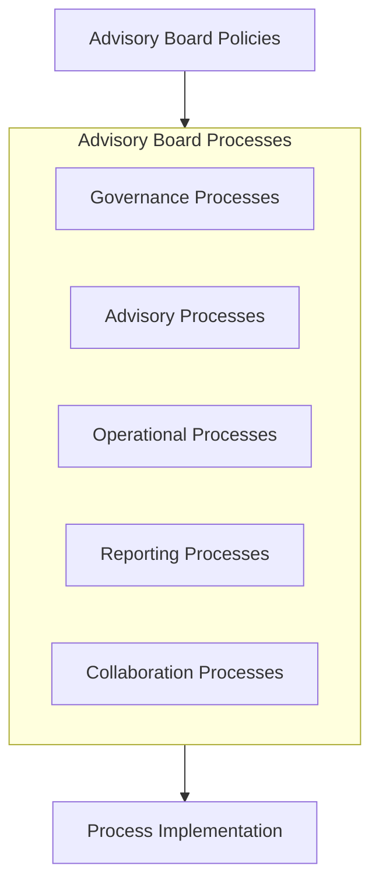

# Advisory Board Processes

## Overview

This directory contains the operational processes that guide the Advisory Board's activities, decision-making, and interactions. These processes define the workflows, procedures, and methodologies used by the board to fulfill its advisory function effectively.

## Process Categories

### Governance Processes
- [[BoardMeetingProcess|Board Meeting Process]]
- [[DecisionMakingProcess|Decision-Making Process]]
- [[MemberOnboarding|Member Onboarding Process]]
- [[PerformanceReviewProcess|Performance Review Process]]

### Advisory Processes
- [[StrategicAdvisoryProcess|Strategic Advisory Process]]
- [[RiskAdvisoryProcess|Risk Advisory Process]]
- [[InnovationAdvisoryProcess|Innovation Advisory Process]]
- [[TechnologyAdvisoryProcess|Technology Advisory Process]]

### Operational Processes
- [[CommitteeOperationProcess|Committee Operation Process]]
- [[WorkingGroupFormation|Working Group Formation Process]]
- [[WorkingGroupReporting|Working Group Reporting Process]]
- [[PolicyDevelopment|Policy Development Process]]

### Reporting Processes
- [[AdvisoryReportingProcess|Advisory Reporting Process]]
- [[CommitteeReporting|Committee Reporting Process]]
- [[BoardReportingToOrganization|Board Reporting to Organization]]
- [[ImpactAssessment|Impact Assessment Process]]

### Collaboration Processes
- [[StakeholderEngagement|Stakeholder Engagement Process]]
- [[OrganizationalCollaboration|Organizational Collaboration Process]]
- [[ExternalExpertEngagement|External Expert Engagement]]
- [[KnowledgeSharingProcess|Knowledge Sharing Process]]

## Process Development and Maintenance

The Advisory Board follows a structured approach to process development and maintenance:

1. Process needs identification
2. Process mapping and documentation
3. Review and feedback
4. Approval and implementation
5. Training and adoption
6. Regular review and improvement

## Related Documents

- [[../Charter|Advisory Board Charter]]
- [[../Policies/README|Policies Overview]]
- [[../Reports/ProcessEffectiveness|Process Effectiveness Reports]] 