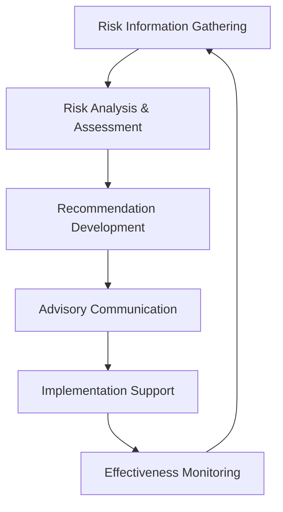

# Risk Advisory Process

## Process Purpose

This process outlines the structured approach for the Advisory Board to provide expert guidance on risk management matters, ensuring effective risk oversight, and strategic risk direction to support organizational resilience and sustainable growth.

## Process Overview

## Process Steps

### 1. Risk Information Gathering

#### 1.1 Risk Data Collection
- Review risk reports from the [[../../../RiskManagement/README|Risk Management Unit]]
- Collect industry risk trends and emerging threats
- Review organizational risk appetite and tolerance statements
- Gather input from key stakeholders on risk concerns

#### 1.2 Risk Context Assessment
- Evaluate current organizational risk profile
- Assess strategic objectives and potential risk impacts
- Review past risk events and response effectiveness
- Identify regulatory and compliance requirements

#### 1.3 Information Synthesis
- Compile and organize risk information
- Identify information gaps requiring further investigation
- Prepare summaries for Advisory Board analysis

**Outputs**: Comprehensive risk information package

### 2. Risk Analysis & Assessment

#### 2.1 Independent Risk Evaluation
- Apply expert judgment to assess identified risks
- Consider risk interdependencies and cascading effects
- Evaluate adequacy of current risk controls
- Identify potential blind spots in risk assessment

#### 2.2 Strategic Risk Lens
- Assess risks in relation to strategic objectives
- Identify strategic opportunities within risk landscape
- Evaluate competitive risk positioning
- Consider long-term risk implications

#### 2.3 Collaborative Assessment
- Engage with [[../../Committees/RiskCommittee/README|Risk Committee]] for specialized analysis
- Consult with [[../../WorkingGroups/RiskGroup/README|Risk Working Group]] on specific risk challenges
- Facilitate cross-functional risk discussions

**Outputs**: Independent risk assessment perspective

### 3. Recommendation Development

#### 3.1 Risk Strategy Guidance
- Develop recommendations for risk strategy enhancements
- Suggest risk appetite adjustments when appropriate
- Propose risk prioritization approaches
- Recommend resource allocation for risk management

#### 3.2 Risk Process Improvements
- Identify opportunities to enhance risk management processes
- Recommend governance improvements
- Suggest risk tool and methodology enhancements
- Propose risk culture development initiatives

#### 3.3 Recommendation Refinement
- Test recommendations through expert review
- Ensure practicality and applicability
- Align with organizational constraints and capabilities
- Validate with key stakeholders when appropriate

**Outputs**: Actionable risk recommendations

### 4. Advisory Communication

#### 4.1 Formal Advisory Reports
- Prepare comprehensive advisory reports with findings and recommendations
- Document rationale and supporting analysis
- Include implementation considerations
- Outline expected benefits and potential challenges

#### 4.2 Executive Briefings
- Present key insights to executive leadership
- Facilitate strategic risk discussions
- Address executive questions and concerns
- Build consensus on risk direction

#### 4.3 Risk Management Unit Engagement
- Share advisory perspective with [[../../../RiskManagement/README|Risk Management Unit]]
- Clarify recommendations and implementation requirements
- Support translation of strategic guidance to tactical actions
- Facilitate knowledge transfer

**Outputs**: Clear, actionable risk guidance

### 5. Implementation Support

#### 5.1 Advisory Consultation
- Provide expertise during implementation planning
- Clarify intent of recommendations
- Suggest implementation approaches
- Address emerging questions

#### 5.2 Implementation Oversight
- Monitor implementation progress
- Identify potential challenges or roadblocks
- Suggest course corrections when needed
- Provide ongoing expertise and support

#### 5.3 Stakeholder Engagement
- Support stakeholder communication about risk initiatives
- Help address resistance or concerns
- Advocate for risk management priorities
- Reinforce risk culture development

**Outputs**: Implementation guidance and support

### 6. Effectiveness Monitoring

#### 6.1 Impact Assessment
- Evaluate effectiveness of implemented recommendations
- Assess changes in risk profile and management capability
- Measure against expected outcomes
- Identify lessons learned

#### 6.2 Feedback Collection
- Gather feedback from stakeholders on advisory value
- Collect insights on process effectiveness
- Identify improvement opportunities
- Document successes and challenges

#### 6.3 Process Refinement
- Update risk advisory process based on lessons learned
- Enhance advisory approaches
- Implement continuous improvement
- Share best practices

**Outputs**: Process improvement recommendations

## Roles and Responsibilities

### Advisory Board
- Provides strategic risk guidance
- Approves formal risk recommendations
- Engages with executive leadership on risk matters

### Risk Committee
- Conducts detailed risk analyses
- Develops initial recommendations
- Manages ongoing risk advisory process

### Risk Working Group
- Addresses specific risk challenges
- Conducts specialized research
- Develops targeted recommendations

### Advisory Board Chair
- Ensures quality of risk advisory outputs
- Facilitates executive engagement
- Coordinates with Risk Management Unit leadership

## Related Documents

- [[../../Committees/RiskCommittee/README|Risk Committee Charter]]
- [[../../WorkingGroups/RiskGroup/README|Risk Working Group Charter]]
- [[../../../RiskManagement/README|Risk Management Unit]]
- [[../../../RiskManagement/Processes/RiskAssessment|Risk Assessment Process]]
- [[../../Policies/RiskOversight|Risk Oversight Policy]]

## Process Administration

- **Process Owner**: Risk Committee Chair
- **Last Review Date**: [Date]
- **Next Review Date**: [Date] 