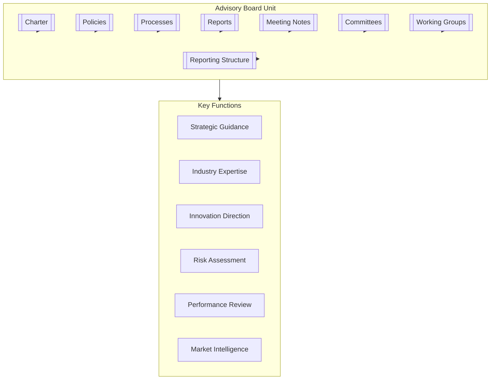

# Advisory Board

## Overview

The Advisory Board serves as an independent consultative body providing strategic guidance, industry expertise, and objective insights to support the organization's mission, growth, and innovation while ensuring alignment with best practices and market trends.

## Key Documents

- **Charter**: [[Charter]] - Defines the board's purpose, scope, objectives, governance, and structure.
- **Committees**: [[Committees/README|Committees Overview]] - Specialized advisory groups:
    - [[Committees/AuditCommittee/README|Audit Committee]]
    - [[Committees/ComplianceCommittee/README|Compliance Committee]]
    - [[Committees/EthicsCommittee/README|Ethics Committee]]
    - [[Committees/GovernanceCommittee/README|Governance Committee]]
    - [[Committees/InnovationCommittee/README|Innovation Committee]]
    - [[Committees/RiskCommittee/README|Risk Committee]]
    - [[Committees/StrategyCommittee/README|Strategy Committee]]
- **Working Groups**: [[WorkingGroups/README|Working Groups Overview]] - Task-focused teams:
    - [[WorkingGroups/StrategyGroup/README|Strategy Group]]
    - [[WorkingGroups/RiskGroup/README|Risk Group]]
    - [[WorkingGroups/TechnologyGroup/README|Technology Group]]
    - [[WorkingGroups/PerformanceGroup/README|Performance Group]]
    - [[WorkingGroups/SpecialProjects/README|Special Projects]]
- **Policies**: [[Policies/README|Policies Overview]] - Governs how the board operates
- **Processes**: [[Processes/README|Processes Overview]] - Core advisory workflows
- **Meeting Notes**: [[MeetingNotes/README|Meeting Notes]] - Records of discussions and decisions
- **Reports**: [[Reports/README|Reports]] - Advisory outputs and recommendations
- **Reporting Structure**: [[ReportingStructure/README|Reporting Structure]] - Organizational relationships

## Purpose

To provide independent, expert guidance that enhances organizational strategy, innovation, risk management, and performance through diverse perspectives and specialized knowledge.

## Contact

- **Advisory Board Chair**: [[Dr. Eleanor Mitchell]]
- **Slack Channel**: `#advisory-board`

## Related Units

- [[../BoardOfDirectors/README|Board of Directors]] - Formal governance relationship
- [[../ExecutiveCommittee/README|Executive Committee]] - Strategic alignment
- [[../RiskManagement/README|Risk Management Unit]] - Risk oversight coordination
- [[../Strategy/README|Strategy Unit]] - Strategic planning collaboration
- [[../Innovation/README|Innovation Unit]] - Innovation guidance 