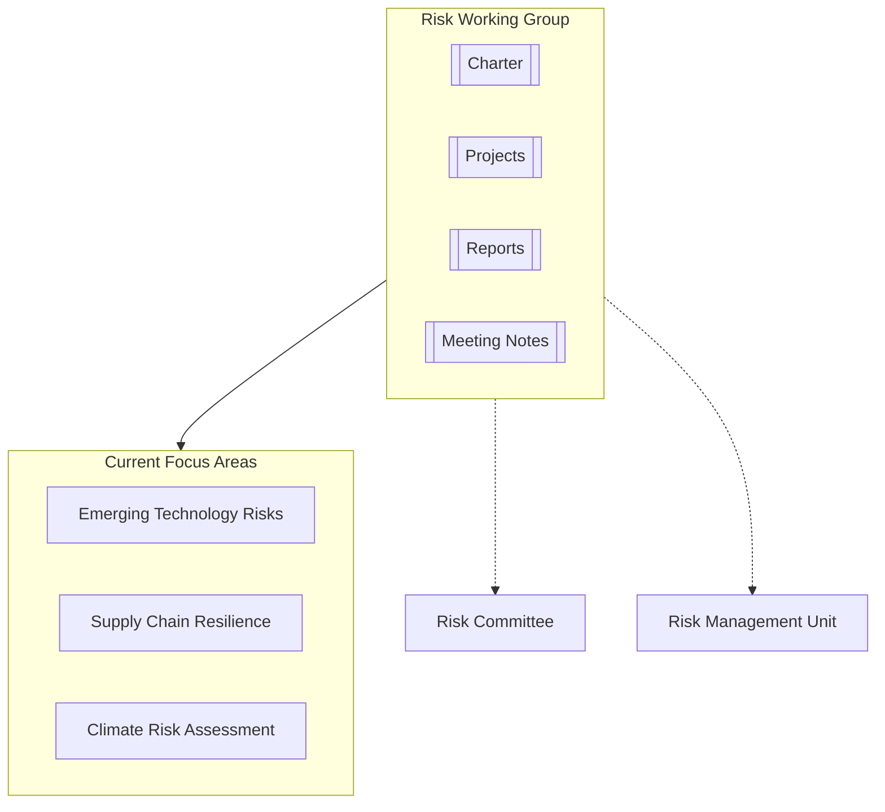

# Risk Working Group

## Overview

The Risk Working Group is a specialized task force established by the Advisory Board to address specific risk-related challenges and opportunities. The group collaborates with the [[../../Committees/RiskCommittee/README|Risk Committee]] and the [[../../../RiskManagement/README|Risk Management Unit]] while focusing on targeted risk initiatives.

## Mission

To identify, analyze, and recommend solutions for emerging and complex risk challenges through focused research, expert consultation, and collaborative problem-solving.

## Current Initiatives

1. **Emerging Technology Risk Assessment**
   - Evaluating risks associated with AI, automation, and digital transformation
   - [[Projects/EmergingTechRisk|Project Details]]

2. **Supply Chain Resilience Framework**
   - Developing a comprehensive approach to supply chain risk management
   - [[Projects/SupplyChainResilience|Project Details]]

3. **Climate Risk Impact Analysis**
   - Assessing organizational exposure to climate-related risks
   - [[Projects/ClimateRiskAssessment|Project Details]]

## Working Group Membership

- **Lead**: [[Maria Rodriguez]] - Strategic Risk Management Consultant
- **Members**:
  - [[David Thompson]] - Operational Resilience Expert
  - [[Susan Williams]] - Supply Chain Risk Specialist
  - [[Michael Chen]] - Technology Risk Analyst
  - [[Jennifer Garcia]] - Climate Risk Expert
  - [[Jordan Taylor]] - Risk Management Director (Organization Representative)

## Key Documents

- [[Charter|Working Group Charter]]
- [[ProjectPlan|Current Project Plan]]
- [[Reports/README|Group Reports and Deliverables]]
- [[MeetingNotes/README|Meeting Notes]]

## Related Entities

- [[../../Committees/RiskCommittee/README|Risk Committee]]
- [[../../../RiskManagement/README|Risk Management Unit]]
- [[../../../RiskAdvisoryBoard/README|Risk Advisory Board]]
- [[../../../Strategy/README|Strategy Unit]]
- [[../StrategyGroup/README|Strategy Working Group]] 