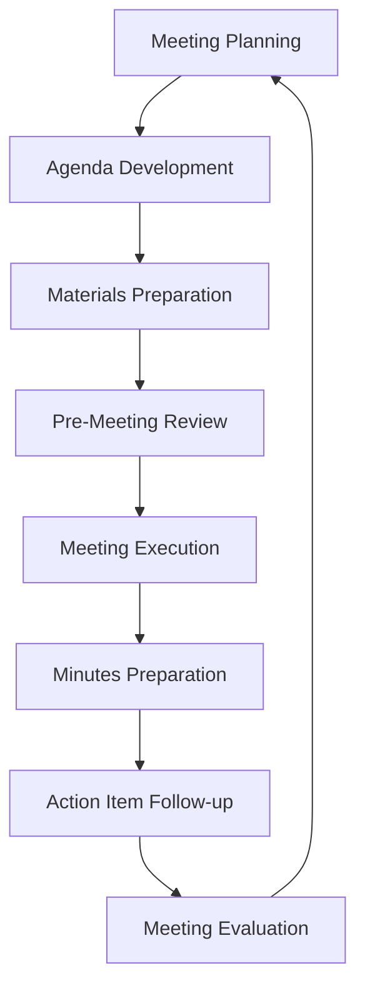

# Board Meeting Process

## 📋 Process Overview
### Purpose
This process outlines the standard procedures for planning, conducting, and following up on Board of Directors meetings to ensure effective governance, informed decision-making, and proper documentation.

### Scope
- Regular board meetings
- Special board meetings
- Annual board meetings
- Executive sessions

## 🔄 Process Flow

## 📅 Pre-Meeting Phase
### Meeting Planning
**Owner**: Corporate Secretary
1. Schedule meeting based on annual board calendar
2. Confirm director availability
3. Reserve meeting location or virtual platform
4. Send calendar invitations
5. Arrange logistics (accommodations, meals, etc.)

### Agenda Development
**Owner**: Board Chair & Corporate Secretary
1. Draft agenda based on annual plan and current priorities
2. Review with Board Chair for approval
3. Incorporate committee reports
4. Add regular governance items
5. Include strategic discussion topics
6. Allocate appropriate time for each item
7. Finalize and distribute agenda minimum 1 week before meeting

### Materials Preparation
**Owner**: Corporate Secretary & Executive Team
1. Collect reports from committees and executives
2. Prepare board presentation materials
3. Compile supporting documentation
4. Ensure consistent formatting and quality
5. Organize materials in board book format
6. Include previous meeting minutes for approval
7. Distribute materials minimum 5 business days before meeting

### Pre-Meeting Review
**Owner**: Board Chair & Directors
1. Directors review all materials
2. Submit clarification questions in advance
3. Board Chair confirms readiness of presenters
4. Corporate Secretary ensures all logistics are confirmed
5. Technical check for virtual participants

## 🗣️ Meeting Execution Phase
### Meeting Conduct
**Owner**: Board Chair
1. Call meeting to order
2. Confirm quorum
3. Approve agenda
4. Approve previous meeting minutes
5. Guide through agenda items
6. Ensure balanced discussion
7. Facilitate decision-making
8. Summarize key decisions and actions
9. Confirm next meeting date
10. Adjourn meeting

### Discussion Protocols
**Owner**: All Participants
1. Present agenda items as scheduled
2. Allow questions after each presentation
3. Ensure all directors have opportunity to speak
4. Document key discussion points
5. Note dissenting opinions
6. Record formal votes
7. Capture action items with owners and deadlines

### Executive Session
**Owner**: Board Chair
1. Excuse non-board members
2. Conduct private board discussion
3. Document key decisions (without detailed discussion)
4. Re-admit executives if needed for follow-up

## 📝 Post-Meeting Phase
### Minutes Preparation
**Owner**: Corporate Secretary
1. Draft comprehensive minutes within 5 business days
2. Include:
   - Date, time, location
   - Attendees and absentees
   - Key discussion points
   - Decisions made and voting results
   - Action items assigned
3. Review draft with Board Chair
4. Distribute draft to all directors for review
5. Incorporate feedback
6. Finalize for approval at next meeting

### Action Item Follow-up
**Owner**: Corporate Secretary & Item Owners
1. Create action item tracker
2. Distribute to all action item owners
3. Monitor progress against deadlines
4. Provide status updates to Board Chair
5. Ensure completion before next meeting
6. Include status report in next meeting materials

### Meeting Evaluation
**Owner**: Governance Committee
1. Solicit feedback on meeting effectiveness
2. Assess quality of materials and discussion
3. Evaluate time management
4. Identify improvement opportunities
5. Implement process improvements for next meeting

## 👥 Roles and Responsibilities
### Board Chair
- Approve meeting agenda
- Lead meeting effectively
- Ensure balanced participation
- Maintain focus on strategic matters
- Guide decision-making process

### Directors
- Review materials thoroughly before meeting
- Attend and participate actively
- Come prepared with questions
- Contribute expertise to discussions
- Vote on formal matters

### Corporate Secretary
- Coordinate meeting logistics
- Prepare and distribute materials
- Record minutes
- Track action items
- Ensure compliance with bylaws

### Executive Presenters
- Prepare concise, focused materials
- Deliver clear presentations
- Respond to questions effectively
- Implement board directives
- Report on progress against goals

## 📏 Guidelines and Standards
### Material Standards
- Materials submitted 10 days before meeting
- Standard templates for all reports
- Executive summary for each report (1-page maximum)
- Clear recommendations highlighted
- Supporting data in appendices

### Time Management
- 3-4 hour standard meeting length
- 70% strategic discussions
- 20% governance/compliance matters
- 10% administrative items
- Time limits for presentations (15-20 minutes)

### Decision Documentation
- Clear record of formal resolutions
- Documentation of voting results
- Capture of key discussion points
- Rationale for significant decisions
- Dissenting views noted

## 📊 Effectiveness Measures
### Process Metrics
- Materials distributed on time (%)
- Meeting start/end on schedule (%)
- Agenda items completed (%)
- Action items completed by deadline (%)
- Director attendance rate (%)

### Quality Metrics
- Director satisfaction with meeting effectiveness
- Quality of materials and presentations
- Balanced participation across directors
- Strategic focus of discussions
- Clear outcomes and next steps

## 🔄 Continuous Improvement
### Feedback Mechanisms
- Post-meeting evaluation survey
- Annual board effectiveness assessment
- Periodic process review
- External governance review

### Common Challenges and Solutions
- Challenge: Meeting running over time
  - Solution: Stricter agenda timeboxes, pre-read materials
- Challenge: Unbalanced participation
  - Solution: Chair actively soliciting input from all directors
- Challenge: Too operational, not strategic
  - Solution: Restructure agenda to prioritize strategic matters

## 🔄 Related Processes
- [[CommitteeOperations|Committee Operations Process]]
- [[BoardEvaluation|Board Evaluation Process]]
- [[StrategicPlanning|Strategic Planning Process]]

## 📚 References
- [[../Charter|Board Charter]]
- [[../Policies/boardgovernancepolicy|Board Governance Policy]]
- [[../Reports/BoardMeetingTemplate|Board Meeting Template]]
- [[../MeetingNotes/README|Meeting Notes]]

---
**Metadata**
- Process Version: 1.0
- Effective Date: 2023-01-01
- Review Frequency: Annual
- Process Owner: Corporate Secretary
- Last Updated: 2023-12-15 