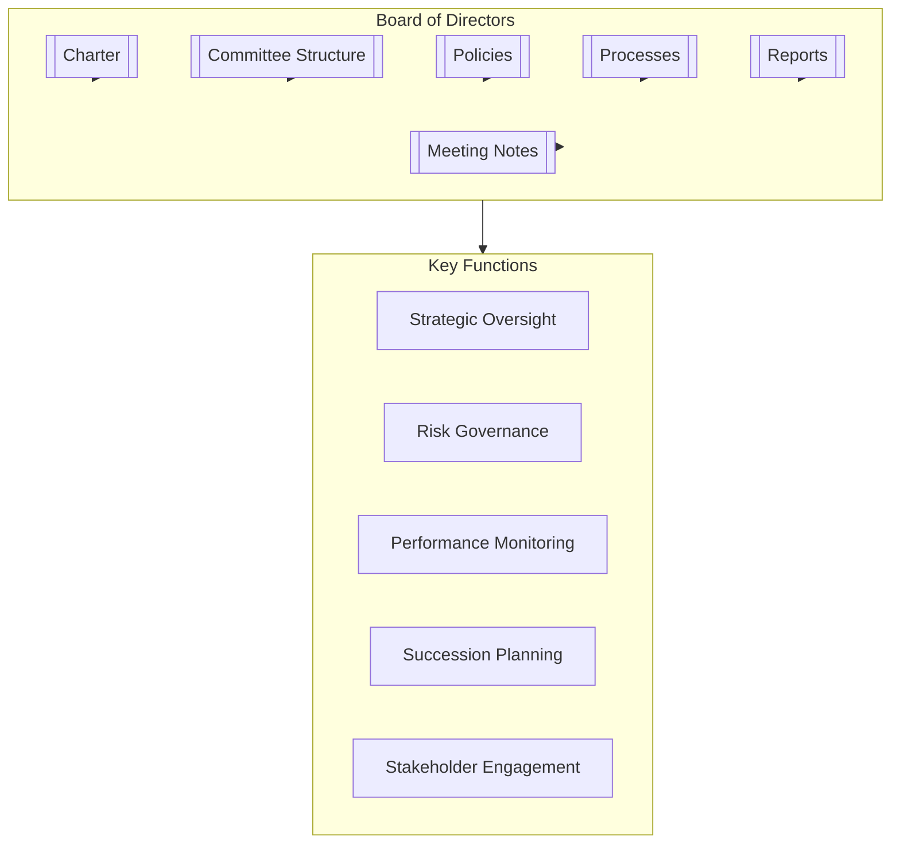

# Board of Directors

## Overview

The Board of Directors is the highest governing body of the organization, providing strategic oversight, governance, and leadership to ensure long-term success, sustainability, and adherence to the organization's mission and values.

## Key Documents

- **Charter**: [[Charter]] - Defines the board's purpose, scope, objectives, governance, and structure.
- **Committee Structure**: [[CommitteeStructure/committeestructure|Committee Structure]] - Outlines board committees and their governance roles.
- **Policies**: [[Policies/README|Policies Overview]] - Governs how the board operates, including:
    - [[Policies/boardofdirectorsunit|Unit Overview & Interfaces]]
    - [[Policies/PositionsPersonas|Positions & Personas]]
    - [[Policies/boardgovernancepolicy|Board Governance Policy]]
    - [[Policies/Responsibilities|Roles & Responsibilities]]
    - [[Policies/SkillsRoles|Skills & Roles]]
- **Processes**: [[Processes/README|Processes Overview]] - Describes core board activities, such as:
    - [[Processes/BoardMeetingProcess|Board Meeting Process]]
    - [[Processes/StrategicPlanning|Strategic Planning]]
    - [[Processes/PerformanceEvaluation|Performance Evaluation]]
    - [[Processes/SuccessionPlanning|Succession Planning]]
- **Meeting Notes**: [[MeetingNotes/README|Meeting Notes]] - Records of board meetings, decisions, and action items.
- **Reports**: [[Reports/README|Reports]] - Board reporting templates and examples.

## Purpose

To provide strategic leadership, effective governance, and oversight to ensure the organization's long-term success while protecting stakeholder interests.

## Contact

- **Board Chair**: [[Sarah Chen]]
- **Corporate Secretary**: [[Michael Rodriguez]]
- **Email**: boardofdirectors@organization.com

## Related Units

- [[../ExecutiveCommittee/README|Executive Committee]] - Direct reporting line to the Board
- [[../Governance/README|Governance Unit]] - Governance framework and compliance
- [[../RiskManagement/README|Risk Management Unit]] - Enterprise risk oversight
- [[../Strategy/README|Strategy Unit]] - Strategic planning and implementation
