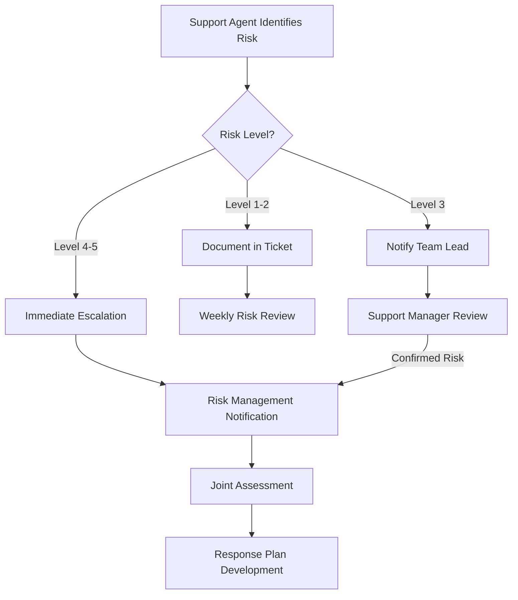

# Customer Support Risk Management Protocol

## Purpose

This policy establishes the framework for identifying, reporting, and managing customer-facing risks within the Customer Support Unit and defines the collaboration protocols with the [[../../RiskManagement/README|Risk Management Unit]]. It ensures that customer-reported issues that may indicate broader organizational risks are properly identified, escalated, and addressed.

## Scope

This protocol applies to all Customer Support personnel and interactions that may involve or reveal potential risks, including but not limited to:
- Data security or privacy concerns
- Product safety issues
- Service disruptions
- Compliance violations
- Reputation threats
- Operational vulnerabilities

## Risk Identification

### Risk Indicators

Customer Support agents should be alert to the following risk indicators in customer interactions:

1. **Multiple Similar Reports**: Several customers reporting the same issue within a short timeframe
2. **Data Concerns**: Customer reports of data exposure, unauthorized access, or privacy concerns
3. **Security Issues**: Reports of potential security vulnerabilities or unauthorized access
4. **Compliance Questions**: Customer inquiries about regulatory compliance or legal requirements
5. **Severe Impact**: Issues causing significant financial or operational impact to customers
6. **Reputation Threats**: Issues that could cause reputation damage if made public
7. **Unusual Patterns**: Unexpected patterns in service usage or customer behavior

### Risk Categorization

When potential risks are identified, they should be categorized according to the following framework aligned with the [[../../RiskManagement/Policies/RiskAppetite|Risk Appetite Framework]]:

| Risk Category | Description | Examples | Escalation Threshold |
|---------------|-------------|----------|----------------------|
| Critical (Level 5) | Immediate threat to customers, data, or organization | Data breach, service outage | Immediate escalation |
| High (Level 4) | Significant impact on multiple customers | Widespread functionality issue | Same business day |
| Medium (Level 3) | Notable impact on limited customers | Localized service degradation | Within 24 hours |
| Low (Level 2) | Minor impact on individual customers | Isolated errors, minor bugs | Within 48 hours |
| Minimal (Level 1) | No immediate impact, potential future concern | UI inconsistencies, feature requests | Weekly review |

## Risk Reporting and Escalation

### Immediate Actions

1. **Document the Issue**: Record detailed information about the potential risk in the ticketing system using the Risk Flag template
2. **Apply Risk Tag**: Apply appropriate risk category tags to the ticket
3. **Notify Team Lead**: Alert the team lead about potential risk issues (Level 3-5)
4. **Implement Initial Containment**: When possible, take immediate steps to contain the issue

### Escalation Path

### Escalation Timeframes

| Risk Level | Escalation Path | Timeframe |
|------------|-----------------|-----------|
| Level 5 (Critical) | Agent → Team Lead → Support Manager → Risk Management (immediate alert) | Immediate (within minutes) |
| Level 4 (High) | Agent → Team Lead → Support Manager → Risk Management | Same business day |
| Level 3 (Medium) | Agent → Team Lead → Support Manager → Weekly Risk Review | Within 24 hours |
| Level 2 (Low) | Agent → Weekly Risk Review | Document and monitor |
| Level 1 (Minimal) | Agent → Weekly Risk Review | Document and monitor |

## Collaboration with Risk Management

### Regular Touchpoints

1. **Weekly Risk Review Meeting**: Joint meeting between Customer Support (CS) and Risk Management (RM) representatives to review flagged issues
2. **Monthly Risk Coordination Meeting**: CS Director and RM representative review trends and ongoing risk mitigation efforts
3. **Quarterly Risk Assessment**: Joint session to evaluate customer-facing risk landscape

### Roles and Responsibilities

| Role | Responsibilities |
|------|------------------|
| Support Agent | Identify and flag potential risks; document details; implement initial containment |
| Team Lead | Review flagged issues; escalate as appropriate; assist in initial assessment |
| Support Manager | Validate risk level; coordinate with Risk Management; oversee mitigation in CS |
| Support Director | Strategic oversight; participate in high-level risk coordination; approve protocol changes |
| Risk Management Unit | Provide expertise; lead formal risk assessment; develop mitigation strategies; monitor effectiveness |

### Information Sharing

Information shared between Customer Support and Risk Management shall include:

1. **From Customer Support to Risk Management**:
   - Detailed description of the potential risk
   - Number of affected customers
   - Frequency and timing of reports
   - Customer impact assessment
   - Relevant ticket IDs and customer communications

2. **From Risk Management to Customer Support**:
   - Risk assessment results
   - Mitigation strategy and timeline
   - Customer communication templates
   - Resolution verification requirements
   - Prevention measures

## Documentation and Reporting

### Risk Register

Customer-facing risks meeting Level 3-5 criteria will be recorded in the organizational Risk Register maintained by the [[../../RiskManagement/README|Risk Management Unit]].

### Regular Reporting

1. **Weekly Risk Summary**: Compilation of all risk-flagged tickets
2. **Monthly Risk Report**: Analysis of trends, recurring issues, and mitigation effectiveness
3. **Customer Support Risk Dashboard**: Key indicators of customer-reported risks

## Training and Awareness

1. All Customer Support personnel shall receive training on:
   - Risk identification and categorization
   - Escalation procedures
   - Initial containment actions
   - Documentation requirements

2. Refresher training shall be conducted:
   - Annually for all support staff
   - Quarterly for team leads and specialists
   - After significant protocol changes

## Protocol Review and Updates

This protocol shall be reviewed jointly by Customer Support and Risk Management:
- Annually as a standard practice
- After any major risk incident
- When significant changes occur to the support environment or risk landscape

## Related Documents

- [[../../RiskManagement/Policies/RiskAppetite|Risk Appetite Framework]]
- [[../../RiskManagement/Processes/RiskIdentification|Risk Identification Process]]
- [[../Processes/EscalationProcedures|Customer Support Escalation Procedures]]
- [[../Processes/RiskIdentification|Customer Support Risk Identification Process]]

## Document Control

| Version | Date | Approved By | Changes |
|---------|------|-------------|---------|
| 1.0 | YYYY-MM-DD | Customer Support Director & Risk Management Director | Initial policy |

---

**Policy Owner**: Customer Support Operations Manager & Risk Management Specialist  
**Last Review**: YYYY-MM-DD  
**Next Review**: YYYY-MM-DD 