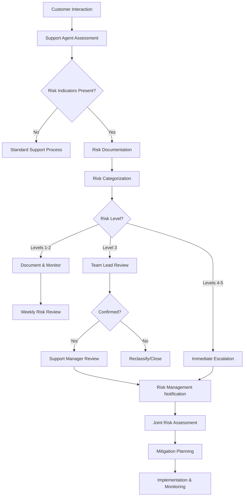

# Customer Support Risk Identification Process

## Purpose

This process document details the steps, responsibilities, and workflows for identifying, documenting, and escalating potential risks that are discovered through customer interactions. It ensures that Customer Support effectively operates as a critical risk identification channel for the organization.

## Scope

This process applies to all Customer Support personnel across all customer communication channels, including:
- Phone support
- Email support
- Live chat
- Support tickets
- Social media inquiries
- Customer forums
- Face-to-face interactions

## Process Overview

## Detailed Process Steps

### 1. Initial Risk Identification

**Purpose**: Recognize potential risk indicators during customer interactions.

**Activities**:
- Monitor for [risk indicators](../Policies/RiskManagementProtocol.md#risk-indicators) during all customer interactions
- Apply critical thinking to identify patterns across multiple customer reports
- Consider both explicit customer reports and implicit indicators
- Reference the [[../../RiskManagement/Policies/RiskAppetite|Risk Appetite Framework]] for context

**Outputs**:
- Initial risk recognition

**Tools and Techniques**:
- Risk Indicator Checklist
- Pattern Recognition Guidelines
- Recent Alert List

### 2. Risk Documentation

**Purpose**: Thoroughly document the potential risk for proper assessment.

**Activities**:
- Complete the Risk Flag template in the ticketing system
- Include all relevant details:
  - Detailed description of the potential risk
  - Affected customers (names, accounts, number)
  - Timing and frequency of reports
  - Observed or reported impact
  - Related tickets or incidents
  - Screenshots or evidence
- Apply appropriate risk tags

**Outputs**:
- Completed Risk Flag documentation
- Tagged support ticket

**Integration with Risk Management**:
- Use taxonomy consistent with [[../../RiskManagement/Processes/RiskIdentification|Risk Management Identification Process]]
- Link to relevant risk categories in the organization's risk register

### 3. Risk Categorization

**Purpose**: Assign appropriate risk level to determine escalation requirements.

**Activities**:
- Assess potential impact severity using the Risk Categorization Matrix
- Determine likelihood based on frequency and pattern of reports
- Assign risk level (1-5) according to the [[../Policies/RiskManagementProtocol|Risk Management Protocol]]
- Consider both customer impact and organizational impact

**Risk Level Assignment**:

| Level | Description | Examples | Customer Impact | Organizational Impact |
|-------|-------------|----------|-----------------|----------------------|
| 5 - Critical | Immediate major threat | Data breach, system outage | Severe disruption to multiple customers | Major financial, legal, or reputational damage |
| 4 - High | Significant issue | Widespread feature failure | Significant impact to many customers | Notable financial or reputational damage |
| 3 - Medium | Notable concern | Recurring error, localized issue | Moderate impact to several customers | Moderate operational or financial impact |
| 2 - Low | Minor issue | Isolated error, UI problem | Minor impact to few customers | Minor operational impact |
| 1 - Minimal | Potential concern | Feature suggestion, improvement opportunity | Minimal current impact | Minimal operational impact |

**Outputs**:
- Assigned risk level
- Completed impact assessment

### 4. Risk Escalation

**Purpose**: Ensure appropriate visibility and rapid response for significant risks.

**Activities**:
- Follow escalation path based on assigned risk level
- Provide required information to next escalation level
- For Level 4-5 risks, initiate immediate notification to management
- Document all escalation steps in the ticket

**Escalation Process by Level**:

| Level | Escalation Process | Timing | Documentation |
|-------|-------------------|--------|---------------|
| Level 5 (Critical) | Direct call to Team Lead + Support Manager + immediate Risk Management alert | Immediate (minutes) | Urgent alert + detailed ticket |
| Level 4 (High) | Direct notification to Team Lead + ticket escalation | Same business day | High priority ticket + email summary |
| Level 3 (Medium) | Notification to Team Lead + standard escalation | Within 24 hours | Standard escalation + detailed notes |
| Level 2 (Low) | Flag in ticketing system | Weekly review cycle | Ticket tagging + basic description |
| Level 1 (Minimal) | Document in ticket | Regular review cycle | Ticket tagging only |

**Outputs**:
- Escalated ticket with appropriate routing
- Notification to relevant stakeholders
- Escalation trail documentation

### 5. Management Review

**Purpose**: Validate risk assessment and determine appropriate next steps.

**Activities**:
- Team Lead/Manager reviews risk assessment and categorization
- Validates or adjusts risk level based on broader context
- Approves escalation to Risk Management for confirmed Levels 3-5
- Assigns resources for immediate containment if needed

**Outputs**:
- Validated risk assessment
- Escalation to Risk Management (if appropriate)
- Initial containment plan (if needed)

### 6. Risk Management Coordination

**Purpose**: Engage with Risk Management Unit for formal assessment and response planning.

**Activities**:
- Provide comprehensive briefing to Risk Management representative
- Participate in joint risk assessment meeting
- Share customer perspective and impact details
- Support development of mitigation strategies
- Coordinate customer communication approach

**Integration with Risk Management Unit**:
- Follow the [[../../RiskManagement/Processes/RiskAssessment|Risk Assessment Process]]
- Provide input to the [[../../RiskManagement/Reports/RiskDashboard|Risk Dashboard]]
- Coordinate with [[../../RiskManagement/Processes/RiskMitigation|Risk Mitigation Process]]

**Outputs**:
- Joint risk assessment
- Coordinated mitigation plan
- Customer Support action items

### 7. Ongoing Monitoring and Reporting

**Purpose**: Track the risk status and effectiveness of mitigation actions.

**Activities**:
- Update risk tickets with new information
- Monitor for similar reports from other customers
- Track resolution progress
- Document customer impact changes
- Participate in weekly and monthly risk reviews
- Update knowledge base with emerging issues

**Outputs**:
- Updated risk tickets
- Contributions to risk reports
- Knowledge base updates

## Roles and Responsibilities

| Role | Responsibilities |
|------|------------------|
| Support Agent | Identify risk indicators; document details; assign initial risk level; escalate per protocol |
| Team Lead | Review risk assessments; validate risk levels; coordinate with Support Manager; oversee containment |
| Support Manager | Final review of Level 3-5 risks; coordinate with Risk Management; allocate resources |
| Support Operations | Maintain risk identification process; compile trends; lead weekly risk reviews |
| Risk Management Unit | Provide expert assessment; lead formal risk evaluation; develop comprehensive response |

## Training Requirements

All Customer Support personnel must complete the following training:
1. Basic Risk Awareness Training (all staff, annual)
2. Risk Identification and Documentation (all support agents, semi-annual)
3. Risk Assessment and Escalation (team leads, quarterly)
4. Advanced Risk Management (managers, quarterly)

## Metrics and Reporting

The following metrics will be tracked to measure the effectiveness of the risk identification process:

| Metric | Description | Target | Reporting Frequency |
|--------|-------------|--------|---------------------|
| Risk Identification Rate | Number of risks identified per 1000 customer interactions | 2-5 | Weekly |
| Escalation Accuracy | % of escalated risks confirmed as valid by Risk Management | >80% | Monthly |
| Time to Escalation | Average time from identification to appropriate escalation | <4 hours | Weekly |
| Risk Resolution Time | Average time from identification to risk mitigation | By risk level | Monthly |
| Customer Impact Reduction | % reduction in customer-reported issues following mitigation | >90% | Quarterly |

## Tools and Templates

- Risk Flag Template
- Risk Indicator Checklist
- Risk Categorization Matrix
- Escalation Workflow Guide
- Customer Risk Report Template

## Related Documents

- [[../Policies/RiskManagementProtocol|Customer Support Risk Management Protocol]]
- [[../../RiskManagement/Processes/RiskIdentification|Risk Management Risk Identification Process]]
- [[../Processes/EscalationProcedures|Customer Support Escalation Procedures]]
- [[../Processes/CustomerCommunication|Customer Communication Process]]

## Document Control

| Version | Date | Author | Changes |
|---------|------|--------|---------|
| 1.0 | YYYY-MM-DD | Customer Support Operations | Initial process |

---

**Process Owner**: Customer Support Operations Manager  
**Last Review**: YYYY-MM-DD  
**Next Review**: YYYY-MM-DD 