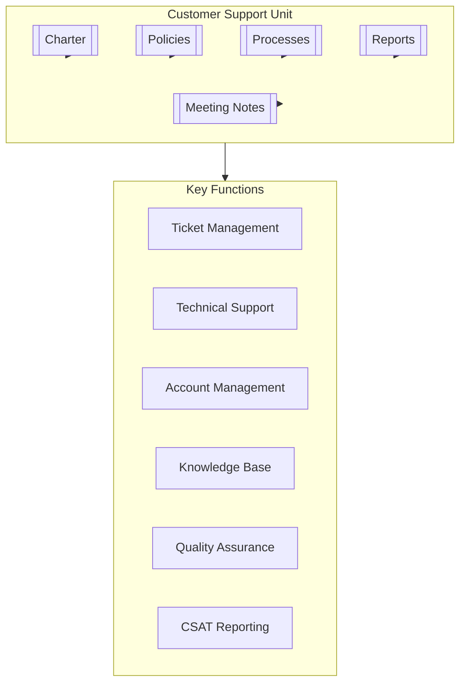

# Customer Support Unit

## Overview

The Customer Support Unit is responsible for delivering timely, effective, and empathetic support to customers across all channels. It serves as the primary interface between customers and the organization, ensuring exceptional service experiences while gathering valuable feedback to drive continuous improvement of products and services.

## Key Documents

- **Charter**: [[Charter]] - Defines the unit's purpose, scope, objectives, governance, and structure.
- **Policies**: [[Policies/README|Policies Overview]] - Governs how the unit operates, including:
    - [[Policies/customersupportunit|Unit Overview & Interfaces]]
    - [[Policies/PositionsPersonas|Positions & Personas]]
    - [[Policies/ServiceLevelAgreements|Service Level Agreements]]
    - [[Policies/Responsibilities|Roles & Responsibilities]]
    - [[Policies/SkillsRoles|Skills & Roles]]
- **Processes**: [[Processes/README|Processes Overview]] - Describes core customer support workflows, such as:
    - [[Processes/TicketManagement|Ticket Management]]
    - [[Processes/EscalationProcedures|Escalation Procedures]]
    - [[Processes/KnowledgeManagement|Knowledge Management]]
    - [[Processes/CustomerCommunication|Customer Communication]]
    - [[Processes/QualityAssurance|Quality Assurance]]
- **Meeting Notes**: [[MeetingNotes/README|Meeting Notes]] - Records of discussions, decisions, and action items.
- **Reports**: [[Reports/README|Reports]] - Performance metrics, customer satisfaction, and trend analyses.

## Purpose

To foster customer loyalty, satisfaction, and success by providing accessible, high-quality support through all customer channels while gathering feedback to improve products and services.

## Contact

- **Customer Support Director**: [[Alex Morgan]]
- **Slack Channel**: `#customer-support`

## Related Units

- [[../Operations/README|Operations Unit]] - Collaboration on operational service delivery
- [[../RiskManagement/README|Risk Management Unit]] - Partnership on customer-facing risk mitigation
- [[../ProductManagement/README|Product Management Unit]] - Feedback loop for product improvements
