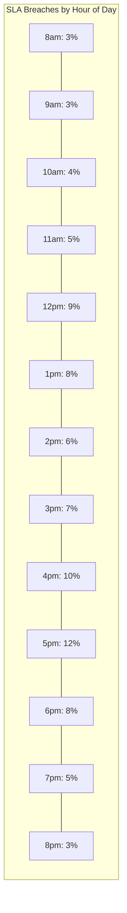
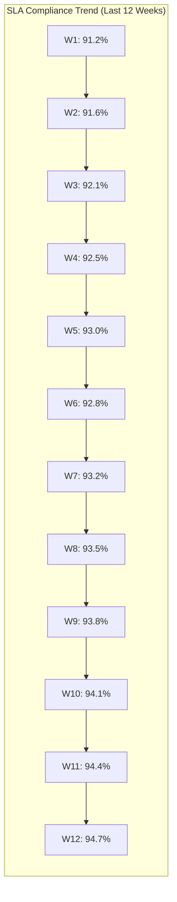

# SLA Compliance Report

This report provides detailed analysis of the Customer Support Unit's compliance with established Service Level Agreements (SLAs) across all support channels, tiers, and issue severities.

## Executive Summary

This weekly SLA Compliance Report tracks the organization's adherence to defined response and resolution time targets. For the current reporting period, overall SLA compliance is **94.7%** against a target of 95%, with notable improvements in email response times and opportunities in the technical support tier.

## Overall SLA Performance

```mermaid
gauge
    title Overall SLA Compliance
    min 0
    max 100
    value 94.7
    customLabel SLA Compliance (%)
    axisWidth 50
    axisLabel Threshold
    threshold 95
```

## Key Performance Metrics

| Metric | Current | Previous | Change | Target | Status |
|--------|---------|----------|--------|--------|--------|
| Overall SLA Compliance | 94.7% | 93.8% | +0.9% | 95% | ⚠️ Near Target |
| Response Time Compliance | 96.2% | 95.1% | +1.1% | 95% | ✅ On Target |
| Resolution Time Compliance | 93.2% | 92.5% | +0.7% | 95% | ⚠️ Below Target |
| First Contact Resolution | 78.4% | 76.9% | +1.5% | 75% | ✅ On Target |
| Average Handle Time | 16.3 min | 17.1 min | -0.8 min | 18 min | ✅ On Target |
| SLA Breach Rate | 5.3% | 6.2% | -0.9% | 5% | ⚠️ Near Target |

## SLA Compliance by Channel

| Channel | Response SLA | Resolution SLA | Overall SLA | Volume | Trend |
|---------|--------------|----------------|-------------|--------|-------|
| Email | 97.3% | 95.1% | 96.2% | 42% | ↑ |
| Live Chat | 98.9% | 94.2% | 96.6% | 28% | ↑ |
| Phone | 99.2% | 93.8% | 96.5% | 22% | → |
| Self-Service Portal | 92.5% | 88.7% | 90.6% | 6% | ↑ |
| Social Media | 93.1% | 89.2% | 91.2% | 2% | ↓ |

## SLA Compliance by Support Tier

| Support Tier | Response SLA | Resolution SLA | Overall SLA | Volume | Trend |
|--------------|--------------|----------------|-------------|--------|-------|
| Tier 1 | 98.2% | 94.8% | 96.5% | 68% | ↑ |
| Tier 2 | 94.6% | 91.9% | 93.3% | 22% | → |
| Tier 3 | 91.2% | 88.5% | 89.9% | 7% | ↑ |
| Enterprise | 99.1% | 97.8% | 98.5% | 3% | → |

## SLA Compliance by Severity

| Severity | Response SLA | Resolution SLA | Overall SLA | Volume | Trend |
|----------|--------------|----------------|-------------|--------|-------|
| Critical (P1) | 97.8% | 94.2% | 96.0% | 4% | ↑ |
| High (P2) | 96.5% | 93.7% | 95.1% | 14% | → |
| Medium (P3) | 96.1% | 92.9% | 94.5% | 48% | ↑ |
| Low (P4) | 95.8% | 92.4% | 94.1% | 34% | → |

## Top SLA Breach Categories

| Issue Category | SLA Breach Rate | Volume | Avg Time to Breach | Primary Cause |
|----------------|-----------------|--------|---------------------|---------------|
| API Integration | 12.3% | 5% | 3.7 hours | Technical complexity |
| Data Migration | 10.8% | 3% | 6.2 hours | Third-party dependencies |
| Security Issues | 9.4% | 2% | 4.1 hours | Escalation delays |
| Custom Deployments | 8.7% | 4% | 5.3 hours | Environment complexity |
| Billing Disputes | 7.2% | 7% | 2.8 hours | Approval workflow |

## Team Performance

| Team | Response SLA | Resolution SLA | Overall SLA | Volume | Trend |
|------|--------------|----------------|-------------|--------|-------|
| General Support | 98.3% | 94.2% | 96.3% | 45% | ↑ |
| Technical Support | 93.8% | 90.4% | 92.1% | 32% | → |
| Billing Support | 97.2% | 93.7% | 95.5% | 18% | ↑ |
| Enterprise Support | 99.1% | 97.3% | 98.2% | 5% | → |

## Agent Performance

### Top Performing Agents
1. **Emma Rodriguez** - Overall SLA: 99.7%, Volume: 132 tickets
2. **Jamal Washington** - Overall SLA: 99.3%, Volume: 128 tickets
3. **Aisha Patel** - Overall SLA: 98.9%, Volume: 145 tickets

### Agents Needing Support
1. **[Redacted]** - Overall SLA: 87.3%, Volume: 98 tickets, Primary Challenge: Complex technical issues
2. **[Redacted]** - Overall SLA: 88.6%, Volume: 105 tickets, Primary Challenge: Handling multiple tickets simultaneously
3. **[Redacted]** - Overall SLA: 89.2%, Volume: 76 tickets, Primary Challenge: New product knowledge

## SLA Breach Analysis

### Time of Day Analysis



### Day of Week Analysis

| Day | SLA Compliance | Volume | Trend |
|-----|----------------|--------|-------|
| Monday | 93.2% | 21% | → |
| Tuesday | 94.8% | 19% | ↑ |
| Wednesday | 95.3% | 18% | ↑ |
| Thursday | 94.9% | 17% | → |
| Friday | 93.8% | 16% | → |
| Saturday | 96.3% | 5% | ↑ |
| Sunday | 96.7% | 4% | ↑ |

### Root Cause Analysis

| Breach Cause | Percentage | Change vs Last Week |
|--------------|------------|---------------------|
| Agent Capacity | 32% | -3% |
| Technical Complexity | 24% | +1% |
| Third-Party Dependencies | 18% | -1% |
| Knowledge Gaps | 14% | -2% |
| Process Bottlenecks | 12% | +1% |

## Escalation Impact on SLA

| Escalation Type | Tickets Escalated | SLA Post-Escalation | Avg Time Added |
|-----------------|-------------------|---------------------|----------------|
| Tier 1 → Tier 2 | 14.3% | 88.7% | +2.3 hours |
| Tier 2 → Tier 3 | 8.7% | 86.2% | +4.1 hours |
| Technical → Development | 3.2% | 78.3% | +8.2 hours |
| Support → Product Management | 2.1% | 82.5% | +6.8 hours |

## SLA Improvement Initiatives

| Initiative | Description | Impact | Status | Owner |
|------------|-------------|--------|--------|-------|
| Knowledge Base Enhancement | Improving searchability and content | +2.1% FCR | In Progress | Knowledge Base Manager |
| Agent Capacity Planning | Optimizing scheduling based on volume patterns | -1.2% breach rate | Implemented | Support Operations Manager |
| Technical Training Program | Advanced troubleshooting skills for complex issues | +3.7% technical resolution | In Progress | Training Manager |
| Escalation Process Refinement | Streamlining handoffs between tiers | -0.8 hours avg resolution | Planned | Support Manager |

## Business Impact Analysis

### Customer Retention Impact
- Tickets meeting SLA: 98.2% retention rate
- Tickets breaching SLA: 82.7% retention rate
- **Impact**: Estimated $37,500 monthly revenue protected through SLA compliance

### Efficiency Impact
- Current cost per ticket: $12.80
- Cost per SLA breach: $23.40 (includes additional handling, escalation, management)
- **Impact**: Estimated $18,450 monthly savings from improved SLA compliance

## Cross-Functional Considerations

### Risk Management
- Critical issue SLA breaches documented in [[../../RiskManagement/Reports/OperationalRisk|Operational Risk Register]]
- Security-related SLA performance shared with [[../../Security/Reports/SecurityIncidents|Security Incident Report]]

### Product Management
- Product-specific SLA challenges communicated to [[../../ProductManagement/Reports/ProductIssues|Product Issues Report]]
- Feature requests to improve supportability tracked in [[../../ProductManagement/Reports/FeaturePrioritization|Feature Prioritization]]

### Operations
- System performance impact on SLAs documented in [[../../Operations/Reports/SystemPerformance|System Performance Report]]
- Staffing requirements shared with [[../../HumanResources/Reports/StaffingNeeds|Staffing Needs Analysis]]

## Historical Trend Analysis



## Next Steps and Recommendations

1. **Capacity Planning**: Adjust staffing for peak SLA breach times (12pm and 4-5pm)
2. **Targeted Training**: Technical support team proficiency in API Integration issues
3. **Process Improvement**: Review and optimize third-party escalation workflows
4. **Knowledge Gap Closure**: Create additional resources for top breach categories
5. **Tool Enhancement**: Implement SLA warning system at 75% of time threshold

## Related Reports

- [[CSATReport|Customer Satisfaction Report]]
- [[VolumeTrendAnalysis|Volume & Trend Analysis]]
- [[QualityReport|Quality Assurance Report]]
- [[../../Operations/Reports/PerformanceMetrics|Operations Performance Metrics]]

## Report Owner

**Support Operations Manager** - Responsible for this report, analysis, and resulting improvement initiatives. For more information about SLA definitions, see [[../Policies/ServiceLevelAgreements|Service Level Agreements]]. 