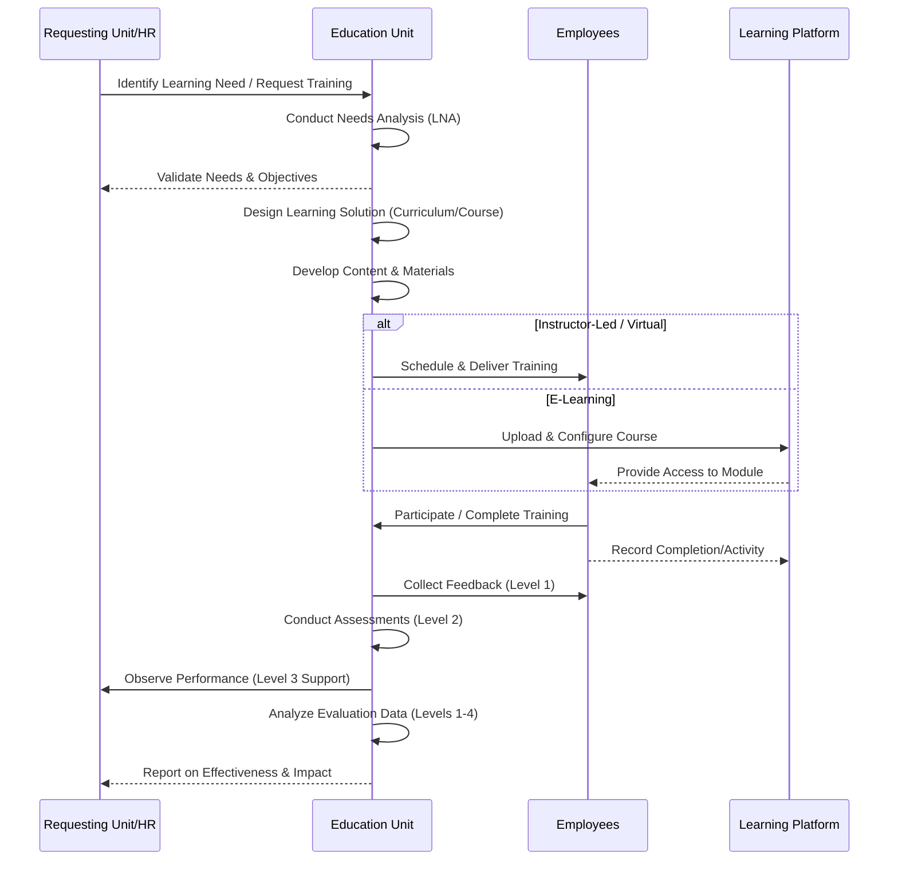
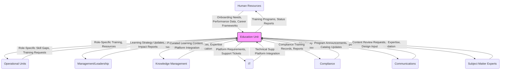

# Education Unit

## Overview
The Education unit is responsible for fostering a culture of continuous learning and development throughout the organization. It designs, delivers, and manages learning programs and resources to enhance employee skills, knowledge, and performance, aligning with organizational goals and promoting professional growth. This includes needs assessment, instructional design, content development, delivery management via various modalities (ILT, VILT, e-learning), technology administration (LMS), program evaluation, and vendor management.

## Core Responsibilities
- Conducting comprehensive **learning needs analysis (LNA)** across departments and roles to identify skill gaps and development opportunities.
- Designing and developing engaging and effective **curriculum, training materials, and learning content** (e-learning, instructor-led, blended learning, job aids, etc.).
- Delivering and facilitating high-impact **training sessions and workshops** (both in-person and virtual).
- Managing and administering the **Learning Management System (LMS)** and other learning technologies to ensure smooth delivery, tracking, and reporting.
- Developing and managing **career development pathways and programs** in collaboration with HR.
- Systematically **evaluating the effectiveness** of training programs and initiatives using established models (e.g., Kirkpatrick).
- Promoting **knowledge sharing** and fostering a community of practice around learning and development.
- Managing relationships with **external training vendors and institutions** to supplement internal capabilities.
- Supporting **onboarding programs** with relevant training modules for new hires.

## Key Processes
The core process typically follows a cycle from identifying needs to evaluating impact.

1.  [[learning_needs_analysis]] - Identifying skill gaps and training requirements.
2.  [[instructional_design_development]] - Creating effective learning experiences based on adult learning principles.
3.  [[curriculum_management]] - Organizing, updating, and retiring learning paths and content.
4.  [[training_delivery_facilitation]] - Conducting engaging live or virtual sessions.
5.  [[elearning_module_development]] - Creating interactive and accessible digital learning content.
6.  [[lms_administration]] - Managing users, courses, reporting, and system health.
7.  [[learning_assessment_evaluation]] - Measuring knowledge transfer, skill application, and business impact.
8.  [[career_pathing_support]] - Guiding employee development in line with career frameworks.
9.  [[vendor_management_education]] - Selecting, contracting, and managing external providers.
10. [[knowledge_sharing_initiatives]] - Facilitating peer-to-peer learning and communities of practice.

## Interfaces
Visualizing the primary internal information flows:

### Internal Primary
-   [[HumanResources]] - Collaboration on onboarding, performance management, career development, compliance training. *Input: Needs, Data; Output: Programs, Reports.*
-   All Operational Units - Needs analysis, delivery of role-specific training. *Input: Skill Gaps, Requests; Output: Training, Resources.*
-   [[Management]]/[Leadership] - Strategic alignment, identifying development needs. *Input: Priorities; Output: Strategy Updates, Impact Reports.*
-   [[KnowledgeManagement]] - Capturing and disseminating organizational knowledge, integrating learning resources. *Input: Expertise; Output: Content Integration.*

### Internal Secondary
-   [[IT]] - Support for learning technologies (LMS, virtual classrooms). *Input/Output: Technical Support/Requirements.*
-   [[Compliance]] - Ensuring delivery and tracking of mandatory training. *Input: Requirements; Output: Records.*
-   [[Communications]] - Promoting learning opportunities. *Input/Output: Promotion Info/Announcements.*
-   [[SubjectMatterExperts]] (SMEs) - Content validation and co-development. *Input/Output: Expertise/Review Requests.*

### External
-   External Training Providers & Vendors
-   Academic Institutions & Universities
-   Professional Associations & Certification Bodies
-   E-learning Content Libraries
-   Instructional Design Consultants
-   Learning Technology Providers

## Resources
### Learning Technologies
-   [[learning_management_system_lms]] - Central platform for hosting, delivery, tracking.
-   [[elearning_authoring_tools]] (e.g., Articulate 360, Adobe Captivate) - For creating interactive modules.
-   [[virtual_classroom_platform]] (e.g., Zoom, Microsoft Teams, Webex) - For live online delivery.
-   [[video_creation_hosting_platform]] (e.g., Panopto, Vimeo) - For recording and sharing video content.
-   [[assessment_survey_tools]] (e.g., Qualtrics, SurveyMonkey, LMS-native) - For evaluations and knowledge checks.
-   [[learning_experience_platform_lxp]] (Potentially) - For personalized learning discovery and curation.
-   [[knowledge_base_integration]] - Connecting learning resources with KM systems.

### Content & Tools
-   [[internal_course_catalog]] - Listing of all available internal training.
-   [[external_content_libraries]] (e.g., LinkedIn Learning, Coursera) - Subscriptions for curated external content.
-   [[facilitator_guides_materials]] - Resources for instructors.
-   [[learner_job_aids_resources]] - Performance support materials.
-   [[instructional_design_templates]] - Standardized formats for development.
-   [[project_management_tools_edu]] (e.g., Jira, Asana) - For tracking development projects.
-   [[analytics_reporting_tools_edu]] (LMS reporting, Power BI) - For analyzing learning data.

## Documentation
### Policies and Procedures
-   [[training_development_policy]] - Overall governance of L&D activities.
-   [[lms_usage_guidelines]] - Rules and best practices for using the LMS.
-   [[instructional_design_standards]] - Quality criteria for course development.
-   [[training_evaluation_procedure]] - How training effectiveness is measured.
-   [[vendor_selection_policy_edu]] - Process for engaging external providers.
-   [[certification_reimbursement_policy]] (if applicable) - Guidelines for external certifications.
-   [[mandatory_training_policy]] - Requirements for compliance training.
-   [[content_development_lifecycle]] - SOP for creating and updating content.

### Frameworks & Guidelines
-   [[competency_framework]] (if used) - Linking training to required job skills.
-   [[career_development_framework]] - Outlining growth paths and related learning.
-   [[learning_pathway_guidelines]] - Structuring curriculum for specific roles or skills.
-   [[facilitation_best_practices]] - Standards for effective training delivery.
-   [[accessibility_standards_learning]] (e.g., WCAG) - Ensuring content is accessible to all learners.

### Templates
-   [[course_design_document_template]]
-   [[training_needs_assessment_template]]
-   [[session_evaluation_form]] (Kirkpatrick Level 1)
-   [[facilitator_feedback_form]]
-   [[project_plan_template_edu]]

## Focus Areas
1.  Foundational & Role-Specific Skills Training
2.  Leadership & Management Development
3.  Compliance & Regulatory Training
4.  Technical Skills Development (Software, Tools, Processes)
5.  Soft Skills & Professional Development (Communication, Teamwork, etc.)
6.  Onboarding & New Hire Training
7.  Product & Service Knowledge Training
8.  Continuous Learning & Upskilling Initiatives (Supporting future skills)

## Operational Functions
1.  Program Design & Development
    -   [[needs_analysis_execution]]
    -   [[content_creation_curation]]
    -   [[learning_path_design]]
    -   [[assessment_strategy_design]]

2.  Training Delivery & Facilitation
    -   [[schedule_coordination_logistics]]
    -   [[instructor_led_training_delivery]]
    -   [[virtual_training_facilitation]]
    -   [[facilitator_support_coaching]]

3.  Learning Technology Management
    -   [[lms_course_user_admin]]
    -   [[learning_platform_maintenance]]
    -   [[reporting_analytics_edu]]
    -   [[technology_vendor_liaison]]

4.  Evaluation & Improvement
    -   [[data_collection_feedback]]
    -   [[impact_analysis_reporting]]
    -   [[program_revision_updates]]
    -   [[benchmarking_best_practices]]

## Performance Metrics
-   **Participation/Completion:** Training completion rates, Program enrollment.
-   **Satisfaction (Level 1):** Learner satisfaction scores (post-course surveys).
-   **Learning (Level 2):** Knowledge gain (pre/post tests), Skill assessment scores.
-   **Behavior (Level 3):** Observed behavior change, Application on the job (manager/peer feedback, performance data).
-   **Results (Level 4):** Business impact (KPI improvement), ROI calculations.
-   **Efficiency/Engagement:** LMS utilization rates, Time-to-competency for new hires, Compliance training adherence rates, Cost per training hour/employee.

## Strategic Management
1.  Learning Strategy Alignment
    -   [[linking_learning_to_business_goals]]
    -   [[workforce_capability_planning]] & [[skill_gap_forecasting]]
    -   [[building_learning_culture_strategy]]
    -   [[measuring_strategic_impact_of_learning]]

2.  Resource & Budget Management
    -   [[budget_planning_allocation_edu]]
    -   [[resource_optimization_edu]] (Internal vs. External, Modality choice)
    -   [[vendor_contract_negotiation]] & [[relationship_management]]

3.  Innovation in Learning
    -   [[exploring_new_learning_technologies]] & [[pedagogical_approaches]]
    -   [[adopting_modern_pedagogies]] (e.g., microlearning, gamification, social learning)
    -   [[piloting_new_programs_modalities]] & [[scaling_successful_innovations]]

## Related Links
-   [[lms_login_portal]] - Access point for learners.
-   [[course_catalog_browser]] - Searchable list of available training.
-   [[training_calendar_schedule]] - Upcoming ILT/VILT sessions.
-   [[career_development_resources_page]] - Hub for growth opportunities.
-   [[knowledge_sharing_forum]] / [[Community_of_Practice_Platform]]
-   [[external_training_request_form]] & [[approval_workflow]]

## Strategic Initiatives
1.  [[implementing_personalized_learning_paths]] - Tailoring content based on role, skills, and goals.
2.  [[enhancing_leadership_development_pipeline]] - Building future leaders.
3.  [[digital_transformation_of_learning_delivery]] - Modernizing approaches and platforms.
4.  [[creating_center_of_excellence_instructional_design]] - Standardizing quality and innovation.
5.  [[improving_measurement_of_learning_impact]] - Moving beyond completion rates to business value.
6.  [[launching_mentorship_program]] - Facilitating informal learning and guidance.

## Innovation Projects
1.  [[ai_powered_learning_recommendations]] - Proactive content suggestions in LMS/LXP.
2.  [[vr_ar_for_skills_training_simulation]] - Immersive learning for complex or hazardous tasks.
3.  [[gamification_for_engagement_compliance]] - Using game mechanics to motivate learners.
4.  [[developing_mobile_learning_app]] - Enabling learning anytime, anywhere.
5.  [[integrating_learning_into_workflow]] (Learning in the Flow of Work) - Providing support at the point of need.

## Risk Management
-   [[outdated_content_risk]] - Ensuring materials are current and accurate. Mitigation: Regular review cycles, SME involvement.
-   [[low_learner_engagement_risk]] - Designing motivating, relevant, and interactive experiences. Mitigation: Varied modalities, active learning techniques.
-   [[ineffective_training_risk]] (Lack of Transfer) - Ensuring learning translates to performance. Mitigation: Practice opportunities, manager involvement, performance support.
-   [[technology_failure_risk]] - LMS/Platform reliability and usability. Mitigation: Robust platform choice, IT support, contingency plans.
-   [[compliance_training_failure_risk]] - Ensuring completion and comprehension. Mitigation: Clear tracking, assessments, mandatory enforcement.
-   [[ip_content_security_risk]] - Protecting proprietary materials. Mitigation: Access controls, NDAs for vendors.
-   [[vendor_performance_risk]] - Ensuring external providers meet quality standards. Mitigation: Clear SLAs, performance monitoring.

## Education Programs
1.  Core Curricula
    -   [[new_hire_onboarding_program]] - Foundational knowledge and skills for new employees.
    -   [[management_essentials_program]] - Core skills for new and existing managers.
    -   [[leadership_development_program]] - Advanced programs for high-potential leaders.
    -   [[annual_compliance_training_suite]] - Mandatory training (e.g., Security, Code of Conduct).

2.  Functional Training Academies (Examples)
    -   [[sales_academy]] - Product knowledge, sales methodology, CRM usage.
    -   [[customer_service_excellence_program]] - Communication, problem-solving, support tools.
    -   [[engineering_technical_skills_path]] - Specific technologies, coding standards, development processes.
    -   [[project_management_certification_track]] - PMP prep, Agile methodologies.

3.  Continuing Education Support
    -   [[tuition_reimbursement_program]] - Policy and process for external course funding.
    -   [[professional_certification_support]] - Assistance for obtaining industry certifications.
    -   [[access_to_external_learning_platforms]] - Managing licenses for LinkedIn Learning, Coursera, etc.

---
Last Updated: <%DATE%>
Version: 1.1
Maintained by: [[Education_Director]] / [[Learning_Development_Lead]]
Security Level: [[Internal]]
Document Status: [[Active]] 