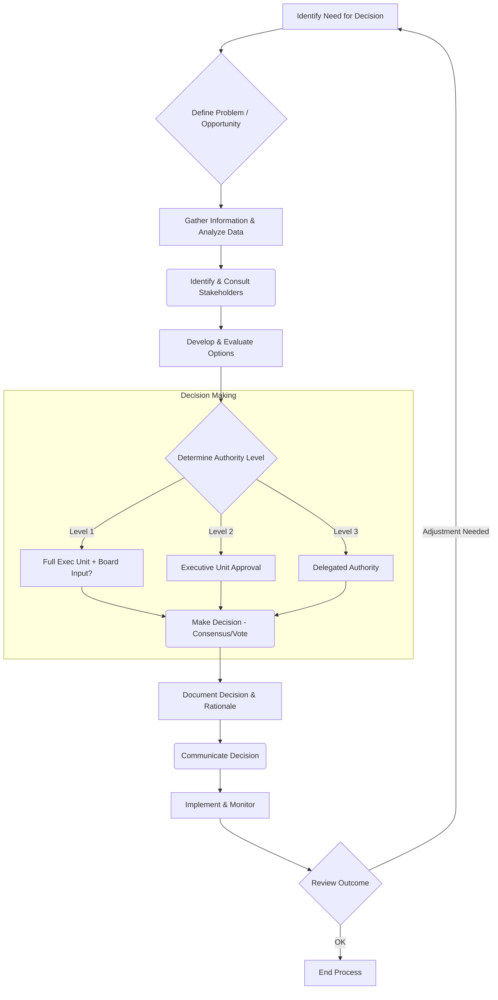

# Executive Decision-Making Framework

## 1. Purpose

This document describes the framework used by the Executive Unit to ensure consistent, informed, timely, and effective decision-making on matters critical to the organization's strategy, operations, and governance.

## 2. Principles

Executive decision-making is guided by the following principles:
*   **Strategic Alignment:** Decisions support the organization's mission, vision, and strategic objectives.
*   **Data-Informed:** Decisions are based on the best available data, analysis, and expertise.
*   **Transparency:** The decision-making process is clear and understandable where appropriate, while maintaining confidentiality for sensitive matters.
*   **Accountability:** Roles and responsibilities for making and implementing decisions are clearly defined.
*   **Timeliness:** Decisions are made in a timeframe appropriate to the situation.
*   **Risk-Aware:** Potential risks and benefits associated with decisions are systematically considered.
*   **Ethical:** Decisions adhere to the organization's code of conduct and ethical standards.
*   **Collaboration:** Input from relevant stakeholders is sought and considered.

## 3. Decision Categories & Authority Levels

Decisions are categorized based on their impact, risk, and scope. Authority levels are defined accordingly (often linked to the [Delegation of Authority Policy](../Policies/DelegationOfAuthority.md)).

*   **Level 1: Strategic & High-Impact:** (e.g., Major acquisitions, significant strategic shifts, annual budget approval, key executive hires). Requires full Executive Unit consensus/vote and often Board approval/input.
*   **Level 2: Significant Operational & Financial:** (e.g., Large capital expenditures below Board threshold, new product line launches, significant policy changes). Requires Executive Unit approval, potentially led by the relevant functional executive.
*   **Level 3: Functional & Tactical:** (e.g., Departmental budgets, operational process improvements, key vendor selections). Often delegated to individual Executives or senior managers, reported back to the Executive Unit.

## 4. Decision-Making Process Steps

While the specific steps may vary based on the decision's complexity and urgency, a general process includes:

1.  **Identify & Define:** Clearly articulate the decision required, the problem to be solved, or the opportunity to be pursued.
2.  **Gather Information & Analyze:** Collect relevant data, conduct analysis (financial, operational, risk, market), and identify potential options.
3.  **Identify Stakeholders & Consult:** Determine who needs to be consulted or informed and gather their input.
4.  **Develop & Evaluate Options:** Define viable options/solutions, assessing the pros, cons, risks, benefits, and resource implications of each.
5.  **Select Preferred Option / Make Decision:** Based on principles, analysis, and consultation, the designated authority level makes the decision (e.g., through consensus, vote, or individual executive authority).
6.  **Document Decision & Rationale:** Record the decision made, the key rationale behind it, and any dissenting opinions if applicable (often in meeting minutes).
7.  **Communicate Decision:** Inform relevant stakeholders of the decision and its implications.
8.  **Implement & Monitor:** Assign responsibility for implementation, track progress, and monitor outcomes. Review the effectiveness of the decision as needed.

## 5. Process Flow (Conceptual Mermaid Diagram)

## 6. Tools & Techniques

The Executive Unit may utilize various tools and techniques, including:
*   SWOT/PESTLE Analysis
*   Cost-Benefit Analysis
*   Risk Assessment Matrices
*   Scenario Planning
*   Decision Trees
*   Stakeholder Mapping

## 7. Review

This framework will be reviewed periodically (e.g., annually) by the Executive Unit to ensure its continued effectiveness and relevance. 