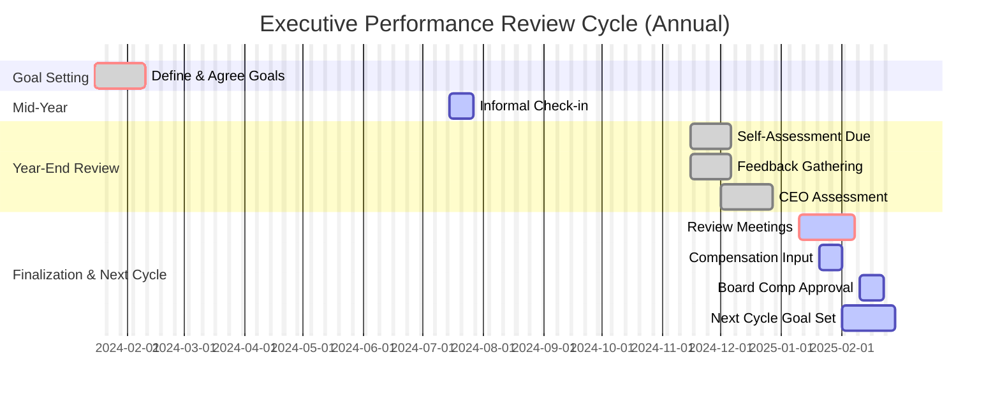

# Executive Performance Review Process

## 1. Purpose

This document outlines the process for evaluating the performance of members of the Executive Unit (excluding the CEO, whose review process is typically managed directly by the Board of Directors). The goal is to ensure accountability, provide constructive feedback, align individual performance with organizational goals, and inform compensation and development decisions.

## 2. Scope

This process applies to all members of the Executive Unit reporting to the CEO. It typically follows an annual cycle, aligned with the organization's overall performance management calendar.

## 3. Principles

*   **Fairness & Objectivity:** Evaluations are based on pre-defined goals, metrics, and observable behaviors.
*   **Alignment:** Performance goals are directly linked to the organization's strategic objectives and the executive's area of responsibility.
*   **Confidentiality:** Review discussions and documentation are kept confidential.
*   **Development-Oriented:** The process aims to identify strengths and areas for development, supporting career growth.
*   **Regular Feedback:** While the formal review is typically annual, ongoing feedback throughout the year is encouraged.

## 4. Roles and Responsibilities

*   **CEO:** Conducts the performance reviews for direct executive reports, provides final ratings, and makes compensation recommendations (subject to Compensation Committee/Board approval).
*   **Executive Unit Members (Reviewees):** Participate actively by providing self-assessments, engaging in review discussions, and setting future goals.
*   **Human Resources (HR):** Facilitates the process, provides tools and guidance, ensures consistency, and maintains records. May aggregate 360-degree feedback if used.
*   **Compensation Committee/Board:** Reviews and approves CEO's recommendations for executive compensation based on performance outcomes.

## 5. Annual Performance Review Cycle Steps

1.  **Goal Setting (Start of Cycle - e.g., Q1):**
    *   CEO and each Executive agree on specific, measurable, achievable, relevant, and time-bound (SMART) performance goals for the year.
    *   Goals align with the strategic plan and individual responsibilities.
    *   Leadership competencies and behavioral expectations are also discussed.
2.  **Mid-Year Check-in (Optional but Recommended - e.g., Q2/Q3):**
    *   Informal discussion between CEO and Executive on progress towards goals.
    *   Opportunity for course correction and feedback.
3.  **Year-End Self-Assessment (End of Cycle - e.g., Q4):**
    *   Executive completes a self-assessment reflecting on achievements against goals, key accomplishments, challenges, and development areas.
4.  **Feedback Gathering (Optional - e.g., Q4):**
    *   HR may coordinate the collection of 360-degree feedback from peers, direct reports, and potentially other stakeholders, if part of the established process.
5.  **CEO Assessment & Review Preparation (e.g., Q4/Q1):**
    *   CEO reviews self-assessment, performance data (KPIs), gathered feedback (if applicable), and own observations.
    *   Drafts the performance review document, including ratings and commentary.
6.  **Performance Review Meeting (e.g., Q1):**
    *   Formal meeting between the CEO and the Executive.
    *   Discussion of past year's performance, achievements, areas for development.
    *   Calibration of ratings and finalization of the review.
7.  **Goal Setting for Next Cycle (During/Following Review Meeting - e.g., Q1):**
    *   Initiate the goal-setting process for the upcoming year.
8.  **Compensation Review (Following Performance Review - e.g., Q1):**
    *   CEO makes compensation recommendations (salary adjustments, bonus payouts) based on performance outcomes, market data, and budget.
    *   Recommendations submitted to Compensation Committee/Board for approval.
9.  **Documentation & Record Keeping:**
    *   Finalized review documents are signed (if required) and filed confidentially by HR.

## 6. Process Timeline Example (Mermaid Gantt Chart)

## 7. Inputs

*   Agreed Performance Goals from start of cycle
*   Executive Self-Assessment
*   Relevant KPIs and Performance Data
*   360-degree Feedback (if applicable)
*   CEO Observations
*   Organizational Performance Context

## 8. Outputs

*   Completed Performance Review Document
*   Performance Ratings
*   Development Plan / Goals for next cycle
*   Input for Compensation Decisions

## 9. Review

This process is reviewed annually by the CEO and HR, with input from the Executive Unit, to ensure effectiveness and alignment with organizational needs. 