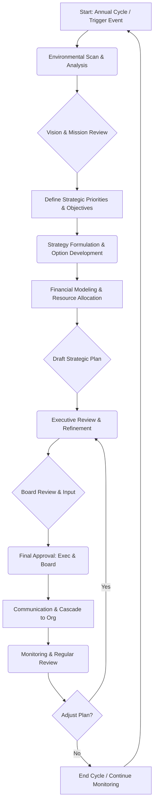

# Executive Strategic Planning Process

## 1. Purpose

This document outlines the process used by the Executive Unit to develop, refine, approve, and oversee the organization's strategic plan. The goal is to establish a clear direction, set priorities, allocate resources effectively, and ensure alignment across the organization.

## 2. Scope

This process covers the cyclical activities involved in strategic planning, typically conducted annually but subject to review and adjustment based on market dynamics or significant organizational events.

## 3. Roles and Responsibilities

*   **Executive Unit:** Owns the overall process, makes final decisions on strategic direction and plan approval.
*   **CEO:** Leads the strategic planning effort, facilitates discussions, and ensures alignment with the Board.
*   **Strategy Lead/Office (if applicable):** Coordinates the process, gathers data, facilitates workshops, drafts documentation.
*   **Unit Leaders:** Provide input on functional/departmental strategies, capabilities, and resource needs.
*   **Finance:** Provides financial analysis, modeling, and budget implications.
*   **Board of Directors:** Provides oversight, input, and final approval of the high-level strategic direction.

## 4. Process Steps

1.  **Environmental Scan & Analysis:**
    *   Gather data on market trends, competitive landscape, technological changes, economic factors, regulatory environment (PESTLE analysis).
    *   Conduct internal assessment (SWOT analysis): Strengths, Weaknesses, Opportunities, Threats.
    *   Review performance against the previous strategic plan.
2.  **Vision & Mission Review:**
    *   Reaffirm or refine the organization's long-term vision and mission based on the analysis.
3.  **Strategic Priorities Definition:**
    *   Identify and prioritize key strategic themes or pillars for the planning period (e.g., 3-5 years).
    *   Define high-level strategic objectives for each priority.
4.  **Strategy Formulation & Option Development:**
    *   Brainstorm and develop specific strategic initiatives and options to achieve the objectives.
    *   Involve unit leaders for functional input.
    *   Assess resource requirements (financial, human, technological) and potential risks for each option.
5.  **Financial Modeling & Resource Allocation:**
    *   Develop financial projections and models based on proposed strategies.
    *   Align strategic initiatives with budget allocation processes.
6.  **Draft Strategic Plan:**
    *   Consolidate analysis, priorities, objectives, initiatives, and financial plans into a draft document.
7.  **Executive Review & Refinement:**
    *   The Executive Unit reviews the draft plan, debates options, and provides feedback.
    *   Iterative refinement based on feedback.
8.  **Board Review & Input:**
    *   Present the refined draft strategic plan to the Board of Directors for input and alignment.
9.  **Final Approval:**
    *   Incorporate Board feedback (if any).
    *   Executive Unit grants final approval of the strategic plan.
    *   Board provides final endorsement/approval as per governance structure.
10. **Communication & Cascade:**
    *   Communicate the approved strategic plan throughout the organization.
    *   Cascade objectives and initiatives to relevant units and teams.
    *   Develop operational plans aligned with the strategy.
11. **Monitoring & Review:**
    *   Establish Key Performance Indicators (KPIs) to track progress.
    *   Conduct regular reviews (e.g., quarterly) of strategic performance by the Executive Unit.
    *   Adjust the plan as needed based on performance and changing conditions.

## 5. Process Flowchart (Mermaid)

## 6. Inputs

*   Previous strategic plan performance data
*   Market research and competitive intelligence
*   Internal performance data (financial, operational)
*   Stakeholder feedback (customer, employee, investor)
*   Technological forecasts
*   Regulatory updates

## 7. Outputs

*   Approved Strategic Plan Document
*   Defined Strategic Priorities and Objectives
*   Key Strategic Initiatives
*   High-level Resource Allocation Plan / Budget Alignment
*   Strategic KPIs
*   Communication Plan

## 8. Review Cycle

*   **Full Process:** Annually (typically)
*   **Performance Monitoring:** Quarterly (typically)
*   **Ad-hoc Review:** Triggered by significant internal or external events. 