# Facilities Unit Charter

## 1. Mission
The mission of the Facilities unit is to plan, provide, operate, maintain, and protect the organization's physical environment and infrastructure assets. We strive to create and sustain safe, functional, efficient, and welcoming workspaces that support the organization's strategic objectives, operational needs, and the well-being of its people.

## 2. Scope and Authority
### 2.1 Scope
The Facilities unit's scope includes, but is not limited to:
- Management and maintenance of all owned or leased properties.
- Space planning, allocation, and move management.
- Building systems operation and maintenance (HVAC, electrical, plumbing, etc.).
- Implementation and oversight of health, safety, and environmental programs relevant to facilities.
- Management of physical access control systems (in coordination with [[Security]]).
- Oversight of utilities consumption and management.
- Management of facilities-related vendor contracts (e.g., cleaning, maintenance, landscaping).
- Execution of facility renovation, refurbishment, and minor construction projects.
- Management of physical assets within facilities (e.g., furniture, fixtures).
- Development and execution of emergency preparedness and response plans related to facilities.

### 2.2 Authority
The Facilities unit, under the direction of the [[Head of Facilities]], has the authority to:
- Develop and implement policies and procedures related to facility management and safety within its scope.
- Manage the allocated facilities budget and authorize expenditures within approved limits.
- Direct and oversee facilities staff and contracted service providers.
- Enter and inspect all organizational spaces for maintenance, safety, and compliance purposes.
- Implement necessary corrective actions to address safety hazards or operational deficiencies.
- Manage the work order system and prioritize facility service requests.
- Oversee the allocation and configuration of workspace, subject to organizational space standards and strategic direction.
- Represent the organization in dealings with facilities-related vendors, landlords, and regulatory agencies.

## 3. Governance and Structure
- **Leadership:** The unit is led by the [[Head of Facilities/Facilities Director]], reporting to [[Executive Sponsor/VP Operations]].
- **Structure:** The unit may be organized into functional teams such as Operations & Maintenance, Space Planning, Project Management, and Safety.
- **Oversight:** Performance and strategic direction may be reviewed by [[Relevant Committee, e.g., Operations Committee, Safety Committee]].

## 4. Key Responsibilities
- **Operations & Maintenance:** Ensure reliable operation of building systems, perform preventive and corrective maintenance, manage cleaning and upkeep.
- **Space Management:** Optimize space utilization, plan and execute relocations, maintain accurate space inventory.
- **Safety & Compliance:** Ensure compliance with relevant health, safety, and environmental regulations; implement safety programs; manage emergency preparedness.
- **Project Management:** Manage the lifecycle of facility projects from planning to completion, on time and within budget.
- **Vendor Management:** Select, manage, and evaluate performance of external service providers.
- **Budget Management:** Develop and manage the facilities operating and capital budgets.
- **Customer Service:** Provide responsive and effective support to internal stakeholders regarding facility needs.

## 5. Operating Principles
- **Safety First:** Prioritize the health and safety of all occupants.
- **Efficiency:** Optimize resource utilization (energy, space, budget).
- **Reliability:** Ensure consistent and dependable operation of critical building systems.
- **Sustainability:** Promote environmentally responsible practices in facility operations.
- **Service Orientation:** Provide high-quality, responsive service to internal customers.
- **Compliance:** Adhere to all applicable laws, regulations, and organizational policies.

## 6. Reporting and Performance Measurement
- The unit will report regularly to [[Executive Sponsor/Relevant Committee]] on key performance indicators (KPIs), including:
    - Work order completion rates and times.
    - Budget performance.
    - Energy consumption trends.
    - Safety incident statistics.
    - Space utilization metrics.
    - Project status updates.
    - Preventive maintenance compliance.
- Performance will be measured against established targets and industry benchmarks.

## 7. Review and Amendment
- This Charter shall be reviewed annually by the [[Head of Facilities]] and [[Executive Sponsor]], or as needed.
- Amendments require approval by [[Approving Authority, e.g., Executive Sponsor]].

## 8. Visualization: Facilities Structure and Key Interfaces

```mermaid
graph TD
    subgraph Executive Level
        Exec[[Executive Sponsor / VP Ops]]
        ExecCom[Executive Committee]
    end

    subgraph FacilitiesUnit [Facilities Unit]
        direction LR
        Head((Head of Facilities))
        OpsMaint[Operations & Maintenance Team]
        SpacePlan[Space Planning Team]
        Projects[Project Management Team]
        Safety[Safety Coordination]
    end

    subgraph Key Internal Interfaces
        AllUnits[All Org Units]
        HR[Human Resources]
        IT[Information Technology]
        Finance[Finance]
        Security[Security]
        Legal[Legal]
        Procurement[Procurement]
    end

    subgraph Key External Interfaces
        Vendors[Service Vendors]
        Contractors[Construction Contractors]
        Utilities[Utility Providers]
        Regulators[Regulatory Agencies]
        Landlord[Landlord/Property Mgmt]
    end

    Exec -- Oversees/Approves --> Head
    Head -- Manages --> OpsMaint
    Head -- Manages --> SpacePlan
    Head -- Manages --> Projects
    Head -- Manages --> Safety
    Head -- Reports To --> Exec
    Head -- Liaises --> ExecCom

    FacilitiesUnit -- Provides Services/Support --> AllUnits
    FacilitiesUnit -- Coordinates With --> HR
    FacilitiesUnit -- Coordinates With --> IT
    FacilitiesUnit -- Coordinates With --> Finance
    FacilitiesUnit -- Coordinates With --> Security
    FacilitiesUnit -- Consults --> Legal
    FacilitiesUnit -- Coordinates With --> Procurement

    AllUnits -- Requests Services --> FacilitiesUnit
    HR -- Collaborates (Ergo, Safety) --> FacilitiesUnit
    IT -- Collaborates (Infra) --> FacilitiesUnit
    Finance -- Collaborates (Budget) --> FacilitiesUnit
    Security -- Collaborates (Physical Security) --> FacilitiesUnit

    FacilitiesUnit -- Manages --> Vendors
    FacilitiesUnit -- Manages --> Contractors
    FacilitiesUnit -- Interacts With --> Utilities
    FacilitiesUnit -- Interacts With --> Regulators
    FacilitiesUnit -- Interacts With --> Landlord
```

---
Approved By: [[Approving Authority]]
Date Approved: [[Date]]
Version: 1.0
