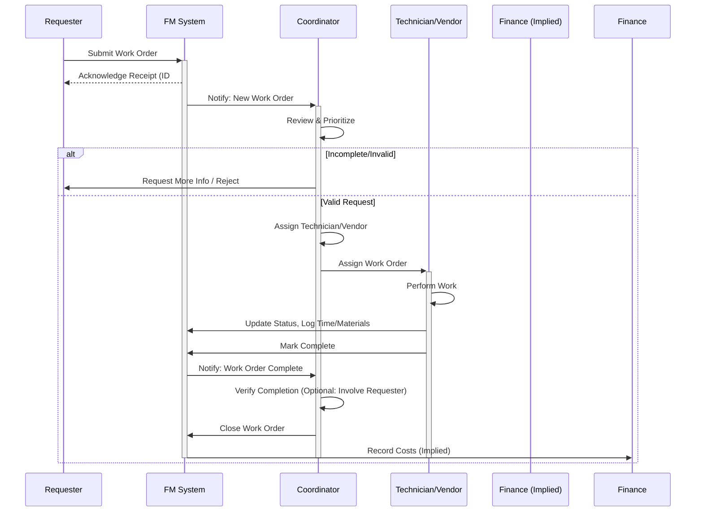

# Facilities Unit Processes

## 1. Introduction
This document describes the standard operating processes for the Facilities unit, ensuring efficient service delivery, safety, and compliance in managing the organization's physical environment.

## 2. Core Processes

### 2.1. Facilities Work Order Management Process ([[facilities_work_order_management]])
- **Objective:** To provide a standardized method for requesting, tracking, prioritizing, assigning, and completing facilities maintenance and service requests.
- **System:** [[facilities_management_system]] (e.g., CMMS/IWMS)
- **Steps:**
    1.  **Request Submission:** Employee/Unit submits a work order request via the designated portal/system, providing details (location, issue description, contact info, urgency).
    2.  **Request Review & Triage:** Facilities Coordinator reviews request for completeness and clarity. Assigns initial priority (e.g., Emergency, Urgent, Routine) based on [[Work Order Prioritization Matrix]].
    3.  **Assignment:** Coordinator assigns the work order to the appropriate internal technician or external vendor based on skill set, location, and workload.
    4.  **Execution:** Technician/Vendor performs the work, documenting labor hours, parts used, and status updates in the system.
    5.  **Completion & Verification:** Technician/Vendor marks the work order as complete. Coordinator or Requestor may verify satisfactory completion.
    6.  **Closure:** Coordinator formally closes the work order in the system. Data is used for reporting and analysis.

### 2.2. Preventive Maintenance (PM) Process ([[preventive_maintenance_scheduling]])
- **Objective:** To proactively maintain critical building systems and equipment, minimizing downtime and extending asset life.
- **System:** [[facilities_management_system]] (PM Module)
- **Steps:**
    1.  **Scheduling:** PM tasks are scheduled automatically by the system based on predefined frequencies (e.g., time-based, usage-based) for registered assets.
    2.  **Work Order Generation:** PM work orders are automatically generated in advance of the due date.
    3.  **Assignment:** PM work orders are assigned to technicians/vendors.
    4.  **Execution:** Technician performs the PM task according to the [[PM Checklist]] for that asset type, documenting findings and actions.
    5.  **Completion & Closure:** Technician completes the PM work order in the system. Records are maintained for compliance and asset history.

### 2.3. Space Request and Allocation Process ([[space_request_allocation]])
- **Objective:** To manage requests for new or modified space allocations efficiently and align them with organizational needs and standards.
- **Steps:**
    1.  **Request Submission:** Unit submits a [[Space Request Form]] detailing requirements (headcount, adjacency needs, timeline, justification).
    2.  **Needs Analysis:** Facilities Space Planner reviews the request, consults with the requesting unit, and assesses needs against current availability and [[Space Standards Document Link]].
    3.  **Option Development:** Planner develops potential allocation options, considering adjacencies, cost, and minimal disruption.
    4.  **Review & Approval:** Options are reviewed with the requesting unit and relevant stakeholders. Approval required from [[Approving Authority, e.g., Head of Facilities, Steering Committee]] based on scope/cost.
    5.  **Implementation Planning:** Facilities Project Manager develops a detailed plan for build-out, furniture, IT coordination, and move logistics.
    6.  **Execution & Move Management:** Facilities oversees construction/reconfiguration and coordinates the physical move.
    7.  **Update Records:** Space Planner updates floor plans and space inventory database.

### 2.4. Safety Inspection Process ([[safety_inspection_reporting]])
- **Objective:** To identify and mitigate potential workplace hazards through regular, systematic inspections.
- **Steps:**
    1.  **Scheduling:** Safety inspections (general workplace, fire safety, equipment-specific) are scheduled according to predefined frequencies.
    2.  **Inspection:** Designated personnel (Facilities Safety Officer, Department Safety Reps) conduct inspections using standardized [[Safety Inspection Checklists]].
    3.  **Documentation:** Findings (compliance, non-compliance, hazards) are documented in the [[safety_management_software]] or inspection form.
    4.  **Corrective Action:** Identified hazards or non-compliance issues generate corrective action tasks assigned to responsible parties (e.g., Facilities maintenance, Department Head).
    5.  **Tracking & Closure:** Corrective actions are tracked until completion and verification.
    6.  **Reporting:** Inspection results and corrective action status are reported to the [[Safety Committee]] and unit management.

### 2.5. Emergency Response Coordination Process ([[emergency_response_coordination]])
- **Objective:** To ensure a coordinated and effective response to facility-related emergencies (fire, flood, power outage, etc.) to protect life and property.
- **Plan:** [[emergency_response_plan]]
- **Steps:**
    1.  **Incident Reporting:** Emergency reported via [[Emergency Contact Number/System]].
    2.  **Initial Assessment & Notification:** Facilities personnel/Security assess the situation and notify relevant internal teams (e.g., Emergency Response Team, IT, Communications) and external agencies (Fire Dept, Police) as needed.
    3.  **Plan Activation:** Relevant sections of the Emergency Response Plan are activated.
    4.  **On-Site Coordination:** Facilities personnel coordinate response actions (e.g., evacuation support, system shutdowns, damage assessment, liaison with emergency services).
    5.  **Communication:** Provide updates to building occupants and leadership via established channels.
    6.  **Recovery & Restoration:** Once safe, Facilities coordinates clean-up, repair, and restoration of services.
    7.  **Post-Incident Review:** Conduct a review to identify lessons learned and update plans/procedures.

## 3. Visualization: Work Order Management Workflow

---
Version: 1.0
Last Updated: [[Date]]
Maintained by: [[Head of Facilities]] 