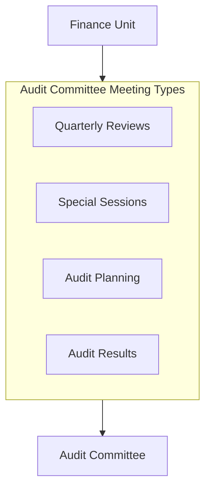

# Audit Committee Meetings

## Overview

This directory contains meeting notes and supporting materials for interactions between the Finance Unit and the [[../../../AdvisoryBoard/Committees/AuditCommittee/README|Audit Committee]]. These meetings provide governance oversight of financial reporting, controls, compliance, and risk management.

## Meeting Schedule

The Finance Unit meets with the [[../../../AdvisoryBoard/Committees/AuditCommittee/README|Audit Committee]] on a regular schedule:

- **Quarterly Financial Reviews** - Review of financial performance, reporting, and compliance
- **Annual Audit Planning** - Planning for external audit activities
- **Audit Results Review** - Discussion of audit findings and remediation
- **Special Topic Sessions** - As needed for urgent matters or special reviews

## Meeting Documentation

### Quarterly Reviews
- [[Q1FinancialReview|Q1 Financial Review Meeting]]
- [[Q2FinancialReview|Q2 Financial Review Meeting]]
- [[Q3FinancialReview|Q3 Financial Review Meeting]]
- [[Q4FinancialReview|Q4 Financial Review Meeting]]

### Audit Planning and Results
- [[AnnualAuditPlanning|Annual Audit Planning Meeting]]
- [[InterimAuditResults|Interim Audit Results Meeting]]
- [[YearEndAuditResults|Year-End Audit Results Meeting]]

### Special Sessions
- [[ControlRemediationReview|Control Remediation Review]]
- [[RegulatoryChangeImpact|Regulatory Change Impact Assessment]]
- [[RiskAssessmentReview|Financial Risk Assessment Review]]

## Standard Meeting Process

1. **Pre-Meeting Preparation**
   - Finance prepares financial materials and analyses
   - Materials distributed to committee members in advance
   - Pre-briefings conducted when necessary

2. **Meeting Execution**
   - CFO presents financial updates and key matters
   - Committee members provide oversight and questioning
   - Decisions and recommendations documented
   - Action items captured and assigned

3. **Post-Meeting Follow-up**
   - Meeting notes distributed to all participants
   - Action items tracked and monitored
   - Progress updates provided between meetings
   - Materials archived for reference

## Key Participants

From Finance Unit:
- [[../../README#Contact|Chief Financial Officer]]
- Finance Director
- Controller
- Other Finance specialists as needed

From [[../../../AdvisoryBoard/Committees/AuditCommittee/README|Audit Committee]]:
- Committee Chair
- Committee Members
- Advisory Board representatives

Other regular participants:
- [[../../../Audit/README|Internal Audit]] representatives
- External auditors
- [[../../../RiskManagement/README|Risk Management]] representatives
- [[../../../Compliance/README|Compliance]] representatives

## Related Materials

- [[../../Policies/AuditPolicy|Audit Policy]]
- [[../../Processes/AuditCoordinationProcess|Audit Coordination Process]]
- [[../../Reports/README|Financial Reports]]
- [[../../../AdvisoryBoard/Committees/AuditCommittee/Charter|Audit Committee Charter]]
- [[../../../Audit/Processes/README|Audit Processes]] 