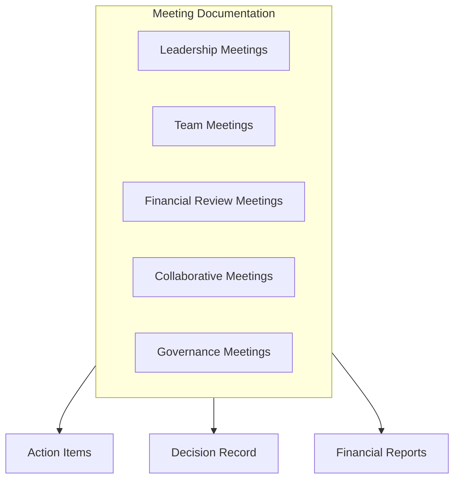

# Finance Meeting Notes

## Overview

This directory contains the official records of Finance Unit meetings, including leadership sessions, team meetings, financial review meetings, and collaborative discussions with other units. These notes document discussions, decisions, action items, and follow-up requirements related to financial matters.

## Meeting Categories

### Leadership Meetings
- [[LeadershipMeetings/README|Finance Leadership Meetings]] - CFO and Finance Director meetings
- Focus on strategic direction, performance oversight, and leadership matters
- Regular cadence (typically weekly)
- Attended by Finance Unit leadership team

### Team Meetings
- [[TeamMeetings/README|Finance Team Meetings]] - Full finance team meetings
- General updates, cross-functional coordination, and team announcements
- Typically held monthly
- Attended by all Finance Unit staff

### Financial Review Meetings
- [[ReviewMeetings/README|Financial Review Meetings]] - Performance review sessions
- Detailed analysis of financial performance, budget adherence, and forecasts
- Regular schedule (monthly/quarterly)
- Attended by Finance leadership and key stakeholders

### Collaborative Meetings
- [[CollaborativeMeetings/README|Collaborative Meetings]] - Sessions with other units
- Coordination with other organizational units on financial matters
- Scheduled as needed
- Attended by Finance representatives and other unit stakeholders

### Governance Meetings
- [[GovernanceMeetings/README|Governance Meetings]] - Oversight and compliance sessions
- Financial governance, control, and compliance matters
- Regular and ad-hoc sessions
- Attended by Finance leadership and governance stakeholders

## Documentation Format

Standard meeting notes include:

1. **Meeting Details**
   - Date, time, and location
   - Participants (present and absent)
   - Meeting purpose and agenda

2. **Discussion Summary**
   - Key topics discussed
   - Major viewpoints and insights
   - Financial implications and considerations

3. **Decisions and Recommendations**
   - Formal decisions made
   - Financial recommendations
   - Approval status and authorities

4. **Action Items**
   - Specific tasks assigned
   - Responsible individuals
   - Due dates
   - Status tracking

5. **Financial Implications**
   - Budget impacts
   - Resource requirements
   - Financial risks and opportunities
   - Compliance considerations

## Meeting Schedule

The Finance Unit maintains a coordinated meeting schedule:

- [[Schedule|Finance Meeting Calendar]] - Comprehensive schedule of all finance meetings
- [[AnnualPlanner|Annual Meeting Planner]] - Strategic planning for major financial meetings
- [[MeetingCoordination|Meeting Coordination Process]] - Process for aligning meetings across groups

## Special Meeting Documentation

Special financial meetings with governance or advisory entities require additional documentation:

- [[AuditCommitteeMeetings/README|Audit Committee Meetings]] - Meetings with the [[../../AdvisoryBoard/Committees/AuditCommittee/README|Audit Committee]]
- [[ExecutiveMeetings/README|Executive Financial Briefings]] - Financial presentations to executives
- [[BudgetMeetings/README|Budget Planning Meetings]] - Annual and special budget planning sessions
- [[AuditMeetings/README|Audit Planning and Review Meetings]] - Coordination with internal/external auditors

## Related Documents

- [[../Charter|Finance Charter]]
- [[../Policies/MeetingProtocols|Meeting Protocols]]
- [[../Processes/MeetingManagement|Meeting Management Process]]
- [[../Reports/README|Financial Reports]]
- [[../../AdvisoryBoard/MeetingNotes/README|Advisory Board Meeting Notes]] 