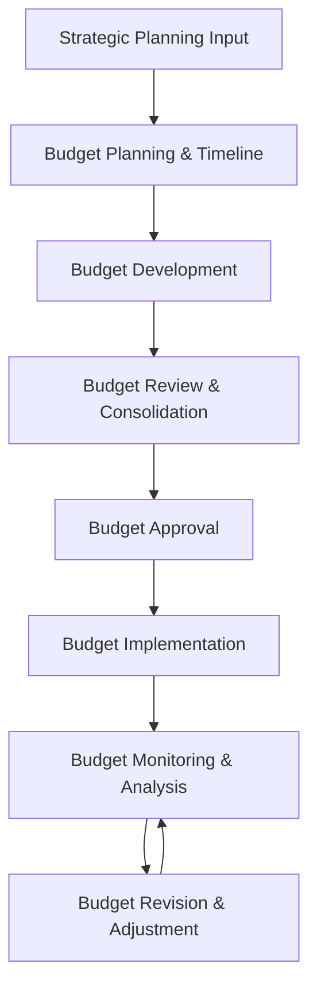

# Budgeting Process

## Process Purpose

This process outlines the structured approach for developing, approving, implementing, and monitoring the organization's annual budget. It ensures alignment with strategic objectives, appropriate resource allocation, and effective financial management.

## Process Overview

## Process Steps

### 1. Strategic Planning Input

#### 1.1 Strategic Alignment
- Obtain strategic priorities and objectives from the [[../../Strategy/README|Strategy Unit]]
- Review long-term financial plan for multi-year context
- Identify key initiatives requiring financial resources
- Determine organizational growth targets and financial parameters

#### 1.2 Financial Guidelines Development
- Establish key financial targets and constraints
- Define budget assumptions (inflation, growth factors, etc.)
- Develop preliminary resource allocation guidelines
- Define performance expectations and financial targets

**Outputs**: Strategic context and financial guidelines

### 2. Budget Planning & Timeline

#### 2.1 Budget Calendar Development
- Establish key milestones and deadlines for the budget process
- Align with organizational planning cycles and fiscal year
- Coordinate with the [[../../ExecutiveCommittee/README|Executive Committee]] for governance touchpoints
- Schedule appropriate review and approval meetings

#### 2.2 Process Communication
- Distribute budget calendar to all stakeholders
- Conduct budget kickoff meetings with budget owners
- Provide budget templates and instructions
- Communicate strategic priorities, targets, and constraints

**Outputs**: Budget calendar, templates, and instructions

### 3. Budget Development

#### 3.1 Revenue Forecasting
- Project revenue by product/service line
- Apply pricing strategies and volume projections
- Consider market conditions and competitive factors
- Integrate sales and marketing plans

#### 3.2 Expense Planning
- Develop personnel and staffing budgets
- Plan operational expenses by category
- Project capital expenditure requirements
- Allocate resources for strategic initiatives

#### 3.3 Departmental Budget Preparation
- Department leaders develop detailed budgets
- Justify resource requirements based on objectives
- Document assumptions and supporting analysis
- Identify efficiency opportunities and cost containment measures

**Outputs**: Detailed departmental budget plans

### 4. Budget Review & Consolidation

#### 4.1 Initial Finance Review
- Finance team reviews departmental submissions
- Verify compliance with guidelines and assumptions
- Analyze for mathematical accuracy and reasonableness
- Provide feedback to departments for revision

#### 4.2 Consolidation and Analysis
- Consolidate departmental budgets into organizational budget
- Perform financial analysis and scenario modeling
- Assess alignment with strategic objectives
- Identify resource allocation conflicts or gaps

#### 4.3 Executive Review
- Present preliminary budget to executive leadership
- Facilitate discussion of key issues and trade-offs
- Incorporate executive feedback and direction
- Prepare revised budget based on guidance

**Outputs**: Consolidated draft budget, financial analysis

### 5. Budget Approval

#### 5.1 Final Review
- Present final budget to the [[../../ExecutiveCommittee/README|Executive Committee]]
- Address questions and provide supporting analysis
- Document key decisions and approvals
- Finalize budget documents for governance approval

#### 5.2 Governance Approval
- Submit budget to appropriate governance bodies
- Present to the [[../../AdvisoryBoard/Committees/AuditCommittee/README|Audit Committee]] for financial review
- Obtain formal approval from the [[../../BoardOfDirectors/README|Board of Directors]]
- Document approvals and any conditions

**Outputs**: Approved organizational budget

### 6. Budget Implementation

#### 6.1 Budget Distribution
- Distribute approved budgets to department leaders
- Configure financial systems with budget parameters
- Establish spending authorities and control mechanisms
- Provide implementation guidance to budget owners

#### 6.2 Operational Integration
- Integrate budget into operational plans
- Align performance metrics with budget targets
- Configure monitoring and reporting tools
- Conduct implementation briefings with key stakeholders

**Outputs**: Implemented budget in financial systems

### 7. Budget Monitoring & Analysis

#### 7.1 Regular Reporting
- Produce monthly budget-to-actual reports
- Distribute financial performance summaries
- Highlight significant variances and trends
- Provide commentary on financial performance

#### 7.2 Variance Analysis
- Identify and investigate budget variances
- Determine causes of significant deviations
- Document explanations for performance gaps
- Develop corrective actions when needed

#### 7.3 Performance Review Meetings
- Conduct monthly financial review meetings
- Discuss performance with department leaders
- Review progress toward financial targets
- Identify improvement opportunities

**Outputs**: Performance reports, variance analyses

### 8. Budget Revision & Adjustment

#### 8.1 Formal Review Points
- Conduct quarterly budget reviews
- Assess changing business conditions
- Evaluate impact of internal/external factors
- Determine if budget adjustments are required

#### 8.2 Budget Adjustments
- Process approved budget adjustments
- Document rationale for significant changes
- Update financial systems and reports
- Communicate revisions to stakeholders

#### 8.3 Forecasting
- Update remainder-of-year forecasts
- Project year-end financial position
- Identify risks and opportunities
- Inform [[../../RiskManagement/README|Risk Management Unit]] of significant financial risks

**Outputs**: Revised budgets, updated forecasts

## Roles and Responsibilities

### Chief Financial Officer
- Overall ownership of budget process
- Strategic financial guidance
- Final review of consolidated budget
- Presentation to governance bodies

### Finance Director
- Budget process management
- Timeline development and enforcement
- Coordination with executive leadership
- Analysis and recommendation development

### Budget Analysts
- Technical support to departments
- Budget consolidation and analysis
- Variance reporting and investigation
- Budget adjustment processing

### Department Leaders
- Departmental budget development
- Resource allocation decisions
- Budget justification and defense
- Ongoing budget management

## Related Documents

- [[../Policies/BudgetPolicy|Budget Policy]]
- [[FinancialReportingProcess|Financial Reporting Process]]
- [[VarianceAnalysisProcess|Variance Analysis Process]]
- [[ForecastingProcess|Forecasting Process]]
- [[../../Strategy/Processes/StrategicPlanningProcess|Strategic Planning Process]]
- [[../../RiskManagement/Processes/RiskAssessment|Risk Assessment Process]]

## Process Administration

- **Process Owner**: Finance Director
- **Last Reviewed**: [Date]
- **Review Frequency**: Annual
- **Next Review Date**: [Date] 