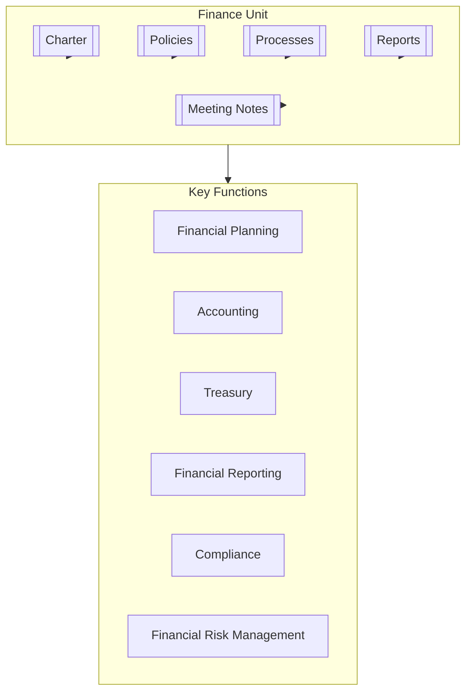

# Finance Unit

## Overview

The Finance Unit is responsible for managing the organization's financial resources, planning, reporting, accounting operations, and ensuring fiscal health and compliance. It provides strategic financial guidance while maintaining accurate financial records and controls.

## Key Documents

- **Charter**: [[Charter]] - Defines the unit's purpose, scope, objectives, governance, and structure.
- **Policies**: [[Policies/README|Policies Overview]] - Governs how the unit operates, including:
    - [[Policies/FinancialControlPolicy|Financial Controls]]
    - [[Policies/AccountingPolicy|Accounting Standards]]
    - [[Policies/ExpensePolicy|Expense Management]]
    - [[Policies/InvestmentPolicy|Investment Guidelines]]
    - [[Policies/BudgetPolicy|Budget Management]]
- **Processes**: [[Processes/README|Processes Overview]] - Describes core financial workflows, such as:
    - [[Processes/BudgetingProcess|Budgeting Process]]
    - [[Processes/FinancialReportingProcess|Financial Reporting]]
    - [[Processes/AuditProcess|Audit Coordination]]
    - [[Processes/RiskAssessmentProcess|Financial Risk Assessment]]
    - [[Processes/InvestmentProcess|Investment Management]]
- **Meeting Notes**: [[MeetingNotes/README|Meeting Notes]] - Records of discussions, decisions, and action items.
- **Reports**: [[Reports/README|Reports]] - Financial summaries, analyses, and dashboards.

## Purpose

To ensure the organization's financial stability, integrity, and growth by maintaining accurate financial records, providing strategic financial guidance, managing financial risks, and ensuring compliance with relevant regulations and standards.

## Core Financial Functions

### Financial Planning and Analysis
- Strategic financial planning
- Budgeting and forecasting
- Business case development
- Financial modeling
- Performance analysis

### Accounting Operations
- General ledger management
- Accounts payable/receivable
- Fixed asset accounting
- Revenue recognition
- Tax compliance

### Treasury Management
- Cash management
- Investment oversight
- Banking relationships
- Liquidity planning
- Financing strategy

### Financial Reporting and Compliance
- Financial statement preparation
- Regulatory reporting
- Internal controls
- Audit coordination
- Policy development

### Financial Risk Management
- Risk identification and assessment
- Risk mitigation strategies
- Insurance management
- Financial controls oversight
- Compliance monitoring

## Contact

- **Chief Financial Officer**: [[Alexandra Hughes]]
- **Slack Channel**: `#finance`

## Related Units

- [[../AdvisoryBoard/Committees/AuditCommittee/README|Advisory Board - Audit Committee]] - Collaboration on financial oversight
- [[../Audit/README|Audit Unit]] - Coordination on internal audits and controls
- [[../RiskManagement/README|Risk Management Unit]] - Partnership on financial risk management
- [[../Compliance/README|Compliance Unit]] - Coordination on financial regulatory compliance
- [[../Legal/README|Legal Unit]] - Collaboration on contracts and financial obligations
