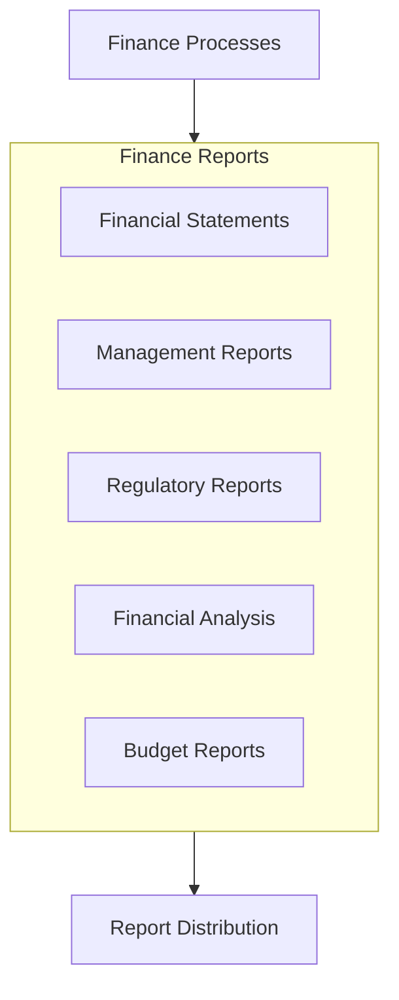

# Finance Reports

## Overview

This directory contains the standard financial reports, analyses, and output documents produced by the Finance Unit. These reports provide insights into financial performance, position, and compliance to support decision-making and fulfil reporting obligations.

## Report Categories

### Financial Statements
- [[FinancialStatements/IncomeStatement|Income Statement]] - Revenue, expenses, and profitability
- [[FinancialStatements/BalanceSheet|Balance Sheet]] - Assets, liabilities, and equity
- [[FinancialStatements/CashFlowStatement|Cash Flow Statement]] - Sources and uses of cash
- [[FinancialStatements/EquityStatement|Statement of Changes in Equity]] - Equity changes over time
- [[FinancialStatements/Notes|Financial Statement Notes]] - Disclosures and additional information

### Management Reports
- [[ManagementReports/FinancialDashboard|Financial Dashboard]] - Key financial metrics and indicators
- [[ManagementReports/PerformanceSummary|Performance Summary]] - Financial performance overview
- [[ManagementReports/BudgetVariance|Budget Variance Analysis]] - Budget vs. actual comparison
- [[ManagementReports/ForecastReport|Financial Forecast]] - Future financial projections
- [[ManagementReports/TrendAnalysis|Financial Trend Analysis]] - Historical performance patterns

### Budget and Planning Reports
- [[BudgetReports/AnnualBudget|Annual Budget]] - Approved organizational budget
- [[BudgetReports/CapitalBudget|Capital Budget]] - Capital expenditure plan
- [[BudgetReports/DepartmentalBudgets|Departmental Budgets]] - Unit-level budget allocations
- [[BudgetReports/BudgetAssumptions|Budget Assumptions]] - Underlying budget premises
- [[BudgetReports/LongRangePlan|Long-Range Financial Plan]] - Multi-year financial projections

### Financial Analysis Reports
- [[AnalysisReports/ProfitabilityAnalysis|Profitability Analysis]] - Margin and profit performance
- [[AnalysisReports/LiquidityAnalysis|Liquidity Analysis]] - Cash position and flow assessment
- [[AnalysisReports/EfficiencyAnalysis|Efficiency Analysis]] - Resource utilization metrics
- [[AnalysisReports/InvestmentAnalysis|Investment Analysis]] - Return on investments and capital
- [[AnalysisReports/CostAnalysis|Cost Structure Analysis]] - Expense patterns and opportunities

### Regulatory and Compliance Reports
- [[RegulatoryReports/TaxFilings|Tax Filings]] - Required tax submissions
- [[RegulatoryReports/StatutoryReports|Statutory Reports]] - Legal reporting requirements
- [[RegulatoryReports/ComplianceCertifications|Compliance Certifications]] - Financial compliance attestations
- [[RegulatoryReports/DisclosureReports|Financial Disclosures]] - Required financial information disclosure
- [[RegulatoryReports/AuditResponses|Audit Responses]] - Responses to audit inquiries and findings

### Special Purpose Reports
- [[SpecialReports/ProjectFinancials|Project Financial Reports]] - Financial status of specific projects
- [[SpecialReports/RiskAssessments|Financial Risk Assessments]] - Analysis of financial risks
- [[SpecialReports/ScenarioAnalysis|Financial Scenario Analysis]] - Impact of different scenarios
- [[SpecialReports/DueDiligence|Financial Due Diligence]] - Detailed financial investigations
- [[SpecialReports/PolicyCompliance|Policy Compliance Reports]] - Adherence to financial policies

## Report Development Process

The Finance Unit follows a structured approach to report development:

1. Requirements identification based on stakeholder needs and compliance obligations
2. Report design including metrics, format, and presentation
3. Data collection from financial systems and operational sources
4. Analysis and validation to ensure accuracy and completeness
5. Report generation and review
6. Distribution to appropriate stakeholders
7. Continuous improvement based on feedback and changing needs

## Report Distribution

Financial reports are distributed through the following channels:
- Executive leadership and management teams
- The [[../../AdvisoryBoard/Committees/AuditCommittee/README|Audit Committee]] and other governance bodies
- Operational units for budget and performance monitoring
- Regulatory agencies for compliance purposes
- External stakeholders as required

## Related Documents

- [[../Charter|Finance Charter]]
- [[../Policies/FinancialReportingPolicy|Financial Reporting Policy]]
- [[../Processes/FinancialReportingProcess|Financial Reporting Process]]
- [[../Processes/DataGovernanceProcess|Data Governance Process]]
- [[../../AdvisoryBoard/Reports/README|Advisory Board Reports]] 